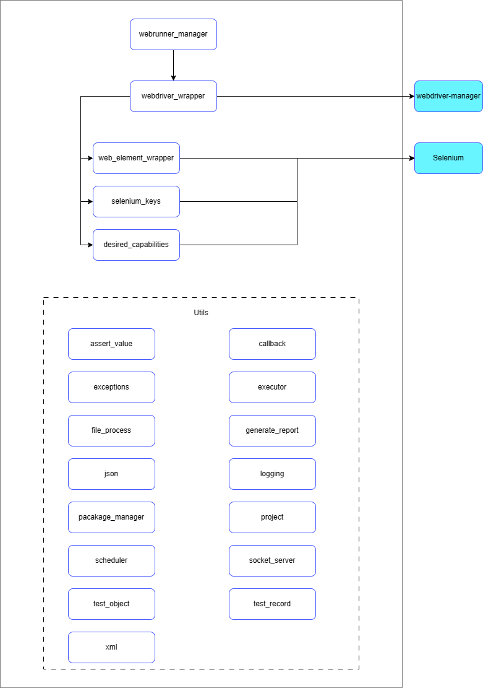

## Webrunner
[](https://pepy.tech/project/je-web-runner)

[](https://www.codacy.com/gh/JE-Chen/WebRunner/dashboard?utm_source=github.com&amp;utm_medium=referral&amp;utm_content=JE-Chen/WebRunner&amp;utm_campaign=Badge_Grade)

[](https://github.com/Intergration-Automation-Testing/WebRunner/actions/workflows/webrunner_stable_python3_9.yml)

[](https://github.com/Intergration-Automation-Testing/WebRunner/actions/workflows/webrunner_stable_python3_10.yml)

[](https://github.com/Intergration-Automation-Testing/WebRunner/actions/workflows/webrunner_stable_python3_11.yml)

### Documentation

[](https://webrunner.readthedocs.io/en/latest/?badge=latest)

[WebRunner Doc Click Here!](https://webrunner.readthedocs.io/en/latest/)

---
> Project Kanban \
> https://github.com/orgs/Integration-Automation/projects/2/views/1 \
> * WEB Automation.
> * Multi WEB Automation instance at same time.
> * Generate JSON/HTML/XML report.
> * Multi browser support like chrome, edge, safari.
> * Auto webdriver download.
> * Web screenshot.
> * Web window automation.
> * Web input automation.
> * Web element locate.
> * Execute any web script.
> * Cookie support.
> * WebRunner script.
> * OS Independent.
> * Remote automation support.
> * Project & Template support.
---

## install

```
pip install je_web_runner
```

## Requires

```
python 3.9 or later
```

>* Test on
>>    * Windows 10 ~ 11
>>    * osx 10.5 ~ 11 big sur
>>    * ubuntu 20.0.4
>>    * raspberry pi 3B+

| All test in test dir

### Architecture Diagram

