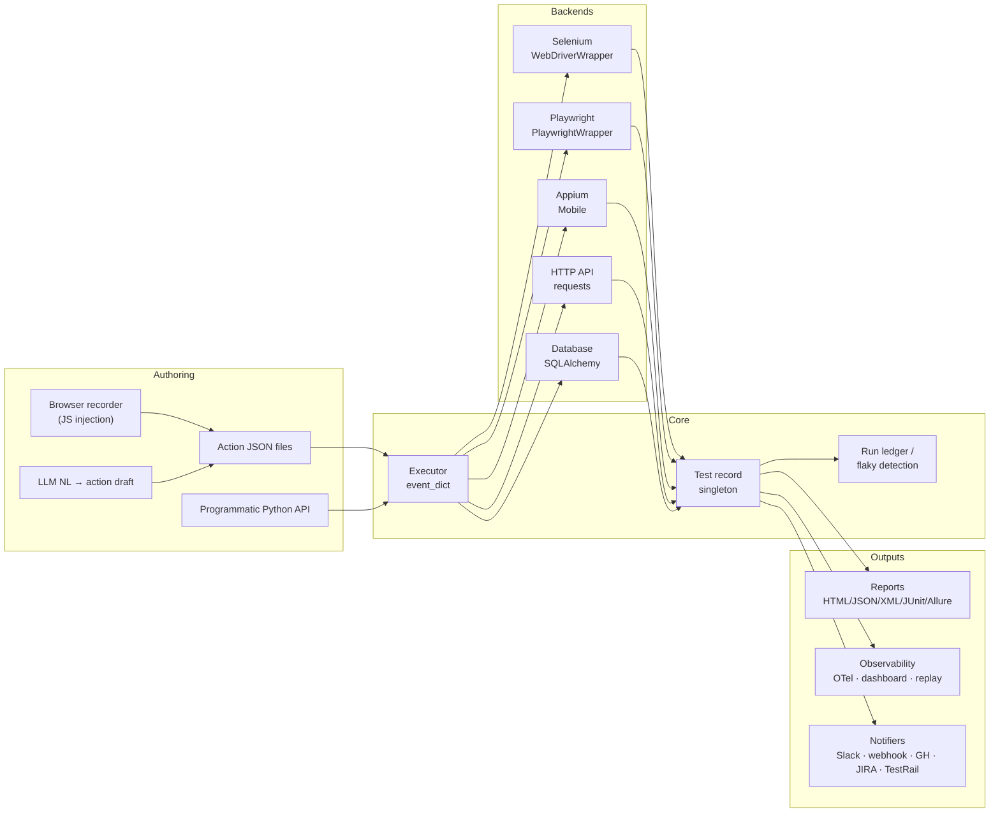
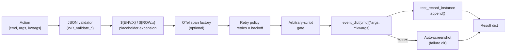
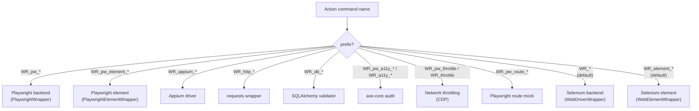

# WebRunner

<p align="center">
  <strong>Cross-platform web automation: Selenium + Playwright, plus a JSON-driven action executor with batteries included.</strong>
</p>

<p align="center">
  <a href="https://pypi.org/project/je-web-runner/"></a>
  <a href="https://pypi.org/project/je-web-runner/"></a>
  <a href="https://github.com/Intergration-Automation-Testing/WebRunner/blob/main/LICENSE"></a>
  <a href="https://webrunner.readthedocs.io/en/latest/"></a>
</p>

<p align="center">
  <a href="README/README_zh-TW.md">繁體中文</a> |
  <a href="README/README_zh-CN.md">简体中文</a>
</p>

---

WebRunner (`je_web_runner`) started as a Selenium wrapper and grew into a full automation platform: a Selenium and a Playwright backend behind one JSON-driven action executor, plus modules for reporting, observability, orchestration, security, and AI assistance. Every executor command has a deterministic name (`WR_*`) and a single dispatch point, so an action JSON can mix browser, HTTP, database, and webhook calls in the same script.

> **Auto-generated reference** — every registered `WR_*` command (signature + summary) is exported under [`docs/reference/command_reference.md`](docs/reference/command_reference.md), and a JSON Schema for action JSON files lives at [`docs/reference/webrunner-action-schema.json`](docs/reference/webrunner-action-schema.json).

## Table of Contents

- [Highlights](#highlights)
- [Installation](#installation)
- [Architecture](#architecture)
  - [System overview](#system-overview)
  - [Action lifecycle](#action-lifecycle)
  - [Backend dispatch](#backend-dispatch)
  - [Module map](#module-map)
- [Quick Start](#quick-start)
- [Core API](#core-api)
- [Action Executor](#action-executor)
- [Backends](#backends)
  - [Selenium (default)](#selenium-default)
  - [Playwright (full)](#playwright-full)
  - [Cloud Grid](#cloud-grid)
  - [Appium (mobile)](#appium-mobile)
- [Reports](#reports)
- [Observability](#observability)
- [Test Orchestration](#test-orchestration)
- [Quality & Security](#quality--security)
- [Browser Internals](#browser-internals)
- [Test Data](#test-data)
- [Auth & APIs](#auth--apis)
- [Recorder](#recorder)
- [CI / Integrations](#ci--integrations)
- [AI Assistance](#ai-assistance)
- [CLI Usage](#cli-usage)
- [Test Record](#test-record)
- [Exception Handling](#exception-handling)
- [Logging](#logging)
- [Supported Browsers](#supported-browsers)
- [Supported Platforms](#supported-platforms)
- [License](#license)

## Highlights

- **Two backends, one executor.** Selenium is the default; the Playwright backend mirrors the same operational surface under `WR_pw_*` and is fully opt-in.
- **Action JSON as a contract.** Every command resolves through `Executor.event_dict`; legacy aliases stay alongside snake_case names for back-compat, and a JSON Schema is exported for IDE autocomplete.
- **Reports in five formats.** HTML, JSON, XML, JUnit XML (CI-native), and Allure result files; a single manifest binds every output for downstream globs.
- **Orchestration built in.** Tag filters, dependency declarations with topological order, ledger-backed re-run-only-failed, flaky detection, A/B run mode, multi-user matrix, deterministic sharding, watch mode, and a stdlib scheduler.
- **Observability without extra plumbing.** Auto-screenshot on failure, retry policy, OpenTelemetry hook, live HTTP dashboard, replay studio (HTML timeline), HAR capture + diff.
- **Quality & security guards.** Action linter, migration helper, hard-coded secrets scanner, HTTP security headers audit, axe-core accessibility audit, Lighthouse runner, perf metrics (FCP/LCP/CLS), visual regression, snapshot testing, network throttling, arbitrary-script gate.
- **Browser internals.** Raw CDP, console + network event capture, localStorage / sessionStorage / IndexedDB, service worker / cache control, Shadow DOM piercing, multi-iframe, file upload / download, browser extension loaders.
- **Test data & fixtures.** Faker integration, factory pattern, testcontainers (Postgres / Redis / generic), per-environment `.env` loader with `${ENV.X}` placeholder expansion, CSV/JSON data-driven runner with `${ROW.x}`.
- **Auth, API, DB.** OAuth2 / OIDC client-credentials / password / refresh-token flows with token cache, HTTP API testing commands with JSON assertions, SQLAlchemy-backed database validation.
- **Integrations.** TCP socket server with token + TLS, BrowserStack / Sauce Labs / LambdaTest cloud Grid, Appium mobile, JIRA + TestRail, Slack / generic webhook notifier, GitHub Actions inline annotations, Locust load testing.
- **AI hooks.** Pluggable LLM callable powers self-healing locators and natural-language → action JSON drafts.
- **Cross-platform & multi-browser.** Windows, macOS, Linux, Raspberry Pi · Chrome, Chromium, Firefox, Edge, IE, Safari · Chromium, Firefox, WebKit (Playwright).

## Installation

**Stable:**

```bash
pip install je_web_runner
```

**Development:**

```bash
pip install je_web_runner_dev
```

**Optional dependencies** (each enables a slice of features; install only what you use):

```bash
pip install playwright           # Playwright backend
python -m playwright install     # Browser binaries for Playwright
pip install Pillow               # Visual regression
pip install faker                # Random test data (WR_faker_*)
pip install sqlalchemy           # Database validation (WR_db_*)
pip install opentelemetry-sdk    # Distributed traces (WR_set_action_span_factory)
pip install Appium-Python-Client # Mobile native (WR_appium_*)
pip install testcontainers       # Spin up Postgres / Redis (WR_tc_*)
pip install locust               # Load testing (WR_locust_*)
```

Hard requirements: Python **3.10+**, `selenium>=4.0.0`, `requests`, `python-dotenv`, `webdriver-manager`, `defusedxml`, `Pillow`.

## Architecture

### System overview


```mermaid
flowchart LR
  subgraph Authoring
    A1["Action JSON files"]
    A2["Programmatic Python API"]
    A3["Browser recorder<br/>(JS injection)"]
    A4["LLM NL → action draft"]
  end

  subgraph Core
    EXE["Executor<br/>event_dict"]
    REC["Test record<br/>singleton"]
    LDG["Run ledger /<br/>flaky detection"]
  end

  subgraph Backends
    SEL["Selenium<br/>WebDriverWrapper"]
    PW["Playwright<br/>PlaywrightWrapper"]
    APM["Appium<br/>Mobile"]
    HTTP["HTTP API<br/>requests"]
    DB["Database<br/>SQLAlchemy"]
  end

  subgraph Outputs
    REP["Reports<br/>HTML/JSON/XML/JUnit/Allure"]
    OBS["Observability<br/>OTel · dashboard · replay"]
    NOT["Notifiers<br/>Slack · webhook · GH · JIRA · TestRail"]
  end

  A1 --> EXE
  A2 --> EXE
  A3 --> A1
  A4 --> A1
  EXE --> SEL
  EXE --> PW
  EXE --> APM
  EXE --> HTTP
  EXE --> DB
  SEL --> REC
  PW --> REC
  APM --> REC
  HTTP --> REC
  DB --> REC
  REC --> LDG
  REC --> REP
  REC --> OBS
  REC --> NOT
```

### Action lifecycle


```mermaid
flowchart LR
  IN["Action<br/>[cmd, args, kwargs]"] --> VAL["JSON validator<br/>(WR_validate_*)"]
  VAL --> ENV["${ENV.X} / ${ROW.x}<br/>placeholder expansion"]
  ENV --> SPAN["OTel span factory<br/>(optional)"]
  SPAN --> RETRY["Retry policy<br/>retries × backoff"]
  RETRY --> GATE["Arbitrary-script<br/>gate"]
  GATE --> DISP["event_dict[cmd](*args, **kwargs)"]
  DISP --> RECORD["test_record_instance<br/>append()"]
  DISP -- failure --> SHOT["Auto-screenshot<br/>(failure dir)"]
  RECORD --> DONE["Result dict"]
  SHOT --> DONE
```

### Backend dispatch


```mermaid
flowchart TB
  CMD["Action command name"] --> ROUTE{"prefix?"}
  ROUTE -- "WR_pw_*" --> PW["Playwright backend<br/>(PlaywrightWrapper)"]
  ROUTE -- "WR_pw_element_*" --> PWE["Playwright element<br/>(PlaywrightElementWrapper)"]
  ROUTE -- "WR_appium_*" --> APM["Appium driver"]
  ROUTE -- "WR_http_*" --> HTTP["requests wrapper"]
  ROUTE -- "WR_db_*" --> DB["SQLAlchemy validator"]
  ROUTE -- "WR_pw_a11y_* / WR_a11y_*" --> AXE["axe-core audit"]
  ROUTE -- "WR_pw_throttle / WR_throttle" --> THR["Network throttling<br/>(CDP)"]
  ROUTE -- "WR_pw_route_*" --> ROUTE_MOCK["Playwright route mock"]
  ROUTE -- "WR_*<br/>(default)" --> SEL["Selenium backend<br/>(WebDriverWrapper)"]
  ROUTE -- "WR_element_*<br/>(default)" --> SE["Selenium element<br/>(WebElementWrapper)"]
```

### Module map

```
je_web_runner/
├── __init__.py
├── __main__.py                    # CLI: --execute_dir / --watch / --tag / --shard / --migrate ...
├── element/web_element_wrapper.py
├── manager/webrunner_manager.py
├── webdriver/
│   ├── webdriver_wrapper.py             # Selenium core
│   ├── webdriver_with_options.py
│   ├── playwright_wrapper.py            # Playwright sync backend (full)
│   ├── playwright_element_wrapper.py
│   └── playwright_locator.py            # TestObject ↔ Playwright selector
└── utils/
    ├── ab_run/                  # A/B run mode (run_ab + diff_records)
    ├── accessibility/           # axe-core audit
    ├── ai_assist/               # Pluggable LLM scaffold
    ├── api/                     # HTTP API testing commands
    ├── appium_integration/      # Mobile native via Appium
    ├── auth/                    # OAuth2 / OIDC token helpers
    ├── callback/                # Callback executor
    ├── cdp/                     # Raw CDP passthrough
    ├── ci_annotations/          # GitHub Actions ::error::
    ├── cli/                     # CLI parser, watch mode, dispatch
    ├── cloud_grid/              # BrowserStack / Sauce Labs / LambdaTest
    ├── dashboard/               # Live progress HTTP server
    ├── database/                # SQL validation (SQLAlchemy)
    ├── data_driven/             # CSV/JSON dataset + ${ROW.x}
    ├── docs/                    # Auto-generated command reference
    ├── dom_traversal/           # Shadow DOM / iframe helpers
    ├── env_config/              # .env loader + ${ENV.X}
    ├── exception/               # Exception hierarchy
    ├── executor/                # Action executor + retry/screenshot/gate
    ├── extensions/              # Browser extension loaders
    ├── factories/               # Factory pattern helpers
    ├── file_process/            # File utilities
    ├── file_transfer/           # Upload / download helpers
    ├── generate_report/         # HTML/JSON/XML/JUnit/Allure + manifest
    ├── har_diff/                # HAR file diff
    ├── json/                    # JSON I/O + validator (length 1/2/3)
    ├── lighthouse/              # Lighthouse CLI runner
    ├── linter/                  # action_linter + migration
    ├── load_test/               # Locust wrapper
    ├── logging/                 # Rotating file handler
    ├── multi_user/              # Multi-user matrix runner
    ├── network_emulation/       # Throttling presets via CDP
    ├── notifier/                # Slack / generic webhooks
    ├── observability/           # Console+network capture · OTel
    ├── package_manager/         # Dynamic plugin loader
    ├── perf_metrics/            # FCP / LCP / CLS / TTFB
    ├── pom_generator/           # POM skeleton from URL/HTML
    ├── project/                 # Project template generator
    ├── recorder/                # JS-injection recorder + PII mask
    ├── replay_studio/           # HTML timeline studio
    ├── run_ledger/              # ledger · flaky · classifier
    ├── schema/                  # Action JSON Schema export
    ├── scheduler/               # stdlib-sched scheduled runner
    ├── secrets_scanner/         # Hard-coded credential scanner
    ├── security_headers/        # HTTP headers audit
    ├── selenium_utils_wrapper/  # Keys / Capabilities
    ├── self_healing/            # Fallback locator registry
    ├── service_worker/          # SW unregister + cache clear
    ├── sharding/                # Deterministic test sharding
    ├── snapshot/                # Text/DOM snapshot testing
    ├── socket_server/           # TCP server with token + TLS
    ├── storage/                 # localStorage / session / IDB
    ├── test_data/               # Faker integration
    ├── test_filter/             # Tag filter + dependency graph
    ├── test_management/         # JIRA + TestRail
    ├── test_object/             # TestObject + record
    ├── test_record/             # Action recording
    ├── testcontainers_integration/   # Postgres / Redis / generic
    ├── visual_regression/       # Pillow-based image diff
    └── xml/                     # XML utilities
```

## Quick Start

### Direct API

```python
from je_web_runner import TestObject, get_webdriver_manager, web_element_wrapper

manager = get_webdriver_manager("chrome")
manager.webdriver_wrapper.to_url("https://www.google.com")
manager.webdriver_wrapper.implicitly_wait(2)

search_box = TestObject("q", "name")
manager.webdriver_wrapper.find_element(search_box)
web_element_wrapper.click_element()
web_element_wrapper.input_to_element("WebRunner automation")

manager.quit()
```

### JSON action list (modern aliases)

```python
from je_web_runner import execute_action

actions = [
    ["WR_new_driver", {"webdriver_name": "chrome"}],
    ["WR_to_url", {"url": "https://www.google.com"}],
    ["WR_implicitly_wait", {"time_to_wait": 2}],
    ["WR_save_test_object", {"test_object_name": "q", "object_type": "NAME"}],
    ["WR_find_recorded_element", {"element_name": "q"}],
    ["WR_element_click"],
    ["WR_element_input", {"input_value": "WebRunner automation"}],
    ["WR_quit_all"],
]
execute_action(actions)
```

The legacy names (`WR_get_webdriver_manager`, `WR_SaveTestObject`, `WR_quit`, `WR_input_to_element`, …) still work — see [Quality & Security](#quality--security) for the one-shot migration helper.

### Mixed positional + keyword arguments

```python
[
    ["WR_to_url", ["https://example.com"], {"timeout": 30}],
]
```

The validator accepts length-1, length-2 (`[cmd, dict_or_list]`), and length-3 (`[cmd, [positional], {kwargs}]`) actions.

## Core API

The original Selenium-flavoured API remains the canonical entry point for programmatic use. Sections preserved from the original README:

- **WebDriver Manager** — `get_webdriver_manager`, `new_driver`, `change_webdriver`, `close_choose_webdriver`, `quit`.
- **WebDriver Wrapper** — `to_url`, `forward`, `back`, `refresh`, `find_element`, `find_elements`, `implicitly_wait`, `explict_wait` (alias `WR_explicit_wait`), `set_script_timeout`, `set_page_load_timeout`, the full ActionChains-backed mouse/keyboard surface, cookies, `execute_script`, window management, screenshots, frame/window/alert switching, `get_log`.
- **Web Element Wrapper** — `click_element`, `input_to_element`, `clear`, `submit`, `get_attribute`, `get_property`, `get_dom_attribute`, `is_displayed`, `is_enabled`, `is_selected`, `value_of_css_property`, `screenshot`, `change_web_element`, `check_current_web_element`, plus the new `select_by_value` / `select_by_index` / `select_by_visible_text`.
- **TestObject** — `TestObject(name, type)`, `create_test_object`, `get_test_object_type_list` (returns `['ID', 'NAME', 'XPATH', 'CSS_SELECTOR', 'CLASS_NAME', 'TAG_NAME', 'LINK_TEXT', 'PARTIAL_LINK_TEXT']`).

Programmatic examples for each surface are kept identical to the previous edition; see the relevant Sphinx pages under `docs/source/Eng/doc/` for full code snippets.

## Action Executor

The executor maps a string command name to a Python callable. Every backend, integration, and helper registers under `event_dict`.

### Action shapes

```python
["command"]                                    # no args
["command", {"key": "value"}]                  # kwargs
["command", [arg1, arg2]]                      # positional
["command", [arg1], {"key": "value"}]          # positional + kwargs (length 3)
```

### Length-3 example

```python
[
    ["WR_pw_evaluate", ["() => document.title"], {"arg": None}],
]
```

### Top-level shapes

```python
[ ...actions... ]                                                  # bare list

{
  "webdriver_wrapper": [ ...actions... ],
  "meta": {"tags": ["smoke", "fast"], "depends_on": ["login"]}     # optional
}
```

`meta.tags` and `meta.depends_on` are picked up by the CLI for filtering and topological execution.

### Adding custom commands

```python
from je_web_runner import add_command_to_executor

def my_step(name: str) -> None:
    print(f"hello {name}")

add_command_to_executor({"my_command": my_step})
```

### Retry, screenshots, scripts

```python
from je_web_runner.utils.executor.action_executor import executor

executor.set_retry_policy(retries=2, backoff=0.5)             # global retry
executor.set_failure_screenshot_dir("./failures")              # auto PNG on raise
executor.set_allow_arbitrary_script(False)                     # gate WR_execute_script / WR_pw_evaluate / WR_cdp
```

## Backends

### Selenium (default)

Selenium is the original backend. Every legacy command (and its modern alias) routes here unless an explicit `WR_pw_*` / `WR_appium_*` prefix is used.

### Playwright (full)

The Playwright backend mirrors the operational surface of the Selenium wrapper under `WR_pw_*`:

- **Lifecycle / pages / navigation** — `WR_pw_launch`, `WR_pw_quit`, `WR_pw_new_page`, `WR_pw_switch_to_page`, `WR_pw_close_page`, `WR_pw_to_url`, `WR_pw_forward`, `WR_pw_back`, `WR_pw_refresh`, `WR_pw_url`, `WR_pw_title`, `WR_pw_content`.
- **Find** — `WR_pw_find_element`, `WR_pw_find_elements`, `WR_pw_find_element_with_test_object_record`, `WR_pw_find_with_healing`.
- **Page-level shortcuts** — `WR_pw_click`, `WR_pw_dblclick`, `WR_pw_hover`, `WR_pw_fill`, `WR_pw_type_text`, `WR_pw_press`, `WR_pw_check`, `WR_pw_uncheck`, `WR_pw_select_option`, `WR_pw_drag_and_drop`.
- **Element-level (after `WR_pw_find_element_with_test_object_record`)** — `WR_pw_element_click`, `WR_pw_element_dblclick`, `WR_pw_element_fill`, `WR_pw_element_type_text`, `WR_pw_element_press`, `WR_pw_element_check`, `WR_pw_element_uncheck`, `WR_pw_element_select_option`, `WR_pw_element_get_attribute`, `WR_pw_element_inner_text`, `WR_pw_element_inner_html`, `WR_pw_element_is_visible`, `WR_pw_element_is_enabled`, `WR_pw_element_is_checked`, `WR_pw_element_scroll_into_view`, `WR_pw_element_screenshot`, `WR_pw_element_change`.
- **Script / cookies / waits / viewport / mouse / keyboard / frames** — `WR_pw_evaluate`, `WR_pw_get_cookies`, `WR_pw_add_cookies`, `WR_pw_clear_cookies`, `WR_pw_screenshot`, `WR_pw_wait_for_selector`, `WR_pw_wait_for_load_state`, `WR_pw_wait_for_timeout`, `WR_pw_wait_for_url`, `WR_pw_set_viewport_size`, `WR_pw_mouse_*`, `WR_pw_keyboard_*`.
- **Mobile emulation / locale / clock** — `WR_pw_emulate("iPhone 13")`, `WR_pw_set_locale`, `WR_pw_set_timezone`, `WR_pw_clock_install` / `_set_time` / `_run_for`, `WR_pw_set_geolocation`, `WR_pw_grant_permissions`.
- **HAR + route mock** — `WR_pw_start_har_recording`, `WR_pw_stop_har_recording`, `WR_pw_route_mock`, `WR_pw_route_mock_json`, `WR_pw_route_unmock`, `WR_pw_route_clear`.

Existing scripts can move to Playwright incrementally; `TestObject` records are translated to Playwright selectors automatically (`CSS_SELECTOR` → as-is, `XPATH` → `xpath=…`, `ID` → `#…`, `NAME` → `[name="…"]`, `LINK_TEXT` → `text=…`, `PARTIAL_LINK_TEXT` → `:has-text("…")`).

### Cloud Grid

```python
from je_web_runner import (
    connect_browserstack,
    build_browserstack_capabilities,
)

connect_browserstack(
    username="...",
    access_key="...",
    capabilities=build_browserstack_capabilities(
        browser_name="chrome",
        browser_version="latest",
        os_name="Windows",
        os_version="11",
        project="WebRunner",
        build="ci-2026-04-26",
    ),
)
# All existing WR_* commands now run against the cloud session.
```

`connect_saucelabs` and `connect_lambdatest` follow the same shape.

### Appium (mobile)

```python
from je_web_runner import (
    start_appium_session,
    build_android_caps,
    build_ios_caps,
)

start_appium_session(
    "https://appium.example/wd/hub",
    capabilities=build_android_caps(app="/path/to/app.apk"),
)
# WR_* commands now drive the mobile session.
```

## Reports

```python
from je_web_runner import (
    generate_html_report,
    generate_json_report,
    generate_xml_report,
    generate_junit_xml_report,
    generate_allure_report,
)
from je_web_runner.utils.generate_report.report_manifest import generate_all_reports

# Run every generator + write a manifest binding all outputs:
result = generate_all_reports("run_2026_04_26", allure_dir="allure-results")
print(result["manifest_path"])  # → run_2026_04_26.manifest.json
```

| Format    | Output shape                                             | Spec-driven? |
|-----------|----------------------------------------------------------|--------------|
| JSON      | `<base>_success.json` + `<base>_failure.json`            | split        |
| HTML      | `<base>.html`                                            | single       |
| XML       | `<base>_success.xml` + `<base>_failure.xml`              | split        |
| JUnit XML | `<base>_junit.xml`                                       | single       |
| Allure    | `<allure_dir>/<uuid>-result.json` (× N)                  | directory    |

The manifest captures the actual paths produced — CI globs no longer need to know the per-format conventions.

## Observability

```python
from je_web_runner import (
    test_record_instance,
    summarise_run,
    notify_run_summary,
)
from je_web_runner.utils.executor.action_executor import executor
from je_web_runner.utils.observability.otel_tracing import install_executor_tracing
from je_web_runner.utils.dashboard.live_dashboard import start_dashboard
from je_web_runner.utils.replay_studio.replay_studio import export_replay_studio

executor.set_failure_screenshot_dir("./failures")
install_executor_tracing("webrunner")                 # one OTel span per action
start_dashboard("127.0.0.1", 8080)                    # browser-friendly progress UI
test_record_instance.set_record_enable(True)

# … run actions …

export_replay_studio("./run.html", screenshot_dir="./failures")
notify_run_summary("https://hooks.slack.com/services/...")
```

Failure screenshot, OpenTelemetry tracing, retry policy, and the live dashboard all hook into the same `Executor.event_dict` so they compose without coupling.

## Test Orchestration

```bash
# Filter by tag, run in parallel processes, persist a ledger, fail fast on dep breaks.
python -m je_web_runner \
    --execute_dir ./actions \
    --tag smoke,fast \
    --exclude-tag slow \
    --parallel 4 \
    --parallel-mode process \
    --ledger ./.run_ledger.json

# Re-run only the files that failed last time:
python -m je_web_runner --execute_dir ./actions --rerun-failed ./.run_ledger.json

# Watch a directory and re-run on file change:
python -m je_web_runner --execute_dir ./actions --watch ./actions

# Distribute across 4 runners deterministically (per machine):
python -m je_web_runner --execute_dir ./actions --shard 1/4
python -m je_web_runner --execute_dir ./actions --shard 2/4
python -m je_web_runner --execute_dir ./actions --shard 3/4
python -m je_web_runner --execute_dir ./actions --shard 4/4
```

Companion APIs — `WR_run_for_users` (multi-user matrix), `WR_run_ab` (A/B mode), `WR_flakiness_stats`, `WR_classify_failure`, `WR_schedule` + `WR_run_scheduler_for`.

## Quality & Security

- **Action linter** — `WR_lint_action` / `WR_lint_action_file` flag legacy command names, hard-coded URLs, dangerous scripts, missing tags, duplicate consecutive actions.
- **Migration helper** — `python -m je_web_runner --migrate ./actions` rewrites the eleven legacy aliases to their preferred names (`--migrate-dry-run` reports without writing).
- **Hard-coded secrets scanner** — `WR_scan_secrets_file` / `WR_assert_no_secrets` catch AWS / GitHub / Slack / JWT / Google / private-key strings before they land in commits.
- **Security headers audit** — `WR_audit_security_headers_url` checks HSTS / CSP / X-Frame-Options / X-Content-Type-Options / Referrer-Policy / Permissions-Policy.
- **Accessibility audit** — `WR_a11y_run_audit` injects user-supplied axe-core (`load_axe_source`) and runs against the active session; Playwright variant `WR_pw_a11y_run_audit`.
- **Lighthouse** — `WR_lighthouse_run` shells out to the official `lighthouse` Node CLI; `WR_lighthouse_assert_scores` enforces budgets.
- **Page perf metrics** — `WR_perf_collect` / `WR_pw_perf_collect` snapshot FCP / LCP / CLS / TTFB / domContentLoaded / load via `PerformanceObserver`; `WR_perf_assert_within` checks thresholds.
- **Visual regression** — `WR_visual_capture_baseline` + `WR_visual_compare` (Pillow soft-dep).
- **Snapshot testing** — `WR_match_snapshot` / `WR_update_snapshot` (text/DOM, unified diff on mismatch).
- **Network throttling** — `WR_throttle("slow_3g")` / `WR_pw_throttle("offline")`; presets cover Slow 3G, Fast 3G, Regular 4G, Wi-Fi, Offline, no-throttling.
- **HAR diff** — `WR_diff_har` / `WR_diff_har_files` show added / removed / status-changed requests between two runs.
- **Arbitrary-script gate** — `executor.set_allow_arbitrary_script(False)` blocks `WR_execute_script` / `WR_execute_async_script` / `WR_pw_evaluate` / `WR_cdp` / `WR_pw_cdp` for untrusted action JSON.

## Extended Capabilities

Reliability & flake reduction:

- **Adaptive retry** — `je_web_runner.utils.adaptive_retry.run_with_retry(fn, policy=...)` replays only failures the classifier marks transient / flaky / environment; real bugs short-circuit.
- **Locator strength scorer** — `linter.locator_strength.score_locator(strategy, value)` ranks locators 0–100; `assert_strength` fails CI on fragile XPath / TAG_NAME picks.
- **Smart wait** — `smart_wait.wait_for_fetch_idle` and `wait_for_spa_route_stable` patch `window.fetch` and `history.pushState` to detect SPA quiescence — no more `time.sleep`.
- **Service throttler** — `throttler.throttle("payments-api")` is a file-semaphore that caps cross-shard concurrency on a shared service.

Debugging & observability:

- **Timeline merger** — `observability.timeline.build(spans=, console=, responses=)` merges OTel spans, console messages, and network responses into one chronologically-sorted event list.
- **Failure bundle** — `failure_bundle.FailureBundle("login_test", error_repr).add_screenshot(...).write("bundle.zip")` packages screenshots / DOM / network / console / trace into a single replayable zip with manifest.
- **Memory leak detector** — `memory_leak.detect_growth(driver, action, iterations=10, growth_bytes_per_iter_budget=...)` polls `performance.memory.usedJSHeapSize` and fails on linear-fit growth above budget.
- **Playwright trace recorder** — `trace_recorder.TraceRecorder(output_dir="trace-out").start(context, name); …; .stop(context)` always writes a `.zip` viewable with `playwright show-trace`.
- **CSP reporter** — `csp_reporter.CspViolationCollector` injects a `securitypolicyviolation` listener and exposes `assert_none()` / `assert_no_directive("script-src")`.

Test data & determinism:

- **Record/replay fixture** — `snapshot.fixture_record.FixtureRecorder("fx.json", mode="auto")` saves the producer's output the first time, replays it forever after.
- **DB fixture loader** — `database.fixtures.load_fixture_file("seed.json")` + `load_into_connection(conn, fixture)` seeds testcontainers Postgres / MySQL / SQLite from a `{table: [rows]}` JSON.

API & contract testing:

- **API mocking** — `api_mock.MockRouter().add("GET", "/api/users/*", body={"id": 1}).attach_to_page(page)` intercepts Playwright routes; URL globs and `re:` regex patterns supported.
- **Contract testing** — `contract_testing.validate_response(body, schema)` runs a JSON-Schema subset; `validate_against_openapi(body, doc, "/users/{id}", "GET", 200)` resolves `$ref` and checks the right schema for the response status.
- **GraphQL helper** — `graphql.GraphQLClient("https://api/graphql").execute("{ me { id } }")`; `extract_field(payload, "me.id")` plucks values via dotted path.
- **In-process mock services** — `mock_services.MockOAuthServer().start()` issues fake bearer tokens, `MockSmtpServer` captures sent mails, `MockS3Storage` is a memory KV.

Security probes:

- **Header tampering** — `header_tampering.HeaderTampering().set_header("X-Forwarded-For", "192.0.2.1").attach_to_page(page)` mutates outbound requests so testers can probe missing-CSRF / wrong-origin / stripped-auth handling.
- **License scanner** — `license_scanner.scan_text(bundle_text)` finds SPDX identifiers and known license phrases (AGPL/GPL/MIT/Apache-2.0/MPL/ISC/BSD) so SBOM gates can `assert_allowed_licenses`.

Browser & locale:

- **Device emulation presets** — `device_emulation.playwright_kwargs("iPhone 15 Pro")` and `apply_to_chrome_options(opts, "Desktop 1080p")`; viewport + DPR + UA + touch in one call.
- **Geo / TZ / locale** — `geo_locale.GeoOverride(latitude=51.5, longitude=-0.13, timezone="Europe/London", locale="en-GB")` produces both CDP commands and Playwright `new_context` kwargs.
- **Multi-tab choreographer** — `multi_tab.TabChoreographer().open_new(driver, "side", url=...)` registers tabs by alias so action JSON can `WR_switch_tab("side")`.
- **WebAuthn virtual authenticator** — `webauthn.enable_virtual_authenticator(driver)` uses CDP `WebAuthn.*` to simulate passkey / FIDO2 sign-in flows.
- **Cookie consent dismisser** — `cookie_consent.ConsentDismisser().dismiss(driver)` clicks the first matching OneTrust / TrustArc / Cookiebot / Didomi / Quantcast button; selector list extensible via `register_selector`.

Reporting & CI:

- **PR comment poster** — `pr_comment.post_or_update_comment("owner/repo", 42, body, token=...)` is idempotent via a hidden HTML marker so retried CI runs don't pile up.
- **Trend dashboard** — `trend_dashboard.compute_trend("ledger.json")` buckets the ledger by day; `render_html(trend)` produces a self-contained SVG line chart + table.

Orchestration & developer experience:

- **Action template library** — `action_templates.render_template("login_basic", {...})` substitutes `{{placeholders}}` in built-in flows (login, accept-cookies, switch-locale, close-modal).
- **Diff-aware shard** — `sharding.diff_shard.select_for_changed(candidates, base_ref="main")` filters candidates to those touched by the current branch's `git diff`.
- **Watch mode** — `watch_mode.watch_loop(directory, on_change=callback, interval=0.5)` re-runs a callback whenever JSON files change.
- **Kubernetes runner** — `k8s_runner.render_job_manifests(ShardJobConfig(name_prefix="run", image=..., total_shards=8, actions_dir="/actions"))` produces one `batch/v1 Job` per shard.
- **Per-route perf budgets** — `perf_metrics.budgets.evaluate_metrics("/checkout", {"lcp_ms": 2300}, budgets)` plus `assert_within_budget(result)` enforce route-specific thresholds.

AI assistance:

- **Failure RCA** — `ai_assist.llm_assist.explain_failure(test_name, error_repr, console=, network=, steps=)` asks the registered LLM for `{likely_cause, evidence, next_steps, confidence}`.

## MCP Server

WebRunner ships a [Model Context Protocol](https://modelcontextprotocol.io/) server so any MCP-aware client (Claude, IDE plugins, etc.) can drive WebRunner over JSON-RPC stdio.

```bash
python -m je_web_runner.mcp_server
```

The default tool list exposes:

- `webrunner_lint_action`, `webrunner_locator_strength`
- `webrunner_render_template`, `webrunner_compute_trend`
- `webrunner_validate_response`, `webrunner_summary_markdown`
- `webrunner_diff_shard`, `webrunner_render_k8s`, `webrunner_partition_shard`

```python
from je_web_runner.mcp_server import McpServer, Tool, build_default_tools, serve_stdio

# Or build a custom server
server = McpServer()
for tool in build_default_tools():
    server.register(tool)
server.register(Tool(
    name="my_custom_tool",
    description="…",
    input_schema={"type": "object", "properties": {"x": {"type": "string"}}},
    handler=lambda args: f"hello {args['x']}",
))
serve_stdio(server=server)
```

The server speaks MCP `2024-11-05`: `initialize`, `tools/list`, `tools/call`, `resources/list`, `ping`, `shutdown`.

## Action JSON LSP

A standard Language Server Protocol implementation for action JSON files:

```bash
python -m je_web_runner.action_lsp
```

`textDocument/completion` returns every registered `WR_*` command; `textDocument/publishDiagnostics` runs the action linter on `didOpen` / `didChange`. Pair with VS Code's *Configure JSON Language Servers* or the JetBrains LSP plugin.

## Even More Capabilities (polish wave)

CLI & orchestration polish:

- **Regex test selector** — `test_filter.name_filter.filter_paths(paths, include=["smoke.*"], exclude=["slow"])` keeps only matching candidate paths; orthogonal to the existing tag filter.
- **Process supervisor** — `process_supervisor.ProcessSupervisor().kill_orphans()` walks the OS process table for `chromedriver` / `geckodriver` / `msedgedriver` and kills stragglers (skips `os.getpid()` automatically). `with_watchdog(callable, timeout_seconds=300)` wraps a long callable with a hard wall-clock raise.
- **Pipeline DSL** — `pipeline.load_pipeline({"stages": [...]})` + `run_pipeline(pipeline, runner)` execute multi-stage gates: `continue_on_failure=True` makes a stage non-blocking (linters / scanners), otherwise downstream stages skip.

Frontend / mobile / coverage:

- **Storybook visual snapshots** — `storybook.visual_snapshots.capture_story_snapshots(stories, base_url, take_screenshot, navigate, baseline_dir=...)` walks every story, persists deterministic filenames (`components-button--primary.png`), and diffs against an optional baseline. `assert_no_visual_regressions(report)` is the gate.
- **Appium gestures** — `appium_integration.gestures` ships `swipe`, `scroll`, `long_press`, `pinch`, `double_tap` that prefer Appium's `mobile:` named-gesture extension and fall back to W3C Actions on older drivers.
- **Coverage map** — `coverage_map.build_coverage_map("./actions")` walks every action JSON file, normalises `WR_to_url` paths (`/users/42` → `/users/:id`) and produces a route → files reverse index. `coverage.uncovered(declared_routes)` answers "which routes have no test?".

## Even More Capabilities (final wave)

Debugging & reproducibility:

- **CDP message tap** — `cdp_tap.CdpRecorder("cdp.ndjson").attach(driver)` wraps `execute_cdp_cmd` so every command + return value is appended to an ndjson log; `CdpReplayer(load_recording(...))` plays it back against a stub for offline debugging.
- **Cross-browser parity** — `cross_browser.diff_runs([chromium_run, firefox_run, webkit_run])` diffs title / DOM hash / console / network status / screenshot hash, classifying each finding as `major` (5xx, title, DOM mismatch) or `minor`. `assert_parity(report, only_major=True)` is the gate.
- **Browser state diff** — `state_diff.capture_state(driver)` snapshots cookies + localStorage + sessionStorage; `diff_states(before, after)` lists added / removed / changed keys per section so cart / auth flows stay traceable.

Authoring / scaffolding:

- **Page Object codegen** — `pom_codegen.discover_elements_from_html(html)` walks every element with `data-testid` / `id` / form `name`; `render_pom_module(elements, class_name="LoginPage")` returns a Python module with one `TestObject` property per element.

CI reproducibility:

- **Workspace lock file** — `workspace_lock.build_lock(drivers=..., playwright_versions={"chromium": "127.0.0.0"})` snapshots every Python distribution + driver version + Playwright browser version; `write_lock(lock, ".webrunner/lock.json")` and `diff_locks(before, after)` complete the pipeline.

Long-running observability:

- **A11y trend dashboard** — `a11y_trend.aggregate_history(history)` buckets axe runs by day and impact; `render_html(points)` produces a self-contained SVG line chart so regressions are visible at a glance.
- **Perf drift detector** — `perf_drift.detect_drift({"lcp_ms": samples}, baseline_window=20, recent_window=5)` compares the recent P95 against a rolling baseline P95 and flags drift outside `tolerance`. `assert_no_regression(report)` is the strict path; `higher_is_better={"frame_rate"}` for inverted metrics.

## Even More Capabilities (newest wave)

Authoring / formatting:

- **Action JSON formatter** — `action_formatter.format_actions(actions)` writes a canonical multi-line array with kwargs in a stable preferred-then-alphabetical order; `format_file(path)` reformats in place and reports `(text, changed)`.
- **Markdown → action JSON** — `md_authoring.parse_markdown(text)` understands `- open <url>`, `- click #id`, `- type "x" into <selector>`, `- wait 3s`, `- assert title "..."`, `- press Enter`, `- screenshot`, `- run template <name>`, `- quit`. Lines that don't match are preserved as `WR__note` so the round-trip is loss-less.

Triage / production observability:

- **Failure clustering** — `failure_cluster.cluster_failures(failures, top_n=5)` reduces each error message to a stable signature (strips timestamps, hex addresses, line numbers, paths, large numerics, quoted substrings) so the same root cause across runs lands in one bucket.
- **Synthetic monitoring** — `synthetic_monitoring.SyntheticMonitor(alert_sink).register("homepage", check)` reruns checks; the sink only fires on edge transitions (`green → red` / `red → green`) with `failure_threshold` / `recovery_threshold` to silence flapping.
- **OTLP exporter** — `observability.otlp_exporter.configure_otlp_export(provider, OtlpExportConfig(endpoint="https://otlp:4317"))` ships the existing OTel spans to Jaeger / Tempo / any OTLP backend (gRPC by default, HTTP fallback).

Frontend / component:

- **Storybook integration** — `storybook.discover_stories(index_path)` reads Storybook 7+ `index.json` (or legacy `stories.json`); `plan_actions_for_stories(stories, base_url, run_a11y=True)` builds a flat action list visiting each story in iframe mode and running axe + screenshot.
- **Shadow DOM auto-pierce** — `dom_traversal.shadow_pierce.find_first(driver, "button.primary")` recursively walks open shadow roots (Selenium `execute_script` or Playwright `evaluate`) so a single CSS selector can match across shadow boundaries.

## Even More Capabilities (latest wave)

Onboarding / migration:

- **Workspace bootstrapper** — `python -m je_web_runner --init` (or `bootstrapper.init_workspace("my-tests")`) drops `actions/sample.json`, `.webrunner/ledger.json`, pinned-driver template, JSON schema, pre-commit hook, and a starter GitHub Actions workflow.
- **Driver pinner** — `driver_pin.install_for_browser(".webrunner/drivers.json", "firefox")` reads a JSON pin file (`name` / `version` / `url` / `archive_format` / `binary_inside`), downloads + extracts once, then serves from cache. Bypasses the GitHub API rate limit that webdriver-manager hits in CI.
- **Selenium → Playwright translator** — `sel_to_pw.translate_python_source(text)` rewrites `driver.find_element(By.ID, "x")` → `page.locator("#x")` and similar; `translate_action_list(actions)` rewrites `WR_*` action JSON to its `WR_pw_*` equivalent (drops `WR_implicitly_wait` since Playwright auto-waits).

Test authoring:

- **Form auto-fill** — `form_autofill.plan_fill_actions(fields, fixture, submit_locator=...)` infers each field from `data-testid` / `id` / `name` / `placeholder` / `label` / `type` and emits a ready-to-run `WR_save_test_object` + `WR_element_input` sequence.

Quality:

- **A11y diff** — `accessibility.a11y_diff.diff_violations(baseline, current)` buckets axe-core findings into `added` / `resolved` / `persisting` keyed on `(rule_id, target)`; `assert_no_regressions(diff, allow_rules=...)` is the CI gate.

Performance / orchestration:

- **Fan-out** — `fanout.run_fan_out([("preflight-a", task_a), task_b, ...], max_workers=4)` runs read-only callables concurrently inside one test, returning per-task duration + outcome with `raise_for_failures()` for the strict path.
- **Event bus** — `event_bus.EventBus(".webrunner/events.log").publish("setup-done", {"shard": 1})`; subscribers `poll()` from a remembered offset or `wait_for(topic, predicate=..., timeout=30)`. File-backed ndjson — no Redis dependency.

Browser internals:

- **Extension test harness** — `extension_harness.parse_manifest("./ext")` reads MV2 / MV3 manifests; `apply_to_chrome_options(options, [ext_dir])` adds `--load-extension` flags; `playwright_persistent_context_args(...)` returns the kwargs needed for `launch_persistent_context`.

## Even More Capabilities

Reliability & dev-loop:

- **Browser pool** — `browser_pool.BrowserPool(factory, size=4, max_uses=50).warm()`; `with pool.session() as ses: …` removes browser cold-start from local dev. Health check + recycle policy built in.
- **WebDriver BiDi bridge** — `bidi_backend.BidiBridge().subscribe(target, "console", callback)` works against either Selenium 4 BiDi (`driver.script.add_console_message_handler`) or Playwright `page.on(...)`. `register_translator` lets you wire custom event names.

Determinism & offline runs:

- **HAR replay server** — `har_replay.HarReplayServer(load_har("recorded.har")).start()` boots a local HTTP server that serves recorded responses; supports literal / glob / `re:` URL matching with rotation across duplicates. Drop-in for staging-API outages.

Quality / privacy:

- **PII scanner** — `pii_scanner.scan_text(text)` finds emails, E.164 phones, Luhn-validated credit cards, US SSN, ROC ID, and IPv4. `assert_no_pii(text, allow_categories=...)` for CI gates; `redact_text(text)` returns a sanitised copy.
- **Visual diff review UI** — `visual_review.VisualReviewServer(baseline_dir, current_dir).start()` opens a local web UI showing each baseline / current pair side-by-side with an *Accept current as baseline* button (idempotent file copy with path-traversal guard).

Test orchestration:

- **Test impact analysis** — `impact_analysis.build_index("./actions")` walks every action JSON file and projects locator names, URLs, template names, and `WR_*` commands into a reverse index; `affected_action_files(index, locators=["primary_cta"])` answers "which tests touch this?" so diff-aware shards can go beyond filename matching.

## Browser Internals

```python
from je_web_runner import (
    selenium_cdp,                 # raw CDP
    pw_emulate, pw_set_locale,    # mobile / locale
)
from je_web_runner.utils.storage.browser_storage import (
    selenium_local_storage_set,
    selenium_indexed_db_drop,
)
from je_web_runner.utils.observability.event_capture import (
    start_event_capture,
    assert_no_console_errors,
    assert_no_5xx,
)
from je_web_runner.utils.dom_traversal.shadow_iframe import (
    selenium_query_in_shadow,
    playwright_shadow_selector,
    selenium_switch_iframe_chain,
)
from je_web_runner.utils.file_transfer.file_helpers import (
    selenium_upload_file,
    wait_for_download,
)
from je_web_runner.utils.extensions.extension_loader import (
    selenium_chrome_options_with_extension,
    playwright_extension_launch_args,
)
```

Service worker / cache control, console + network event capture and assertions, file upload via element + download dir watcher, browser extension loaders for Chromium-family.

## Test Data

```python
from je_web_runner import (
    load_env, get_env, expand_in_action,                   # .env + ${ENV.X}
    load_dataset_csv, load_dataset_json, run_with_dataset, # data-driven + ${ROW.x}
    fake_email, fake_name, fake_credit_card, fake_value,   # faker
)
from je_web_runner.utils.factories.factory import user_factory, order_factory
from je_web_runner.utils.testcontainers_integration.containers import (
    start_postgres,
    start_redis,
    cleanup_all,
)
```

Every helper is JSON-callable too (`WR_load_env`, `WR_load_dataset_csv`, `WR_run_with_dataset`, `WR_faker_email`, `WR_user_factory`, `WR_tc_postgres`, …).

## Auth & APIs

```python
from je_web_runner import (
    http_get, http_post, http_assert_status, http_assert_json_contains,
)
from je_web_runner.utils.auth.oauth import (
    client_credentials_token,
    bearer_header,
)
from je_web_runner.utils.database.db_validate import (
    db_query,
    db_assert_count,
    db_assert_value,
)

token = client_credentials_token(
    "https://idp.example/oauth2/token",
    "client-id", "client-secret",
    cache_key="default",
)
http_get("https://api.example/users/me", headers=bearer_header(token["access_token"]))
http_assert_status(200)
http_assert_json_contains("role", "admin")

db_assert_count(
    "postgresql+psycopg://user:pw@host/db",
    "SELECT 1 FROM orders WHERE user_id = :uid",
    expected=1,
    params={"uid": 42},
)
```

OAuth2 helpers cache tokens in-process and refresh 30 seconds before expiry.

## Recorder

```python
from je_web_runner import (
    recorder_start,
    recorder_stop,
    recorder_save_recording,
)

recorder_start(webdriver_wrapper_instance)
# … user clicks / inputs in the browser …
recorder_save_recording(
    webdriver_wrapper_instance,
    output_path="./recorded.json",
    raw_events_path="./raw.json",  # optional — debugging
)
```

The recorder injects a static JS listener (no CDP, no eval), so it works on Chrome / Firefox / Edge alike. **Sensitive fields are masked by default** — `type=password`, names matching `password / card_number / cvv / ssn / secret / token / api_key / otp / passcode`, and 13–19-digit numeric values are replaced with `***MASKED***`.

## CI / Integrations

```python
from je_web_runner.utils.notifier.webhook_notifier import notify_run_summary
from je_web_runner.utils.test_management.jira_client import jira_create_failure_issues
from je_web_runner.utils.test_management.testrail_client import (
    testrail_send_results,
    testrail_results_from_pairs,
)
from je_web_runner.utils.ci_annotations.github_annotations import (
    emit_failure_annotations,
    emit_from_junit_xml,
)
```

For GitHub Actions inline annotations, run `emit_from_junit_xml("run_junit.xml")` after `generate_junit_xml_report` — failed test cases surface as `::error file=…::` lines on the PR diff.

`docker/docker-compose.yml` ships a Selenium Grid 4 stack (hub + Chrome + Firefox nodes); `docker/.env.example` exposes the version pin and concurrency settings.

The IDE config examples under [`docs/ide/`](docs/ide/) wire VS Code and JetBrains to the action JSON schema produced by `WR_export_action_schema`.

## AI Assistance

```python
from je_web_runner.utils.ai_assist.llm_assist import (
    set_llm_callable,
    suggest_locator,
    generate_actions_from_prompt,
)

# Plug in any callable that returns a string:
def my_llm(prompt: str) -> str:
    # call OpenAI / Anthropic / local Ollama / mock
    ...

set_llm_callable(my_llm)

locator = suggest_locator(html_blob, description="primary submit button")
draft = generate_actions_from_prompt("log in as alice and place an order")
```

WebRunner intentionally ships **no built-in LLM client** — the boundary is a single `Callable[[str], str]` so swapping provider is one line.

## CLI Usage

```bash
# Original entry points (unchanged):
python -m je_web_runner -e actions.json
python -m je_web_runner -d ./actions/
python -m je_web_runner --execute_str '[["WR_quit_all"]]'

# Newer flags:
python -m je_web_runner -d ./actions --tag smoke --exclude-tag slow
python -m je_web_runner -d ./actions --parallel 4 --parallel-mode process
python -m je_web_runner -d ./actions --ledger ledger.json
python -m je_web_runner -d ./actions --rerun-failed ledger.json
python -m je_web_runner -d ./actions --shard 1/4
python -m je_web_runner -d ./actions --watch ./actions
python -m je_web_runner --report run                          # JSON + HTML + XML + JUnit
python -m je_web_runner --validate ./action_smoke.json
python -m je_web_runner --migrate ./actions --migrate-dry-run
```

Compose any of the flags above; the dispatcher applies tag filters → ledger / re-run-failed → sharding → dependency-aware ordering before handing files to the runner.

## Test Record

```python
from je_web_runner import test_record_instance

test_record_instance.set_record_enable(True)
# … perform automation …
records = test_record_instance.test_record_list
# Each record: {"function_name", "local_param", "time", "program_exception"}
test_record_instance.clean_record()
```

## Exception Handling

WebRunner provides a hierarchy of custom exceptions — every helper raises a domain-specific subclass of `WebRunnerException`:

| Exception                                  | Description                                      |
|--------------------------------------------|--------------------------------------------------|
| `WebRunnerException`                       | Base                                             |
| `WebRunnerWebDriverNotFoundException`      | WebDriver not found                              |
| `WebRunnerOptionsWrongTypeException`       | Invalid options type                             |
| `WebRunnerArgumentWrongTypeException`      | Invalid argument type                            |
| `WebRunnerWebDriverIsNoneException`        | WebDriver is None                                |
| `WebRunnerExecuteException`                | Action execution error                           |
| `WebRunnerJsonException`                   | JSON processing error                            |
| `WebRunnerGenerateJsonReportException`     | JSON / XML / JUnit / Allure report error         |
| `WebRunnerHTMLException`                   | HTML report error                                |
| `WebRunnerAddCommandException`             | Custom command registration error                |
| `WebRunnerAssertException`                 | Assertion failure                                |
| `XMLException` / `XMLTypeException`        | XML processing error                             |
| `CallbackExecutorException`                | Callback execution error                         |
| `PlaywrightBackendError`                   | Playwright backend / element failure             |
| `PlaywrightLocatorError`                   | TestObject → Playwright selector mapping         |
| `RecorderError` / `VisualRegressionError`  | Recorder / visual regression                     |
| `HealingError` / `EnvConfigError` / `DataDrivenError` | Self-healing / env / dataset            |
| `HttpAssertionError` / `HttpError`         | HTTP API assertions                              |
| `AccessibilityError` / `LighthouseError`   | a11y / Lighthouse                                |
| `NotifierError` / `JiraError` / `TestRailError` | Notifications / test management            |
| `CDPError` / `StorageError` / `ServiceWorkerError` | Browser internals                        |
| `OAuthError` / `DatabaseValidationError`   | Auth / DB                                        |
| `NetworkEmulationError` / `LoadTestError`  | Throttling / Locust                              |
| `ShardingError` / `MigrationError` / `ActionLinterError` | Orchestration / linting              |
| `LLMAssistError` / `OTelTracingError`      | AI / observability                               |

## Logging

WebRunner uses a rotating file handler:

- **Log file:** `WEBRunner.log`
- **Level:** WARNING+
- **Max size:** 1 GB
- **Format:** `%(asctime)s | %(name)s | %(levelname)s | %(message)s`

## Supported Browsers

| Browser           | Selenium key | Playwright   |
|-------------------|--------------|--------------|
| Google Chrome     | `chrome`     | `chromium`   |
| Chromium          | `chromium`   | `chromium`   |
| Mozilla Firefox   | `firefox`    | `firefox`    |
| Microsoft Edge    | `edge`       | `chromium`   |
| Internet Explorer | `ie`         | n/a          |
| Apple Safari      | `safari`     | `webkit`     |

## Supported Platforms

- Windows
- macOS
- Ubuntu / Linux
- Raspberry Pi

## License

This project is licensed under the [MIT License](LICENSE).
