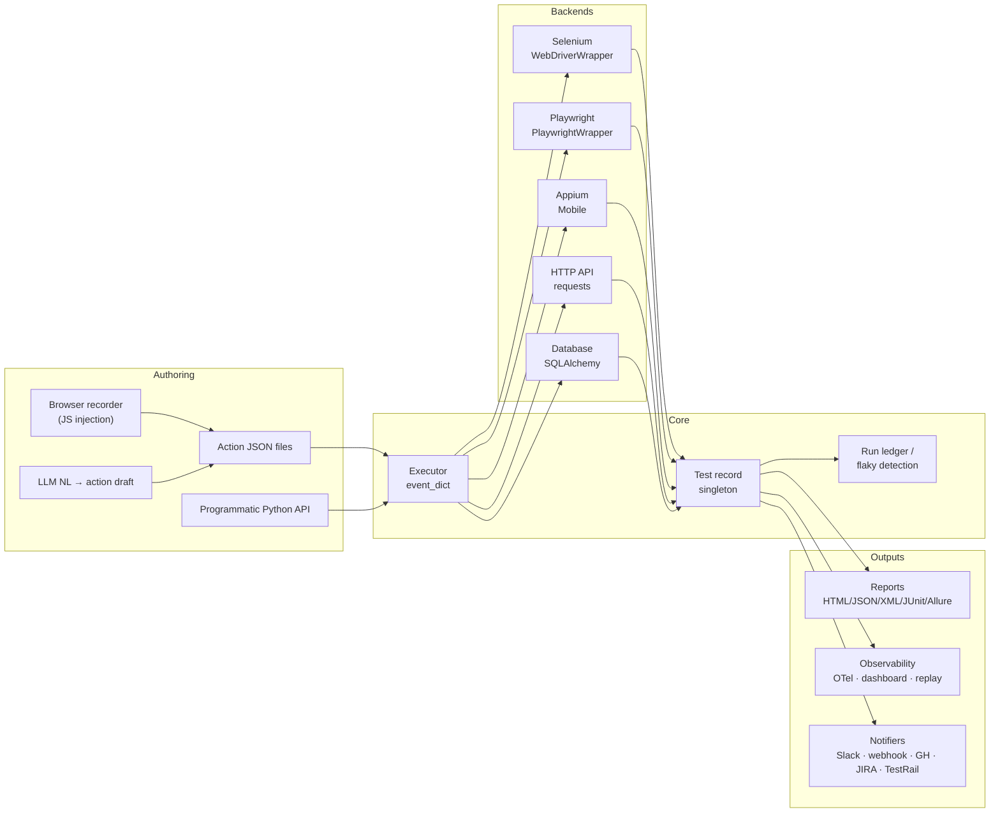
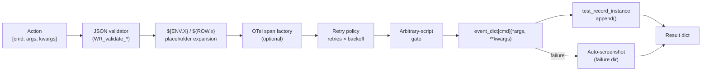
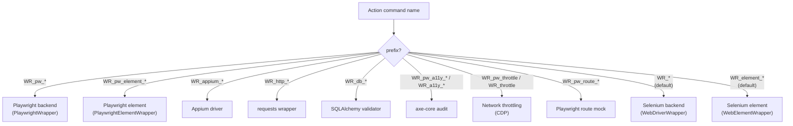

# WebRunner

<p align="center">
  <strong>跨平台网页自动化：Selenium + Playwright，外加一个开箱即用、由 JSON 驱动的动作执行器。</strong>
</p>

<p align="center">
  <a href="https://pypi.org/project/je-web-runner/"></a>
  <a href="https://pypi.org/project/je-web-runner/"></a>
  <a href="https://github.com/Integration-Automation/WebRunner/blob/main/LICENSE"></a>
  <a href="https://webrunner.readthedocs.io/en/latest/"></a>
</p>

<p align="center">
  <a href="../README.md">English</a> |
  <a href="README_zh-TW.md">繁體中文</a>
</p>

---

WebRunner（`je_web_runner`）最初只是一个 Selenium 封装，如今已成长为一个完整的自动化平台：一个 Selenium 后端与一个 Playwright 后端，统一由一个 JSON 驱动的动作执行器调度，再加上用于报告、可观测性、编排、安全与 AI 辅助的各类模块。每个执行器命令都有一个确定性的名称（`WR_*`）和单一的分发点，因此一份动作 JSON 可以在同一个脚本里混合浏览器、HTTP、数据库与 webhook 调用。

> **自动生成的参考文档** —— 每个已注册的 `WR_*` 命令（签名 + 摘要）都导出在 [`docs/reference/command_reference.md`](../docs/reference/command_reference.md)，动作 JSON 文件的 JSON Schema 则位于 [`docs/reference/webrunner-action-schema.json`](../docs/reference/webrunner-action-schema.json)。

## 目录

- [亮点特性](#亮点特性)
- [安装](#安装)
- [架构](#架构)
  - [系统总览](#系统总览)
  - [动作生命周期](#动作生命周期)
  - [后端分发](#后端分发)
  - [模块地图](#模块地图)
- [快速开始](#快速开始)
- [公共 API 与弃用策略](#公共-api-与弃用策略)
- [核心 API](#核心-api)
- [动作执行器](#动作执行器)
- [后端](#后端)
  - [Selenium（默认）](#selenium默认)
  - [Playwright（完整）](#playwright完整)
  - [Cloud Grid（云端网格）](#cloud-grid云端网格)
  - [Appium（移动端）](#appium移动端)
- [报告](#报告)
- [可观测性](#可观测性)
- [测试编排](#测试编排)
- [质量与安全](#质量与安全)
- [更多能力](#更多能力)
- [专项模块](#专项模块)
- [高级 WebDriverWrapper](#高级-webdriverwrapper)
- [浏览器内部机制](#浏览器内部机制)
- [测试数据](#测试数据)
- [认证与 API](#认证与-api)
- [录制器](#录制器)
- [CI / 集成](#ci--集成)
- [AI 辅助](#ai-辅助)
- [CLI 用法](#cli-用法)
- [测试记录](#测试记录)
- [异常处理](#异常处理)
- [日志](#日志)
- [支持的浏览器](#支持的浏览器)
- [支持的平台](#支持的平台)
- [许可证](#许可证)

## 亮点特性

- **两个后端，一个执行器。** Selenium 为默认后端；Playwright 后端在 `WR_pw_*` 下镜像了相同的操作面，完全按需选用。
- **动作 JSON 即契约。** 每个命令都通过 `Executor.event_dict` 解析；旧式别名与 snake_case 名称并存以保持向后兼容，并导出 JSON Schema 供 IDE 自动补全。
- **五种格式的报告。** HTML、JSON、XML、JUnit XML（CI 原生）以及 Allure 结果文件；单一清单（manifest）将每个输出绑定起来，方便下游用通配符匹配。
- **内建编排能力。** 标签过滤、带拓扑排序的依赖声明、由账本支撑的只重跑失败项、抖动检测、A/B 运行模式、多用户矩阵、确定性分片、监视模式，以及一个基于标准库的调度器。
- **无需额外接线的可观测性。** 失败时自动截图、重试策略、OpenTelemetry 钩子、实时 HTTP 仪表盘、回放工作室（HTML 时间线）、HAR 捕获 + 差异比对。
- **质量与安全守卫。** 动作 linter、迁移助手、硬编码密钥扫描器、HTTP 安全响应头审计、axe-core 无障碍审计、Lighthouse 运行器、性能指标（FCP/LCP/CLS）、视觉回归、快照测试、网络限速、任意脚本闸门。
- **浏览器内部机制。** 原始 CDP、控制台 + 网络事件捕获、localStorage / sessionStorage / IndexedDB、service worker / 缓存控制、穿透 Shadow DOM、多 iframe、文件上传 / 下载、浏览器扩展加载器。
- **高级 WebDriverWrapper 接口。** `set_driver(experimental_options=, extension_paths=, enable_bidi=)`、`attach_to_existing_browser`、原生 CDP 快捷方法（`set_timezone` / `set_locale` / `set_device_metrics` / `set_user_agent` / `set_extra_http_headers` / `set_geolocation` / `set_network_conditions` / `block_urls` / `set_cache_disabled` / `set_download_directory`）、Fetch 拦截原语（`enable_fetch_interception` / `continue_request` / `fulfill_request` / `fail_request`）、W3C BiDi 监听器（`add_console_listener` / `add_js_error_listener`）、用于会话复用的 `save_cookies` / `load_cookies`、`save_full_page_screenshot`、`print_page`（PDF）、`reload(ignore_cache)`、`bring_to_front`、`switch_to_window_by_url|title`、页面元数据取值器（`get_current_url` / `get_title` / `get_page_source` / `get_window_handles` / `new_window` / `close_window`）。以上全部也通过 `WR_*` 别名暴露。
- **独立的 CDP / BiDi 模块。** 后台 `CDPEventListener`（WebSocket 循环 + 同步的 `send` / `on` / 上下文管理器）、用于生成 Chrome DevTools 可加载性能追踪的 `record_trace(driver, path)`，以及封装 `driver.network.add_request_handler` / `add_response_handler` / `add_auth_handler` 的 `bidi_network` 模块，用于跨浏览器请求拦截。
- **测试数据与固件。** Faker 集成、工厂模式、testcontainers（Postgres / Redis / 通用）、带 `${ENV.X}` 占位符展开的按环境 `.env` 加载器、带 `${ROW.x}` 的 CSV/JSON 数据驱动运行器。
- **认证、API、数据库。** 带令牌缓存的 OAuth2 / OIDC 客户端凭据 / 密码 / 刷新令牌流程、带 JSON 断言的 HTTP API 测试命令、由 SQLAlchemy 支撑的数据库校验。
- **集成。** 带令牌 + TLS 的 TCP 套接字服务器、BrowserStack / Sauce Labs / LambdaTest 云端网格、Appium 移动端、JIRA + TestRail、Slack / 通用 webhook 通知器、GitHub Actions 内联注解、Locust 负载测试。
- **AI 钩子。** 可插拔的 LLM callable 驱动自愈定位器和自然语言 → 动作 JSON 草稿。
- **跨平台与多浏览器。** Windows、macOS、Linux、Raspberry Pi · Chrome、Chromium、Firefox、Edge、IE、Safari · Chromium、Firefox、WebKit（Playwright）。

## 安装

**稳定版：**

```bash
pip install je_web_runner
```

**开发版：**

```bash
pip install je_web_runner_dev
```

**可选依赖**（每一项启用一部分功能；只安装你用到的）：

```bash
pip install playwright           # Playwright backend
python -m playwright install     # Browser binaries for Playwright
pip install Pillow               # Visual regression
pip install faker                # Random test data (WR_faker_*)
pip install sqlalchemy           # Database validation (WR_db_*)
pip install opentelemetry-sdk    # Distributed traces (WR_set_action_span_factory)
pip install Appium-Python-Client # Mobile native (WR_appium_*)
pip install testcontainers       # Spin up Postgres / Redis (WR_tc_*)
pip install locust               # Load testing (WR_locust_*)
```

硬性要求：Python **3.10+**、`selenium>=4.0.0`、`requests`、`python-dotenv`、`webdriver-manager`、`defusedxml`、`Pillow`。

## 架构

### 系统总览



### 动作生命周期



### 后端分发



### 模块地图

每个 `utils/` 子包都附有一行摘要，并按核心引擎、`je_web_runner.api` 门面主题及其余部分分组：[`docs/reference/utils_index.md`](../docs/reference/utils_index.md)
（由 `scripts/gen_utils_index.py` 生成）。

```
je_web_runner/
├── __init__.py
├── __main__.py                    # CLI: --execute_dir / --watch / --tag / --shard / --migrate ...
├── element/web_element_wrapper.py
├── manager/webrunner_manager.py
├── webdriver/
│   ├── webdriver_wrapper.py             # Selenium core
│   ├── webdriver_with_options.py
│   ├── playwright_wrapper.py            # Playwright sync backend (full)
│   ├── playwright_element_wrapper.py
│   └── playwright_locator.py            # TestObject ↔ Playwright selector
└── utils/
    ├── ab_run/                  # A/B run mode (run_ab + diff_records)
    ├── accessibility/           # axe-core audit
    ├── ai_assist/               # Pluggable LLM scaffold
    ├── api/                     # HTTP API testing commands
    ├── appium_integration/      # Mobile native via Appium
    ├── auth/                    # OAuth2 / OIDC token helpers
    ├── callback/                # Callback executor
    ├── cdp/                     # Raw CDP passthrough
    ├── ci_annotations/          # GitHub Actions ::error::
    ├── cli/                     # CLI parser, watch mode, dispatch
    ├── cloud_grid/              # BrowserStack / Sauce Labs / LambdaTest
    ├── dashboard/               # Live progress HTTP server
    ├── database/                # SQL validation (SQLAlchemy)
    ├── data_driven/             # CSV/JSON dataset + ${ROW.x}
    ├── docs/                    # Auto-generated command reference
    ├── dom_traversal/           # Shadow DOM / iframe helpers
    ├── env_config/              # .env loader + ${ENV.X}
    ├── exception/               # Exception hierarchy
    ├── executor/                # Action executor + retry/screenshot/gate
    ├── extensions/              # Browser extension loaders
    ├── factories/               # Factory pattern helpers
    ├── file_process/            # File utilities
    ├── file_transfer/           # Upload / download helpers
    ├── generate_report/         # HTML/JSON/XML/JUnit/Allure + manifest
    ├── har_diff/                # HAR file diff
    ├── json/                    # JSON I/O + validator (length 1/2/3)
    ├── lighthouse/              # Lighthouse CLI runner
    ├── linter/                  # action_linter + migration
    ├── load_test/               # Locust wrapper
    ├── logging/                 # Rotating file handler
    ├── multi_user/              # Multi-user matrix runner
    ├── network_emulation/       # Throttling presets via CDP
    ├── notifier/                # Slack / generic webhooks
    ├── observability/           # Console+network capture · OTel
    ├── package_manager/         # Dynamic plugin loader
    ├── perf_metrics/            # FCP / LCP / CLS / TTFB
    ├── pom_generator/           # POM skeleton from URL/HTML
    ├── project/                 # Project template generator
    ├── recorder/                # JS-injection recorder + PII mask
    ├── replay_studio/           # HTML timeline studio
    ├── run_ledger/              # ledger · flaky · classifier
    ├── schema/                  # Action JSON Schema export
    ├── scheduler/               # stdlib-sched scheduled runner
    ├── secrets_scanner/         # Hard-coded credential scanner
    ├── security_headers/        # HTTP headers audit
    ├── selenium_utils_wrapper/  # Keys / Capabilities
    ├── self_healing/            # Fallback locator registry
    ├── service_worker/          # SW unregister + cache clear
    ├── sharding/                # Deterministic test sharding
    ├── snapshot/                # Text/DOM snapshot testing
    ├── socket_server/           # TCP server with token + TLS
    ├── storage/                 # localStorage / session / IDB
    ├── test_data/               # Faker integration
    ├── test_filter/             # Tag filter + dependency graph
    ├── test_management/         # JIRA + TestRail
    ├── test_object/             # TestObject + record
    ├── test_record/             # Action recording
    ├── testcontainers_integration/   # Postgres / Redis / generic
    ├── visual_regression/       # Pillow-based image diff
    └── xml/                     # XML utilities
```

## 范例手册（Cookbook）

`examples/` 目录提供了可直接运行的范例，会针对真实的 Chrome / 网络练习这些新的辅助函数。每个范例都从仓库根目录调用：

| 范例 | 演示内容 |
|---|---|
| `counting_stars.{py,json}` | `WR_sleep`、带 Chrome 标志的 `WR_set_driver`、自动播放策略覆盖、由 JS 驱动的 `video.play()`、跳过广告轮询。 |
| `google_search.py` | 关闭同意提示、在搜索框输入、按 ENTER 提交、抓取结果标题。 |
| `form_submit.py` | 针对 `httpbin/forms/post` 的 `form_autofill.plan_fill_actions` + `state_diff.capture_state` 往返。 |
| `smart_wait_demo.py` | 针对真实页面的 `wait_for_fetch_idle` + `wait_for_spa_route_stable` + `memory_leak.detect_growth`。 |
| `fanout_demo.py` | `fanout.run_fan_out` 并行 HTTP 预检。 |
| `pii_redact_demo.py` | `pii_scanner.scan_text` + `redact_text` + `assert_no_pii`（纯逻辑）。 |
| `quick_smoke.json` | 通过执行器 CLI 运行的最小 `WR_set_driver` → `WR_sleep` → `WR_execute_script` → `WR_quit_all` 冒烟测试。 |

直接运行一个 Python 范例：

```bash
python examples/google_search.py
```

通过执行器运行一个动作 JSON 范例：

```bash
python -m je_web_runner -e examples/quick_smoke.json
```

## 测试分层

```
test/
├── unit_test/         # mock-based unit tests
├── integration_test/  # wired-modules tests with real I/O
└── e2e_test/          # real-browser tests; skips without Selenium Grid
```

- **单元测试**（`test/unit_test/test_*.py`）—— 处处可运行；`test_dev.yml`
  和 `test_stable.yml` 都会拉入。
- **集成测试**（`test/integration_test/`）—— 用真实 SQLite、进程内 HTTP
  服务器以及为 MCP / LSP 准备的真实子进程，把两个及以上模块接线在一起。
  与单元测试相同的工作流，第二步执行。
- **端到端测试**（`test/e2e_test/`）—— 通过 `WEBRUNNER_E2E_HUB`
  与 Selenium Grid 通信。本地：`cd docker && docker compose up -d`。
  CI：`.github/workflows/e2e_browser.yml` 每日 / 按需启动 `selenium/hub:4.20.0` +
  `selenium/node-chrome`。

## 主题化 API 门面

80 多个工具辅助函数位于 `je_web_runner.utils.<area>` 下；为便于发现，
它们同时也在 `je_web_runner.api` 下重新导出：

```python
from je_web_runner.api import (
    authoring,      # action_formatter, md_authoring, templates, sel_to_pw, bootstrap
    debugging,      # cross_browser, pr_comment, extension_harness
    frontend,       # device emulation, geo/locale, multi-tab, shadow pierce, …
    infra,          # driver pin, k8s runner, pipeline, lock, watch_mode, …
    mobile,         # Appium gestures
    networking,     # api_mock, contract_testing, GraphQL, mock services, har_replay
    observability,  # timeline, failure bundle, trace recorder, OTLP, BiDi, cdp_tap
    quality,        # a11y_diff, a11y_trend, perf budgets/drift, trend, failure cluster
    reliability,    # adaptive retry, browser pool, smart wait, throttler, supervisor
    security,       # PII, license, CSP, cookie consent, header tampering
    test_data,      # DB fixtures, fixture record/replay, form auto-fill
)
```

原有的 Selenium 风格顶层接口（`webdriver_wrapper_instance`、
`execute_action`、`TestObject`……）保持不变。

## 快速开始

### 直接 API

```python
from je_web_runner import TestObject, get_webdriver_manager, web_element_wrapper

manager = get_webdriver_manager("chrome")
manager.webdriver_wrapper.to_url("https://www.google.com")
manager.webdriver_wrapper.implicitly_wait(2)

search_box = TestObject("q", "name")
manager.webdriver_wrapper.find_element(search_box)
web_element_wrapper.click_element()
web_element_wrapper.input_to_element("WebRunner automation")

manager.quit()
```

### JSON 动作列表（现代别名）

```python
from je_web_runner import execute_action

actions = [
    ["WR_new_driver", {"webdriver_name": "chrome"}],
    ["WR_to_url", {"url": "https://www.google.com"}],
    ["WR_implicitly_wait", {"time_to_wait": 2}],
    ["WR_save_test_object", {"test_object_name": "q", "object_type": "NAME"}],
    ["WR_find_recorded_element", {"element_name": "q"}],
    ["WR_element_click"],
    ["WR_element_input", {"input_value": "WebRunner automation"}],
    ["WR_quit_all"],
]
execute_action(actions)
```

旧式名称（`WR_get_webdriver_manager`、`WR_SaveTestObject`、`WR_quit`、`WR_input_to_element`……）仍可使用 —— 关于一键迁移助手，请参见[质量与安全](#质量与安全)。

### 混合位置参数与关键字参数

```python
[
    ["WR_to_url", ["https://example.com"], {"timeout": 30}],
]
```

校验器接受长度为 1、长度为 2（`[cmd, dict_or_list]`）以及长度为 3（`[cmd, [positional], {kwargs}]`）的动作。

## 公共 API 与弃用策略

**哪些是公共的** —— 只有这些内容是其他代码应当依赖的，也只有这些内容受本策略保护：

| 接口面 | 涵盖内容 |
| --- | --- |
| 顶层名称 | `je_web_runner.__all__` 中列出的一切（`from je_web_runner import …`） |
| CLI | `python -m je_web_runner` 的各标志，包括原有的 `-e/--execute_file`、`-d/--execute_dir` 和 `--execute_str`（含 Windows 双重编码的 JSON） |
| 动作 JSON | 在 `executor.event_dict` 中注册的 `WR_*` 命令名，以及动作文件的 `webdriver_wrapper` / `meta` 顶层键 |
| 套接字服务器 | `start_web_runner_socket_server`、`send_command`、`read_frame`、`encode_frame` 以及长度前缀的分帧 |
| 受支持的模块路径 | `je_web_runner.utils.executor.action_executor`（`executor`）、`je_web_runner.utils.logging.loggin_instance`（`web_runner_logger`、`WebRunnerLoggingHandler`）、`je_web_runner.webdriver.webdriver_wrapper`（`WebDriverWrapper`、`webdriver_wrapper_instance`，以及 `_options_dict` / `_webdriver_dict` / `_webdriver_manager_dict` 补丁目标） |

这三个模块路径之所以受支持，是因为其他仓库已经导入它们：AutoControlGUI 的
WebRunner 桥接取用 `executor`，Jeffrey_RPA 以那个确切（拼写有误）的名称
钩取 `loggin_instance` 并对封装字典打补丁。它们被视为公共，而不是被要求迁移。
如果其中任何一个消失，`test/unit_test/test_public_api.py` 就会失败。

**哪些不是公共的**：`je_web_runner.utils.` 下的其余所有模块、除上述补丁目标之外
任何以下划线开头命名的东西、报告文件的结构，以及日志格式。它们可以在任意
版本中移动。

**退役某个公共项**

1. 替代项先发布，旧名称作为别名继续可用。
2. 别名抛出 `DeprecationWarning` 指明替代项，并在发行说明中说明。
3. 别名至少再保留两个后续版本才可移除，且只有明确说明移除的版本才可删除它。
4. 在 `architecture.md` §6 中列为跨项目契约的名称有所不同：它绝不会在没有
   消费方仓库于同一轮一起变更的情况下改变，并且双方的 §6 都要更新。

## 核心 API

原有的 Selenium 风格 API 仍是编程式使用的规范入口。从原始 README 保留的各节：

- **WebDriver Manager** —— `get_webdriver_manager`、`new_driver`、`change_webdriver`、`close_choose_webdriver`、`quit`。
- **WebDriver Wrapper** —— `to_url`、`forward`、`back`、`refresh`、`find_element`、`find_elements`、`implicitly_wait`、`explict_wait`（别名 `WR_explicit_wait`）、`set_script_timeout`、`set_page_load_timeout`、完整的由 ActionChains 支撑的鼠标/键盘接口、cookies、`execute_script`、窗口管理、截图、frame/window/alert 切换、`get_log`。
- **Web Element Wrapper** —— `click_element`、`input_to_element`、`clear`、`submit`、`get_attribute`、`get_property`、`get_dom_attribute`、`is_displayed`、`is_enabled`、`is_selected`、`value_of_css_property`、`screenshot`、`change_web_element`、`check_current_web_element`，以及新增的 `select_by_value` / `select_by_index` / `select_by_visible_text`。
- **TestObject** —— `TestObject(name, type)`、`create_test_object`、`get_test_object_type_list`（返回 `['ID', 'NAME', 'XPATH', 'CSS_SELECTOR', 'CLASS_NAME', 'TAG_NAME', 'LINK_TEXT', 'PARTIAL_LINK_TEXT']`）。

各接口面的编程式示例与前一版保持一致；完整代码片段见 `docs/source/Eng/doc/` 下相应的 Sphinx 页面。

## 动作执行器

执行器将字符串命令名映射到一个 Python callable。每个后端、集成与辅助函数都在 `event_dict` 下注册。

### 动作形态

```python
["command"]                                    # no args
["command", {"key": "value"}]                  # kwargs
["command", [arg1, arg2]]                      # positional
["command", [arg1], {"key": "value"}]          # positional + kwargs (length 3)
```

### 长度为 3 的示例

```python
[
    ["WR_pw_evaluate", ["() => document.title"], {"arg": None}],
]
```

### 节奏控制动作

`WR_sleep` 会将执行器线程阻塞指定的秒数 —— 当页面需要沉降时间、当某个 JS 动画需要完成时，或当某个范例想让浏览器保持打开以便用户观看时，都很有用：

```python
[
    ["WR_to_url", {"url": "https://example.com"}],
    ["WR_sleep", {"seconds": 2.5}],
    ["WR_get_screenshot_as_png"],
]
```

负数或非数字的 `seconds` 会抛出 `ValueError`。若要在 JavaScript 内部进行节奏控制（例如等待来自页面的自定义事件），请使用带有 `setTimeout` 驱动回调的 `WR_execute_async_script`。

### 顶层形态

```python
[ ...actions... ]                                                  # bare list

{
  "webdriver_wrapper": [ ...actions... ],
  "meta": {"tags": ["smoke", "fast"], "depends_on": ["login"]}     # optional
}
```

`meta.tags` 与 `meta.depends_on` 会被 CLI 拾取，用于过滤和拓扑执行。

### 添加自定义命令

```python
from je_web_runner import add_command_to_executor

def my_step(name: str) -> None:
    print(f"hello {name}")

add_command_to_executor({"my_command": my_step})
```

### 重试、截图与脚本

```python
from je_web_runner.utils.executor.action_executor import executor

executor.set_retry_policy(retries=2, backoff=0.5)             # global retry
executor.set_failure_screenshot_dir("./failures")              # auto PNG on raise
executor.set_allow_arbitrary_script(False)                     # gate WR_execute_script / WR_pw_evaluate / WR_cdp
```

## 后端

### Selenium（默认）

Selenium 是最初的后端。除非显式使用 `WR_pw_*` / `WR_appium_*` 前缀，否则每个旧式命令（及其现代别名）都路由到这里。

### Playwright（完整）

Playwright 后端在 `WR_pw_*` 下镜像了 Selenium 封装的操作面：

- **生命周期 / 页面 / 导航** —— `WR_pw_launch`、`WR_pw_quit`、`WR_pw_new_page`、`WR_pw_switch_to_page`、`WR_pw_close_page`、`WR_pw_to_url`、`WR_pw_forward`、`WR_pw_back`、`WR_pw_refresh`、`WR_pw_url`、`WR_pw_title`、`WR_pw_content`。
- **查找** —— `WR_pw_find_element`、`WR_pw_find_elements`、`WR_pw_find_element_with_test_object_record`、`WR_pw_find_with_healing`。
- **页面级快捷方法** —— `WR_pw_click`、`WR_pw_dblclick`、`WR_pw_hover`、`WR_pw_fill`、`WR_pw_type_text`、`WR_pw_press`、`WR_pw_check`、`WR_pw_uncheck`、`WR_pw_select_option`、`WR_pw_drag_and_drop`。
- **元素级（在 `WR_pw_find_element_with_test_object_record` 之后）** —— `WR_pw_element_click`、`WR_pw_element_dblclick`、`WR_pw_element_fill`、`WR_pw_element_type_text`、`WR_pw_element_press`、`WR_pw_element_check`、`WR_pw_element_uncheck`、`WR_pw_element_select_option`、`WR_pw_element_get_attribute`、`WR_pw_element_inner_text`、`WR_pw_element_inner_html`、`WR_pw_element_is_visible`、`WR_pw_element_is_enabled`、`WR_pw_element_is_checked`、`WR_pw_element_scroll_into_view`、`WR_pw_element_screenshot`、`WR_pw_element_change`。
- **脚本 / cookies / 等待 / 视口 / 鼠标 / 键盘 / frames** —— `WR_pw_evaluate`、`WR_pw_get_cookies`、`WR_pw_add_cookies`、`WR_pw_clear_cookies`、`WR_pw_screenshot`、`WR_pw_wait_for_selector`、`WR_pw_wait_for_load_state`、`WR_pw_wait_for_timeout`、`WR_pw_wait_for_url`、`WR_pw_set_viewport_size`、`WR_pw_mouse_*`、`WR_pw_keyboard_*`。
- **移动端模拟 / 区域 / 时钟** —— `WR_pw_emulate("iPhone 13")`、`WR_pw_set_locale`、`WR_pw_set_timezone`、`WR_pw_clock_install` / `_set_time` / `_run_for`、`WR_pw_set_geolocation`、`WR_pw_grant_permissions`。
- **HAR + 路由模拟** —— `WR_pw_start_har_recording`、`WR_pw_stop_har_recording`、`WR_pw_route_mock`、`WR_pw_route_mock_json`、`WR_pw_route_unmock`、`WR_pw_route_clear`。

现有脚本可以逐步迁移到 Playwright；`TestObject` 记录会自动翻译为 Playwright 选择器（`CSS_SELECTOR` → 原样，`XPATH` → `xpath=…`，`ID` → `#…`，`NAME` → `[name="…"]`，`LINK_TEXT` → `text=…`，`PARTIAL_LINK_TEXT` → `:has-text("…")`）。

### Cloud Grid（云端网格）

```python
from je_web_runner.utils.cloud_grid.cloud_drivers import (
    connect_browserstack,
    build_browserstack_capabilities,
)

connect_browserstack(
    username="...",
    access_key="...",
    capabilities=build_browserstack_capabilities(
        browser_name="chrome",
        browser_version="latest",
        os_name="Windows",
        os_version="11",
        project="WebRunner",
        build="ci-2026-04-26",
    ),
)
# All existing WR_* commands now run against the cloud session.
```

`connect_saucelabs` 与 `connect_lambdatest` 遵循相同的形态。

### Appium（移动端）

```python
from je_web_runner.utils.appium_integration.appium_driver import (
    start_appium_session,
    build_android_caps,
    build_ios_caps,
)

start_appium_session(
    "https://appium.example/wd/hub",
    capabilities=build_android_caps(app="/path/to/app.apk"),
)
# WR_* commands now drive the mobile session.
```

## 报告

```python
from je_web_runner import (
    generate_html_report,
    generate_json_report,
    generate_xml_report,
    generate_junit_xml_report,
    generate_allure_report,
)
from je_web_runner.utils.generate_report.report_manifest import generate_all_reports

# Run every generator + write a manifest binding all outputs:
result = generate_all_reports("run_2026_04_26", allure_dir="allure-results")
print(result["manifest_path"])  # → run_2026_04_26.manifest.json
```

| 格式      | 输出形态                                                 | 规格驱动？   |
|-----------|----------------------------------------------------------|--------------|
| JSON      | `<base>_success.json` + `<base>_failure.json`            | 拆分         |
| HTML      | `<base>.html`                                            | 单个         |
| XML       | `<base>_success.xml` + `<base>_failure.xml`              | 拆分         |
| JUnit XML | `<base>_junit.xml`                                       | 单个         |
| Allure    | `<allure_dir>/<uuid>-result.json`（× N）                 | 目录         |

清单会捕获实际产出的路径 —— CI 的通配符不再需要知道每种格式的约定。

## 可观测性

```python
from je_web_runner import (
    test_record_instance,
    summarise_run,
    notify_run_summary,
)
from je_web_runner.utils.executor.action_executor import executor
from je_web_runner.utils.observability.otel_tracing import install_executor_tracing
from je_web_runner.utils.dashboard.live_dashboard import start_dashboard
from je_web_runner.utils.replay_studio.replay_studio import export_replay_studio

executor.set_failure_screenshot_dir("./failures")
install_executor_tracing("webrunner")                 # one OTel span per action
start_dashboard("127.0.0.1", 8080)                    # browser-friendly progress UI
test_record_instance.set_record_enable(True)

# … run actions …

export_replay_studio("./run.html", screenshot_dir="./failures")
notify_run_summary("https://hooks.slack.com/services/...")
```

失败截图、OpenTelemetry 追踪、重试策略以及实时仪表盘都挂接到同一个 `Executor.event_dict`，因此它们可以组合而不产生耦合。

## 测试编排

```bash
# Filter by tag, run in parallel processes, persist a ledger, fail fast on dep breaks.
python -m je_web_runner \
    --execute_dir ./actions \
    --tag smoke,fast \
    --exclude-tag slow \
    --parallel 4 \
    --parallel-mode process \
    --ledger ./.run_ledger.json

# Re-run only the files that failed last time:
python -m je_web_runner --execute_dir ./actions --rerun-failed ./.run_ledger.json

# Watch a directory and re-run on file change:
python -m je_web_runner --execute_dir ./actions --watch ./actions

# Distribute across 4 runners deterministically (per machine):
python -m je_web_runner --execute_dir ./actions --shard 1/4
python -m je_web_runner --execute_dir ./actions --shard 2/4
python -m je_web_runner --execute_dir ./actions --shard 3/4
python -m je_web_runner --execute_dir ./actions --shard 4/4
```

配套 API —— `WR_run_for_users`（多用户矩阵）、`WR_run_ab`（A/B 模式）、`WR_flakiness_stats`、`WR_classify_failure`、`WR_schedule` + `WR_run_scheduler_for`。

## 质量与安全

- **动作 linter** —— `WR_lint_action` / `WR_lint_action_file` 标记旧式命令名、硬编码 URL、危险脚本、缺失标签、连续重复动作。
- **迁移助手** —— `python -m je_web_runner --migrate ./actions` 将十一个旧式别名重写为其首选名称（`--migrate-dry-run` 只报告而不写入）。
- **硬编码密钥扫描器** —— `WR_scan_secrets_file` / `WR_assert_no_secrets` 在 AWS / GitHub / Slack / JWT / Google / 私钥字符串落入提交之前将其捕获。
- **安全响应头审计** —— `WR_audit_security_headers_url` 检查 HSTS / CSP / X-Frame-Options / X-Content-Type-Options / Referrer-Policy / Permissions-Policy。
- **无障碍审计** —— `WR_a11y_run_audit` 注入用户提供的 axe-core（`load_axe_source`）并针对活动会话运行；Playwright 变体为 `WR_pw_a11y_run_audit`。
- **Lighthouse** —— `WR_lighthouse_run` 外壳调用官方的 `lighthouse` Node CLI；`WR_lighthouse_assert_scores` 强制执行预算。
- **页面性能指标** —— `WR_perf_collect` / `WR_pw_perf_collect` 通过 `PerformanceObserver` 快照 FCP / LCP / CLS / TTFB / domContentLoaded / load；`WR_perf_assert_within` 检查阈值。
- **视觉回归** —— `WR_visual_capture_baseline` + `WR_visual_compare`（Pillow 软依赖）。
- **快照测试** —— `WR_match_snapshot` / `WR_update_snapshot`（文本/DOM，不匹配时输出统一差异）。
- **网络限速** —— `WR_throttle("slow_3g")` / `WR_pw_throttle("offline")`；预设涵盖 Slow 3G、Fast 3G、Regular 4G、Wi-Fi、Offline、no-throttling。
- **HAR 差异** —— `WR_diff_har` / `WR_diff_har_files` 显示两次运行之间新增 / 移除 / 状态变化的请求。
- **任意脚本闸门** —— `executor.set_allow_arbitrary_script(False)` 为不可信的动作 JSON 阻止 `WR_execute_script` / `WR_execute_async_script` / `WR_pw_evaluate` / `WR_cdp` / `WR_pw_cdp`。

## 扩展能力

可靠性与抖动缩减：

- **自适应重试** —— `je_web_runner.utils.adaptive_retry.run_with_retry(fn, policy=...)` 只重放分类器标记为瞬态 / 抖动 / 环境的失败；真正的 bug 会短路。
- **定位器强度评分器** —— `linter.locator_strength.score_locator(strategy, value)` 将定位器评为 0–100 分；`assert_strength` 在脆弱的 XPath / TAG_NAME 选取上让 CI 失败。
- **智能等待** —— `smart_wait.wait_for_fetch_idle` 与 `wait_for_spa_route_stable` 对 `window.fetch` 和 `history.pushState` 打补丁以检测 SPA 静默 —— 不再需要 `time.sleep`。
- **服务限流器** —— `throttler.throttle("payments-api")` 是一个文件信号量，用于限制共享服务上的跨分片并发。

调试与可观测性：

- **时间线合并器** —— `observability.timeline.build(spans=, console=, responses=)` 将 OTel spans、控制台消息和网络响应合并为一个按时间顺序排序的事件列表。
- **失败包** —— `failure_bundle.FailureBundle("login_test", error_repr).add_screenshot(...).write("bundle.zip")` 将截图 / DOM / 网络 / 控制台 / 追踪打包进单个带清单的可回放 zip。
- **内存泄漏检测器** —— `memory_leak.detect_growth(driver, action, iterations=10, growth_bytes_per_iter_budget=...)` 轮询 `performance.memory.usedJSHeapSize`，并在线性拟合增长超出预算时失败。
- **Playwright 追踪录制器** —— `trace_recorder.TraceRecorder(output_dir="trace-out").start(context, name); …; .stop(context)` 始终写出一个可用 `playwright show-trace` 查看的 `.zip`。
- **CSP 报告器** —— `csp_reporter.CspViolationCollector` 注入一个 `securitypolicyviolation` 监听器并暴露 `assert_none()` / `assert_no_directive("script-src")`。

测试数据与确定性：

- **录制/回放固件** —— `snapshot.fixture_record.FixtureRecorder("fx.json", mode="auto")` 首次保存生产者的输出，之后永远回放。
- **数据库固件加载器** —— `database.fixtures.load_fixture_file("seed.json")` + `load_into_connection(conn, fixture)` 从一个 `{table: [rows]}` JSON 为 testcontainers 的 Postgres / MySQL / SQLite 播种。

API 与契约测试：

- **API 模拟** —— `api_mock.MockRouter().add("GET", "/api/users/*", body={"id": 1}).attach_to_page(page)` 拦截 Playwright 路由；支持 URL 通配符与 `re:` 正则模式。
- **契约测试** —— `contract_testing.validate_response(body, schema)` 运行 JSON-Schema 的一个子集；`validate_against_openapi(body, doc, "/users/{id}", "GET", 200)` 解析 `$ref` 并为响应状态检查正确的 schema。
- **GraphQL 辅助** —— `graphql.GraphQLClient("https://api/graphql").execute("{ me { id } }")`；`extract_field(payload, "me.id")` 通过点分路径提取值。
- **进程内模拟服务** —— `mock_services.MockOAuthServer().start()` 签发假的 bearer 令牌，`MockSmtpServer` 捕获发送的邮件，`MockS3Storage` 是一个内存 KV。

安全探测：

- **请求头篡改** —— `header_tampering.HeaderTampering().set_header("X-Forwarded-For", "192.0.2.1").attach_to_page(page)` 变更出站请求，让测试者可探测缺失-CSRF / 错误-origin / 剥离-auth 的处理。
- **许可证扫描器** —— `license_scanner.scan_text(bundle_text)` 查找 SPDX 标识符和已知的许可证措辞（AGPL/GPL/MIT/Apache-2.0/MPL/ISC/BSD），使 SBOM 闸门可以 `assert_allowed_licenses`。

浏览器与区域：

- **设备模拟预设** —— `device_emulation.playwright_kwargs("iPhone 15 Pro")` 与 `apply_to_chrome_options(opts, "Desktop 1080p")`；一次调用完成视口 + DPR + UA + touch。
- **地理 / 时区 / 区域** —— `geo_locale.GeoOverride(latitude=51.5, longitude=-0.13, timezone="Europe/London", locale="en-GB")` 同时产出 CDP 命令和 Playwright `new_context` kwargs。
- **多标签编排器** —— `multi_tab.TabChoreographer().open_new(driver, "side", url=...)` 按别名注册标签页，使动作 JSON 可以 `WR_switch_tab("side")`。
- **WebAuthn 虚拟认证器** —— `webauthn.enable_virtual_authenticator(driver)` 使用 CDP `WebAuthn.*` 模拟 passkey / FIDO2 登录流程。
- **Cookie 同意关闭器** —— `cookie_consent.ConsentDismisser().dismiss(driver)` 点击首个匹配的 OneTrust / TrustArc / Cookiebot / Didomi / Quantcast 按钮；选择器列表可通过 `register_selector` 扩展。

报告与 CI：

- **PR 评论发布器** —— `pr_comment.post_or_update_comment("owner/repo", 42, body, token=...)` 借助隐藏的 HTML 标记实现幂等，因此重试的 CI 运行不会堆积。
- **趋势仪表盘** —— `trend_dashboard.compute_trend("ledger.json")` 按天对账本分桶；`render_html(trend)` 产出一个自包含的 SVG 折线图 + 表格。

编排与开发者体验：

- **动作模板库** —— `action_templates.render_template("login_basic", {...})` 在内置流程（login、accept-cookies、switch-locale、close-modal）中替换 `{{placeholders}}`。
- **差异感知分片** —— `sharding.diff_shard.select_for_changed(candidates, base_ref="main")` 将候选筛选为当前分支 `git diff` 触及的那些。
- **监视模式** —— `watch_mode.watch_loop(directory, on_change=callback, interval=0.5)` 在 JSON 文件变化时重新运行回调。
- **Kubernetes 运行器** —— `k8s_runner.render_job_manifests(ShardJobConfig(name_prefix="run", image=..., total_shards=8, actions_dir="/actions"))` 为每个分片产出一个 `batch/v1 Job`。
- **按路由的性能预算** —— `perf_metrics.budgets.evaluate_metrics("/checkout", {"lcp_ms": 2300}, budgets)` 加上 `assert_within_budget(result)` 强制执行按路由的阈值。

AI 辅助：

- **失败根因分析** —— `ai_assist.llm_assist.explain_failure(test_name, error_repr, console=, network=, steps=)` 请求已注册的 LLM 返回 `{likely_cause, evidence, next_steps, confidence}`。

## MCP 服务器

WebRunner 附带一个 [Model Context Protocol](https://modelcontextprotocol.io/) 服务器，因此任何支持 MCP 的客户端（Claude、IDE 插件等）都能通过 JSON-RPC stdio 驱动 WebRunner。

```bash
python -m je_web_runner.mcp_server
```

默认工具列表（22 个工具）暴露：

实时浏览器执行：
- `webrunner_run_actions` —— 执行任意 `WR_*` 动作列表。覆盖全部 444 个 `WR_*` 命令，包括高级 WebDriverWrapper 新增项：`WR_attach_to_existing_browser`、`WR_execute_cdp_cmd`、`WR_set_timezone` / `_locale` / `_device_metrics` / `_user_agent` / `_extra_http_headers` / `_geolocation` / `_network_conditions`、`WR_block_urls` / `_set_cache_disabled` / `_set_download_directory`、`WR_save_cookies` / `_load_cookies` / `_clear_origin_storage`、`WR_save_full_page_screenshot` / `_print_page`、`WR_reload(ignore_cache=True)`、`WR_bring_to_front`、`WR_switch_to_window_by_url|title`、`WR_new_window` / `_close_window`、页面元数据取值器、Fetch 拦截原语、`WR_add_script_to_evaluate_on_new_document`……
- `webrunner_run_action_files` —— 批量运行磁盘上的 JSON 文件
- `webrunner_list_commands` —— 发现完整的 `WR_*` 接口面

外加以下工具（无实时浏览器）：

动作 JSON 编写与检查：
- `webrunner_lint_action`、`webrunner_score_action_locators`、`webrunner_locator_strength`
- `webrunner_format_actions`、`webrunner_parse_markdown`、`webrunner_render_template`
- `webrunner_translate_actions_to_playwright`、`webrunner_translate_python_to_playwright`

代码生成：
- `webrunner_pom_from_html`

质量 / 分诊：
- `webrunner_a11y_diff`、`webrunner_cluster_failures`、`webrunner_compute_trend`

安全与隐私：
- `webrunner_scan_pii`、`webrunner_redact_pii`

报告与契约：
- `webrunner_summary_markdown`、`webrunner_validate_response`

分片与基础设施：
- `webrunner_diff_shard`、`webrunner_render_k8s`、`webrunner_partition_shard`

```python
from je_web_runner.mcp_server import McpServer, Tool, build_default_tools, serve_stdio

# Or build a custom server
server = McpServer()
for tool in build_default_tools():
    server.register(tool)
server.register(Tool(
    name="my_custom_tool",
    description="…",
    input_schema={"type": "object", "properties": {"x": {"type": "string"}}},
    handler=lambda args: f"hello {args['x']}",
))
serve_stdio(server=server)
```

该服务器讲的是 MCP `2024-11-05`：`initialize`、`tools/list`、`tools/call`、`resources/list`、`ping`、`shutdown`。

## 动作 JSON LSP

一个用于动作 JSON 文件的标准 Language Server Protocol 实现：

```bash
python -m je_web_runner.action_lsp
```

`textDocument/completion` 返回每个已注册的 `WR_*` 命令；`textDocument/publishDiagnostics` 在 `didOpen` / `didChange` 时运行动作 linter。可与 VS Code 的 *Configure JSON Language Servers* 或 JetBrains LSP 插件搭配使用。

## 更多能力

更小的模块，按其帮助解决的问题分组。较大的领域在上文以及[专项模块](#专项模块)中有各自的章节。

### CLI 与编排优化

- **正则测试选择器** —— `test_filter.name_filter.filter_paths(paths, include=["smoke.*"], exclude=["slow"])` 只保留匹配的候选路径；与现有的标签过滤正交。
- **进程监督者** —— `process_supervisor.ProcessSupervisor().kill_orphans()` 遍历操作系统进程表查找 `chromedriver` / `geckodriver` / `msedgedriver` 并杀掉残留（自动跳过 `os.getpid()`）。`with_watchdog(callable, timeout_seconds=300)` 用一个硬性挂钟超时抛出来包裹长时可调用对象。
- **流水线 DSL** —— `pipeline.load_pipeline({"stages": [...]})` + `run_pipeline(pipeline, runner)` 执行多阶段闸门：`continue_on_failure=True` 让某阶段非阻塞（linters / 扫描器），否则下游阶段跳过。

### 前端 / 移动端 / 覆盖率

- **Storybook 视觉快照** —— `storybook.visual_snapshots.capture_story_snapshots(stories, base_url, take_screenshot, navigate, baseline_dir=...)` 遍历每个 story，持久化确定性文件名（`components-button--primary.png`），并与可选基线做差异比对。`assert_no_visual_regressions(report)` 是闸门。
- **Appium 手势** —— `appium_integration.gestures` 提供 `swipe`、`scroll`、`long_press`、`pinch`、`double_tap`，优先使用 Appium 的 `mobile:` 命名手势扩展，在较旧驱动上回退到 W3C Actions。
- **覆盖率地图** —— `coverage_map.build_coverage_map("./actions")` 遍历每个动作 JSON 文件，归一化 `WR_to_url` 路径（`/users/42` → `/users/:id`）并产出一个路由 → 文件的反向索引。`coverage.uncovered(declared_routes)` 回答“哪些路由没有测试？”。

### 调试与可复现性

- **CDP 消息抓取** —— `cdp_tap.CdpRecorder("cdp.ndjson").attach(driver)` 包裹 `execute_cdp_cmd`，使每个命令 + 返回值都追加到一个 ndjson 日志；`CdpReplayer(load_recording(...))` 针对一个桩回放它以进行离线调试。
- **跨浏览器一致性** —— `cross_browser.diff_runs([chromium_run, firefox_run, webkit_run])` 比对标题 / DOM 哈希 / 控制台 / 网络状态 / 截图哈希，将每个发现分类为 `major`（5xx、标题、DOM 不匹配）或 `minor`。`assert_parity(report, only_major=True)` 是闸门。
- **浏览器状态差异** —— `state_diff.capture_state(driver)` 快照 cookies + localStorage + sessionStorage；`diff_states(before, after)` 按分区列出新增 / 移除 / 变更的键，使购物车 / 认证流程保持可追踪。

### 编写 / 脚手架

- **页面对象代码生成** —— `pom_codegen.discover_elements_from_html(html)` 遍历每个带 `data-testid` / `id` / 表单 `name` 的元素；`render_pom_module(elements, class_name="LoginPage")` 返回一个每元素一个 `TestObject` 属性的 Python 模块。

### CI 可复现性

- **工作区锁文件** —— `workspace_lock.build_lock(drivers=..., playwright_versions={"chromium": "127.0.0.0"})` 快照每个 Python 发行版 + 驱动版本 + Playwright 浏览器版本；`write_lock(lock, ".webrunner/lock.json")` 和 `diff_locks(before, after)` 完成这条流水线。

### 长时运行的可观测性

- **无障碍趋势仪表盘** —— `a11y_trend.aggregate_history(history)` 按天和影响程度对 axe 运行分桶；`render_html(points)` 产出一个自包含的 SVG 折线图，使回归一眼可见。
- **性能漂移检测器** —— `perf_drift.detect_drift({"lcp_ms": samples}, baseline_window=20, recent_window=5)` 将近期 P95 与滚动基线 P95 比较，并标记超出 `tolerance` 的漂移。`assert_no_regression(report)` 是严格路径；`higher_is_better={"frame_rate"}` 用于反向指标。

### 编写 / 格式化

- **动作 JSON 格式化器** —— `action_formatter.format_actions(actions)` 写出一个规范的多行数组，kwargs 按稳定的“首选优先再字母序”排列；`format_file(path)` 就地重格式化并报告 `(text, changed)`。
- **Markdown → 动作 JSON** —— `md_authoring.parse_markdown(text)` 理解 `- open <url>`、`- click #id`、`- type "x" into <selector>`、`- wait 3s`、`- assert title "..."`、`- press Enter`、`- screenshot`、`- run template <name>`、`- quit`。不匹配的行会保留为 `WR__note`，使往返无损。

### 分诊 / 生产可观测性

- **失败聚类** —— `failure_cluster.cluster_failures(failures, top_n=5)` 将每条错误消息归约为一个稳定签名（剥离时间戳、十六进制地址、行号、路径、大数字、引号子串），使跨运行的同一根因落入一个桶。
- **合成监控** —— `synthetic_monitoring.SyntheticMonitor(alert_sink).register("homepage", check)` 重跑检查；sink 只在边沿转换（`green → red` / `red → green`）时触发，并用 `failure_threshold` / `recovery_threshold` 抑制抖动。
- **OTLP 导出器** —— `observability.otlp_exporter.configure_otlp_export(provider, OtlpExportConfig(endpoint="https://otlp:4317"))` 将现有的 OTel spans 发往 Jaeger / Tempo / 任意 OTLP 后端（默认 gRPC，HTTP 回退）。

### 前端 / 组件

- **Storybook 集成** —— `storybook.discover_stories(index_path)` 读取 Storybook 7+ 的 `index.json`（或旧式 `stories.json`）；`plan_actions_for_stories(stories, base_url, run_a11y=True)` 构建一个平铺的动作列表，以 iframe 模式访问每个 story 并运行 axe + 截图。
- **Shadow DOM 自动穿透** —— `dom_traversal.shadow_pierce.find_first(driver, "button.primary")` 递归遍历开放的 shadow root（Selenium `execute_script` 或 Playwright `evaluate`），使单个 CSS 选择器可跨 shadow 边界匹配。

### 上手 / 迁移

- **工作区引导器** —— `bootstrapper.init_workspace("my-tests")` 放置 `actions/sample.json`、`.webrunner/ledger.json`、固定驱动模板、JSON schema、pre-commit 钩子，以及一个起步的 GitHub Actions 工作流。
- **驱动固定器** —— `driver_pin.install_for_browser(".webrunner/drivers.json", "firefox")` 读取一个 JSON pin 文件（`name` / `version` / `url` / `archive_format` / `binary_inside`），下载 + 解压一次，然后从缓存提供。绕过 webdriver-manager 在 CI 中命中的 GitHub API 速率限制。
- **Selenium → Playwright 翻译器** —— `sel_to_pw.translate_python_source(text)` 将 `driver.find_element(By.ID, "x")` 重写为 `page.locator("#x")` 之类；`translate_action_list(actions)` 将 `WR_*` 动作 JSON 重写为其 `WR_pw_*` 等价物（丢弃 `WR_implicitly_wait`，因为 Playwright 会自动等待）。

### 测试编写

- **表单自动填充** —— `form_autofill.plan_fill_actions(fields, fixture, submit_locator=...)` 从 `data-testid` / `id` / `name` / `placeholder` / `label` / `type` 推断每个字段，并发出一个可直接运行的 `WR_save_test_object` + `WR_element_input` 序列。

### 质量

- **无障碍差异** —— `accessibility.a11y_diff.diff_violations(baseline, current)` 将 axe-core 发现以 `(rule_id, target)` 为键分桶为 `added` / `resolved` / `persisting`；`assert_no_regressions(diff, allow_rules=...)` 是 CI 闸门。

### 性能 / 编排

- **扇出** —— `fanout.run_fan_out([("preflight-a", task_a), task_b, ...], max_workers=4)` 在一个测试内并发运行只读可调用对象，返回每任务的耗时 + 结果，并以 `raise_for_failures()` 提供严格路径。
- **事件总线** —— `event_bus.EventBus(".webrunner/events.log").publish("setup-done", {"shard": 1})`；订阅者从记住的偏移量 `poll()`，或 `wait_for(topic, predicate=..., timeout=30)`。文件支撑的 ndjson —— 无 Redis 依赖。

### 浏览器内部机制

- **扩展测试装置** —— `extension_harness.parse_manifest("./ext")` 读取 MV2 / MV3 manifest；`apply_to_chrome_options(options, [ext_dir])` 添加 `--load-extension` 标志；`playwright_persistent_context_args(...)` 返回 `launch_persistent_context` 所需的 kwargs。

### 可靠性与开发循环

- **浏览器池** —— `browser_pool.BrowserPool(factory, size=4, max_uses=50).warm()`；`with pool.session() as ses: …` 从本地开发中移除浏览器冷启动。内建健康检查 + 回收策略。
- **WebDriver BiDi 桥接** —— `bidi_backend.BidiBridge().subscribe(target, "console", callback)` 可针对 Selenium 4 BiDi（`driver.script.add_console_message_handler`）或 Playwright `page.on(...)` 工作。`register_translator` 让你接线自定义事件名。

### 确定性与离线运行

- **HAR 回放服务器** —— `har_replay.HarReplayServer(load_har("recorded.har")).start()` 启动一个本地 HTTP 服务器，提供录制的响应；支持字面 / glob / `re:` URL 匹配并在重复项间轮换。可直接替代预发布 API 的宕机。

### 质量 / 隐私

- **PII 扫描器** —— `pii_scanner.scan_text(text)` 查找邮箱、E.164 电话、Luhn 校验的信用卡、美国 SSN、中华民国身份证号和 IPv4。`assert_no_pii(text, allow_categories=...)` 用于 CI 闸门；`redact_text(text)` 返回一个净化副本。
- **视觉差异审查 UI** —— `visual_review.VisualReviewServer(baseline_dir, current_dir).start()` 打开一个本地 Web UI，将每对基线 / 当前并排显示，并带一个 *Accept current as baseline* 按钮（带路径穿越防护的幂等文件复制）。

### 测试编排

- **测试影响分析** —— `impact_analysis.build_index("./actions")` 遍历每个动作 JSON 文件，将定位器名、URL、模板名和 `WR_*` 命令投影到一个反向索引；`affected_action_files(index, locators=["primary_cta"])` 回答“哪些测试触及这个？”，使差异感知分片可以超越文件名匹配。

## 专项模块

第二波工具模块，各自位于 `je_web_runner/utils/` 下独立的子包中，按能力领域组织。每个模块都经过完整的单元测试，并独立于核心执行器发布（只导入你用到的）。

### Web 平台 API

- **`webtransport_assert`** —— HTTP/3 WebTransport 数据报 + 流帧录制器，带
  count / payload / JSON-shape / stream-complete 断言（对应 `websocket_assert`
  和 `sse_assert`）。
- **`indexed_db_explorer`** —— 浏览器侧采集 JS + 类型化
  `IdbSnapshot`；断言覆盖 store 存在性、记录数、键存在、
  索引存在，外加按 store 的差异。
- **`file_system_access`** —— 模拟 `showOpenFilePicker` /
  `showSaveFilePicker` / `showDirectoryPicker` 的 JS shim；记录对假句柄
  执行的每次写入以便后续断言。
- **`notifications_audit`** —— 追踪 `Notification.requestPermission`
  调用时机（用户手势检查、最小页面存活时间）与策略违规
  （拒绝后重复提示、拒绝后通知刷屏、tag 复用）。
- **`sse_assert`** —— Server-Sent Events 流录制器 + 分块缓冲
  馈送 + count / data-contains / JSON-shape / 严格递增 id 断言。
- **`websocket_assert`** —— WebSocket 帧录制器 + count / payload /
  pubsub-pattern / JSON-shape 断言。
- **`webrtc_assert`** —— `PeerSnapshot.from_dict`、`aggregate_stats`
  （getStats），以及 connected / track-present / SDP-codec / packet-loss /
  min-bytes 断言。
- **`view_transitions`** —— View Transitions API 的插桩片段 +
  duration budget / CLS budget / group-name 断言。

### 安全与响应头

- **`mixed_content_audit`** —— HAR + 控制台消息扫描，查找 HTTPS 页面上的
  HTTP 资源（active vs passive vs HSTS-upgrade）。
- **`clickjacking_audit`** —— X-Frame-Options + `frame-ancestors` 解析器 +
  iframe 探测页生成器；STRICT / SAMEORIGIN / ALLOWED / MISSING
  裁定。
- **`open_redirect_detector`** —— 八载荷探测集（`//evil`、
  `@userinfo`、`javascript:`、`data:`、大小写混合绕过……）+
  分类器（BLOCKED / ALLOWED / AMBIGUOUS）。
- **`sri_verify`** —— 解析 `<script>` / `<link rel=stylesheet>` 标签 →
  校验 `integrity=` 强度 + crossorigin 要求 +
  从调用方提供的载荷提供器重新计算哈希。
- **`coop_coep_audit`** —— `crossOriginIsolated` 页面头检查（COOP
  `same-origin` + COEP `require-corp` / `credentialless`）+ 按资源的
  CORP / CORS 校验器。
- **`token_leak_detector`** —— 扫描响应体 / HAR / 日志行，查找
  泄漏的 JWT（含头部校验）、AWS / GitHub / Slack / Stripe /
  Google / 通用 bearer 令牌。按令牌后缀去重。
- **`consent_audit`** —— Cookie 目录（GA / FB pixel / Hotjar /
  LinkedIn / Mixpanel / Stripe / Intercom / CSRF / session）+ 同意前 +
  拒绝后重新引入检测器。
- **`pii_in_screenshot`** —— 对截图做 OCR + PII 正则（Luhn 校验的卡号、SSN、
  中华民国身份证号、IBAN、IPv4、电话、邮箱）；OCR 层复用
  `ocr_assert`。

### 性能预算

- **`inp_tracker`** —— Interaction-to-Next-Paint 插桩 +
  p98-INP + 按 Google 阈值的 good/needs-work/poor 评级。
- **`hydration_check`** —— SSR hydration 不匹配检测（带框架属性/注释
  剥离的 DOM 差异 + 覆盖 React / Vue / Svelte / Astro / Nuxt 的
  控制台标记扫描）。
- **`bundle_budget`** —— HAR → 按 AssetKind 的传输总量（script /
  stylesheet / image / font / media）+ 违规明细 + 最大资产
  排名。
- **`third_party_budget`** —— 供应商目录（GA / FB Pixel / Hotjar /
  Intercom / Stripe / Segment / Mixpanel / Amplitude / Sentry 等）+
  req / byte / blocking-ms / vendor-count 预算。
- **`long_animation_frame`** —— `long-animation-frame` PerformanceObserver
  监听器 + 按脚本归因（强制回流时间、暂停时间）。
- **`console_error_budget`** —— JS 控制台 / 未处理拒绝预算，
  带正则忽略模式；Selenium 与 CDP 适配器。

### 后端集成

- **`grpc_tester`** —— gRPC 桩方法封装 + gRPC-Web 分帧
  （长度前缀编/解码 + trailer 解析器）+ 状态断言。
- **`webhook_receiver`** —— 标准库线程化 HTTP 服务器（随机端口）+
  `wait_for(predicate)` 轮询 + path / header / JSON-predicate
  断言辅助。可直接用于“应用是否 POST 了 webhook？”测试。
- **`idempotency_check`** —— 运行请求两次 + 比较
  status / body / state / side-effect count。`ignore_body_keys`、
  `allow_status_change_to` 处理合法的第二次 409。
- **`pagination_audit`** —— 通过调用方提供的 fetcher 遍历所有页；
  检测跨页重复、cursor-loop、off-by-one 总数，以及
  排序违规。
- **`backend_log_correlator`** —— W3C traceparent → 从
  Loki / Elasticsearch / JSON-lines 文件抓取匹配日志行 → 附加到
  失败包。
- **`email_render`** —— MailHog / Mailpit / `.eml` 捕获 →
  通过可插拔渲染驱动做跨视口截图。

### AI / 工作流

- **`failure_narrator`** —— 加载失败包目录 → LLM 驱动的
  自然语言“为何失败”摘要 → 严格 JSON 信封 →
  markdown 报告。LLM 客户端可插拔。
- **`repro_minimizer`** —— 经典 delta-debugging（ddmin），把一个
  失败的动作列表收缩到其最小的仍失败子序列。
- **`locator_hardener`** —— 启发式脆弱性评分（nth-of-type /
  text-xpath / hashed-class / deep-descendant）→ LLM 建议的稳定
  选择器，并对响应加安全过滤。
- **`test_categorizer`** —— 对动作名模式的正则规则 → 自动
  打标签：smoke / regression / perf / a11y / security / payment /
  data_driven / visual / api。
- **`exploratory_ai`** —— 带 `PageObserver` +
  `ActionPlanner` 协议的智能体探索式测试器；提供一个确定性的
  `RandomPlanner` 作为 fuzz 回退，从观测到的错误收集 `BugSignal`。
- **`story_to_actions`** —— 将用户故事 + 可选 Figma 帧提示 LLM 驱动地
  翻译为经校验的 WR 动作 JSON；校验器拒绝不安全的动作名
  和糟糕的定位器策略。
- **`session_to_test`** —— rrweb / 通用事件流 → WR 动作 JSON；
  自动检测输入格式。
- **`test_auto_repair`** —— 根据失败包 +
  git diff 上下文，由 LLM 驱动改写测试。
- **`edge_case_generator`** —— LLM 边界用例变体生成器
  （与 `mutation_testing` 互补）。
- **`multimodal_qa`** —— 将截图 + 问题发送给视觉 LLM，
  解析带置信度下限的 pass / fail / uncertain 判定；适用于像素差异之外的
  UI“这样对吗？”检查。
- **`prompt_drift_monitor`** —— 通过基线嵌入 + must_include / must_exclude
  词汇锚点，追踪应用内部 LLM 功能的输出漂移。
- **`test_dedup_ai`** —— 结构化（规范指纹）+ 语义
  （可插拔嵌入器的余弦聚类）方式对动作 JSON
  文件去重。
- **`walkthrough_docs`** —— 从录制的运行生成分步 SOP / Confluence 风格
  文档。

### a11y / i18n / 视觉

- **`ocr_assert`** —— 基于 OCR 的文本断言（`contains` / `fuzzy` /
  `any`），用于 canvas / WebGL / 图像内容；内建空白 + 重音
  归一化。
- **`screen_reader_runner`** —— 遍历无障碍树以模拟
  NVDA / VoiceOver 的阅读顺序 + 标记未命名的交互元素、
  标题级别跳跃、缺失 alt、通用链接文本。
- **`pseudo_localization`** —— 伪本地化字符串
  （`__éxámplé strîng__`）+ 扫描渲染页面查找硬编码文本
  泄漏。保留 `{name}` / `%d` / `<tag>` 占位符。
- **`forced_colors_mode`** —— 四个 CSS 媒体查询（color-scheme /
  reduced-motion / forced-colors / contrast）的 CDP-features
  构建器 + 带“变为不可见”检测的计算样式差异。
- **`visual_ai`** —— aHash / dHash / pHash + SSIM 代理，用于 canvas /
  图表视觉差异。

### 治理与报告

- **`pr_risk_score`** —— 将 flake / 影响分析 / 定位器健康 /
  覆盖率信号融合为 0-100 的 PR 风险评分，带 markdown 报告和
  is_blocking 闸门。
- **`flag_matrix`** —— 特性标志组合矩阵，带
  forbid / require 约束、固定基线、确定性
  采样，以及贪心的最小失败子集覆盖。
- **`chaos_hooks`** —— 带种子的混沌注入（offline / throttle /
  流程中重载 / tab-background），每个动作列表有确定性
  时间表。
- **`db_snapshot`** —— 按测试的数据库 savepoint/rollback 隔离，带
  可插拔后端协议；提供一个 `InMemoryBackend` 用于
  对该工作流自身做单元测试。
- **`time_freezer`** —— 覆盖 `Date` / `Date.now` / `performance.now` 的
  CDP 注入脚本；freeze 或 slow-motion 模式，
  用于确定性的时间相关测试。
- **`persona_runner`** —— 同一套件 × N 个人物（admin / free /
  enterprise / guest）矩阵；摘要标记人物特定 vs
  文件特定的回归。
- **`git_bisect_flake`** —— 仅账本或探测驱动的 bisect，找出导致测试
  开始失败的回归提交。
- **`test_cost_estimator`** —— 按运行器的价目表（Sauce / BrowserStack /
  LambdaTest / GitHub Actions）× 账本分钟数 → 每套件 / 运行器 / 测试的
  USD + CO₂ 估算。
- **`slack_digest`** —— 渲染 Slack Block-Kit + Teams Adaptive Card +
  纯文本测试摘要，含隔离活动、最高风险 PR、成本
  趋势和通过率变化。
- **`quarantine_age_report`** —— 为每个被隔离的测试添加 fresh / lingering /
  stale / abandoned 层级 + 升级告警。
- **`test_debt_dashboard`** —— 扫描 pytest skip / xfail / TODO + JSON
  `_skip` 标记 + 年龄 + 从 CODEOWNERS 派生的所有者映射。
- **`sla_tracker`** —— 按周 / 按日分桶的、在 SLA 时长阈值下
  完成的套件百分比 + 趋势。
- **`bug_repro_stability`** —— 将失败探测重复 N 次 → 分类
  deterministic / flaky / non-reproducible + 错误签名分组 +
  最长通过 / 失败连续段。
- **`test_owners_map`** —— CODEOWNERS 解析器（last-match-wins glob
  语义）+ 按测试的覆盖层 + 无主测试审计。
- **`failure_triage`** —— 对失败包做 AI 失败根因
  分析。
- **`flake_detector`** —— 时间衰减的抖动评分 + 隔离
  注册表。
- **`locator_health`** —— 项目级定位器审计 + 升级
  建议。
- **`mutation_testing`** —— 动作 JSON 变异测试（kill-rate /
  score）。
- **`live_dashboard`** —— 聚合的 Web UI：runs + flake + quarantine +
  locators。
- **`test_scheduler`** —— 在时间 + 云预算约束下的价值密度
  调度器。

### 其他专项模块

- **`chrome_profile`** —— 持久化 Chrome 配置文件 + 隐身 +
  snapshot / sync-back。
- **`device_cloud`** —— 真机云（BrowserStack / Sauce /
  LambdaTest）连接器。
- **`otel_bridge`** —— 用于分布式追踪的 W3C traceparent
  注入。
- **`otp_interceptor`** —— MailHog / Mailpit / IMAP / SMS OTP 轮询
  用于 2FA 流程。
- **`download_verify`** —— PDF / CSV / Excel / JSON / SHA256 下载
  断言。
- **`openapi_to_e2e`** —— OpenAPI / Swagger 规格 → `WR_http_*` 动作
  JSON 生成器。
- **`cross_tab_sync`** —— 多页 BroadcastChannel / storage
  传播断言。

### 现代 Web 平台与运行时 API

覆盖较新浏览器接口的模块，这些接口用纯粹的 WebDriver
难以驱动：

- **`popover_assert`** —— `<dialog>` / popover open / close / invoker
  / “只有一个 modal” 断言。
- **`cookie_store_api`** —— 异步 `cookieStore` API 采集 +
  change-event 断言 + secure-only 强制。
- **`speculation_rules`** —— Speculation Rules（`prerender` /
  `prefetch`）验证、预渲染激活、no-double-fire。
- **`web_locks`** —— 多标签 Web Locks 争用装置，带
  deadlock + serialisation + acquired-count 断言。
- **`storage_buckets`** —— Storage Buckets API 隔离、持久性
  提示，以及按 bucket 的 IDB 隔离检查。
- **`hydration_streaming`** —— 流式 SSR 按边界的时机
  （arrival、interactive）+ 顺序断言。
- **`web_push_assert`** —— Push 订阅 VAPID key 匹配、
  endpoint 白名单、`userVisibleOnly`、`showNotification` 载荷。
- **`background_sync_assert`** —— Background Sync register / fire /
  retry / `lastChance`（配额耗尽）断言。
- **`wake_lock_assert`** —— 屏幕唤醒锁 acquire / release / leak
  / 可见性时重新获取检测。
- **`pip_assert`** —— 画中画（video + Document PiP）
  enter / exit / size 断言。
- **`web_share_assert`** —— `navigator.share` 载荷记录 +
  回退 UI 断言。
- **`compression_streams`** —— `CompressionStream` gzip / deflate /
  brotli 往返 + 压缩率预算。
- **`compute_pressure`** —— Compute Pressure API 假观察者 + 应用
  throttle-reaction 断言。

### 现代认证、支付与身份

- **`webauthn_mock`** —— 用于 Passkey / FIDO2 / WebAuthn 流程的
  确定性 `navigator.credentials` shim；按用户构建预置凭据。
- **`credential_management`** —— Password / Federated Credential
  Management API 模拟 + autofill / `preventSilentAccess` 断言。
- **`payment_request_assert`** —— Payment Request API shim + Apple
  Pay / Google Pay 结算表校验（currency、shipping、`complete()`）。
- **`three_d_secure_flow`** —— 3-D Secure 2.x 分支模型
  （frictionless / challenge / fallback / reject）+ silent-finalize
  检测。

### 移动端 Web 专项

- **`touch_gesture`** —— `tap` / `swipe` / `pinch` / `long_press`
  CDP-frame 构建器 + 事件断言。
- **`viewport_audit`** —— Viewport meta + safe-area-inset 审计 +
  WCAG 1.4.4 user-scalable 审计。
- **`virtual_keyboard`** —— `visualViewport` 前 / 后 + 键盘
  inset CSS 变量 + 聚焦元素可见性。
- **`pull_to_refresh`** —— `overscroll-behavior` + 阈值 + 刷新
  处理器 + 面向 PWA 的 network-refetch 断言。

### LLM / AI 功能测试

- **`rag_grounding_assert`** —— 检索集中的 RAG 引用、
  词汇重叠、无支撑声明短语扫描。
- **`llm_token_cost_tracker`** —— 按测试的 token / $ 账本，带
  按模型价目表 + 预算断言。
- **`streaming_chat_assert`** —— 面向流式聊天的 TTFT / inter-token gap /
  UTF-8 洁净度 / duplicate-or-OOS 分块断言。
- **`tool_call_assert`** —— LLM tool / function-call 名称 + 排序 +
  JSON Schema 参数校验。
- **`hallucination_probe`** —— Ground-truth 探测运行器 + 拒绝
  检测 + 幻觉率预算。

### 邮件与通知投递

- **`email_deliverability`** —— SPF / DKIM / DMARC 头 +
  `List-Unsubscribe`（Gmail/Yahoo 批量规则）+ BCC-leak 审计。
- **`inbox_render_outlook`** —— Outlook（Word 渲染器）/ Gmail /
  Apple Mail 渲染兼容性预检发现。
- **`push_delivery`** —— FCM / APNs 载荷大小 + 必填字段 +
  PII 扫描 + collapse key + TTL 校验。

### 性能预算（续）

- **`memory_pressure_emulate`** —— CDP 内存 / CPU 压力
  模拟配置 + run-under-profile 断言。
- **`third_party_block_test`** —— 逐供应商的 block-resilience
  矩阵（no-vendor / blocked / passed）。
- **`bundle_diff_pr`** —— PR bundle 增量（added / removed / grew）+
  growth-gate + markdown 报告。
- **`lcp_image_audit`** —— LCP 图像已预加载 + 无 `loading="lazy"` +
  `fetchpriority="high"` 断言。
- **`font_loading_strategy`** —— `@font-face` `font-display` 策略 +
  `size-adjust` 回退，用于 FOUT / FOIT / FOFT 验证。
- **`resource_hints_audit`** —— `preload` / `prefetch` / `preconnect`
  使用 vs 声明 + `preload as=` 校验。
- **`critical_css_audit`** —— `<head>` 中内联 CSS 预算 + render-
  blocking 外部样式表预加载审计。
- **`lighthouse_regression`** —— Lighthouse 分数相对
  基线的回归 + Core Web Vitals 指标预算。

### 安全与响应头（续）

- **`prompt_injection_scanner`** —— LLM 越狱载荷库 +
  canary-leak 检测。
- **`cors_matrix`** —— CORS preflight 矩阵探测 + credentials /
  origin 策略断言。
- **`oauth_pkce_replay`** —— 确认授权服务器拒绝
  重放的 OAuth state / PKCE verifier。
- **`cookie_chips_audit`** —— CHIPS Partitioned cookie 合规
  （第三方需 Partitioned + Secure + SameSite=None）。
- **`sbom_diff`** —— CycloneDX SBOM 差异（added / removed / upgrade
  / license / vulnerability 闸门）。
- **`webhook_signature_verify`** —— GitHub / Stripe / Slack / 通用
  HMAC webhook 签名校验器。
- **`dom_xss_taint`** —— 通过 JS 插桩 + canary 检测的轻量
  DOM-XSS 污点追踪。
- **`csp_violation_parser`** —— CSP `report-uri` / `report-to`
  载荷解析器 + recon-attempt 启发式。
- **`hsts_preload_audit`** —— HSTS preload-list 合规
  （`max-age` ≥ 1 年 + `includeSubDomains` + `preload`）。
- **`tls_cipher_audit`** —— 实时 TLS 握手 + 版本 + cipher
  白名单 + 证书 subject 检查。
- **`cookie_scope_abuse`** —— session 类 cookie 作用域（顶级域
  / `Path=/`）+ `HttpOnly` / `Secure` / `SameSite` 审计。

### 后端集成（续）

- **`graphql_n_plus_1`** —— N+1 查询检测器，带按字段 SQL
  模板重复 + cartesian-fanout 启发式。
- **`mq_assert`** —— Kafka / RabbitMQ / SQS 式消息队列
  发布断言（drain + matcher + idempotency + ordering）。
- **`grpc_streaming_assert`** —— gRPC 流式（unary / server /
  client / bidi）帧数 + 大小 + 顺序 + half-close 断言。
- **`openapi_drift`** —— 实时 API vs OpenAPI 规格漂移（未文档化
  端点 / 方法 / 状态，zombie 端点）。
- **`api_version_compat`** —— 旧客户端 vs 新服务器的向后兼容
  矩阵，覆盖响应结构 + 必填请求字段。
- **`rate_limit_assert`** —— 429 + `Retry-After` + `X-RateLimit-*`
  单调 + recovery-after-wait 断言。
- **`har_to_openapi`** —— HAR → OpenAPI 3.1 逆向工程
  （路径模板、query 参数、响应 schema）。

### QA 治理与开发体验（续）

- **`failure_auto_tag`** —— 启发式 + LLM 失败自动打标签器
  （`flaky-locator` / `timeout` / `js-error` / `network-5xx` …）。
- **`test_self_describe`** —— 从动作 JSON 逆向工程出 Gherkin
  `Given / When / Then` 段落。
- **`pr_title_generator`** —— 从差异 + 提交历史生成
  Conventional-Commits PR 标题。
- **`action_refactor_suggester`** —— 动作 JSON 重构坏味道
  （hard sleep、positional XPath、重复定位器、click-wait-click）。
- **`test_roi_scorer`** —— Find-rate × cost × coverage × recency
  加权的每测试 ROI 评分。
- **`pre_merge_gate_dsl`** —— 对 `PrFacts` 快照的声明式
  `when` / `require` pre-merge 闸门规则。
- **`commit_msg_trigger`** —— 从提交消息解析 `[skip ci]` / `[ci e2e]` /
  `[ci shard=3/8]` / `Closes #123`。
- **`flakiness_graveyard`** —— 带 TTL 的隔离 / 复活 / 埋葬账本，
  用于陈旧的抖动测试。
- **`test_blame_owner`** —— CODEOWNERS + git-blame + HEAD + 默认
  → 测试所有者解析链。
- **`test_dup_dry`** —— 结构化动作 JSON 重复 + prefix-
  overlap 检测（提取辅助函数的机会）。
- **`snapshot_diff_approval`** —— Baseline / pending / rejected
  快照登记 + 审批工作流。
- **`failure_cluster_dbscan`** —— 失败消息分词器 + DBSCAN
  根因聚类（纯 Python，无 sklearn）。
- **`test_naming_lint`** —— `should_when` / `given_when_then` /
  `camel_subject` 命名约定 linter。

### i18n / a11y（续）

- **`rtl_layout_verify`** —— RTL 方向 + 逻辑属性
  （`margin-inline-start`）+ bidi-isolation 审计。
- **`dst_boundary_test`** —— DST 春季前移 / 秋季回拨的间隙与
  重叠检测 + scheduled-fire 模型。
- **`number_currency_locale`** —— 数字 / 货币 / 日期 locale-
  format 断言辅助（含印度 lakh 分组）。
- **`wcag22_touch_target`** —— WCAG 2.2 SC 2.5.8 target-size 审计器，
  带 spacing-circle 例外。

### 新兴技术设备 API

- **`webgpu_pixel_verify`** —— WebGPU canvas 像素回读 + mean /
  solid-colour / tile-diff 断言。
- **`webhid_mock`** —— WebHID 设备 shim，带 input / output report
  捕获装置。
- **`webusb_mock`** —— WebUSB 设备 shim，带 control / bulk
  transfer 捕获。
- **`webserial_mock`** —— Web Serial UART shim + line-write 捕获。
- **`webcodecs_assert`** —— WebCodecs 分块 codec / resolution /
  keyframe-interval / framerate 断言。
- **`speech_api_assert`** —— `SpeechSynthesis` / `SpeechRecognition`
  模拟 + utterance / language / volume 断言。

关于逐模块的参考，另见 [`CLAUDE.md`](../CLAUDE.md)、
自动生成的 [`docs/reference/command_reference.md`](../docs/reference/command_reference.md)，
以及 `docs/source/Eng/doc/specialized_modules/` 下的
Sphinx 章节。

## 高级 WebDriverWrapper

Selenium 封装现在通过 `je_web_runner/webdriver/_wrapper_mixins/` 下的
mixin 组合而成（lifecycle / element / wait 仍在
`webdriver_wrapper.py` 中；cookies / actions / media / navigation / scripting 是
各 mixin 主题）。外部导入 —— `webdriver_wrapper_instance`、
`WebDriverWrapper`，以及 `_options_dict` / `_webdriver_dict` /
`_webdriver_manager_dict` 补丁目标 —— 保持不变。

### 隐身 / 反爬启动

```python
from je_web_runner import webdriver_wrapper_instance

webdriver_wrapper_instance.set_driver(
    "chrome",
    options=[
        "--disable-blink-features=AutomationControlled",
        f"--user-data-dir={profile_dir}",
    ],
    experimental_options={
        "excludeSwitches": ["enable-automation"],
        "useAutomationExtension": False,
    },
    extension_paths=["/path/to/extension.crx"],  # optional
    enable_bidi=True,                            # for add_console_listener etc.
)
webdriver_wrapper_instance.add_script_to_evaluate_on_new_document(
    "Object.defineProperty(navigator, 'webdriver', {get: () => undefined});"
)
```

### 附加到手动启动的 Chrome（会话复用）

```python
# Step 1 — user starts Chrome themselves:
#   chrome.exe --remote-debugging-port=9222 --user-data-dir="C:/temp/profile"
webdriver_wrapper_instance.attach_to_existing_browser("127.0.0.1:9222")
```

### CDP 快捷方法（模拟、网络、下载）

```python
w = webdriver_wrapper_instance
w.set_timezone("Asia/Tokyo")
w.set_locale("ja-JP")
w.set_device_metrics(390, 844, device_scale_factor=3, mobile=True)
w.set_user_agent("Mozilla/5.0 (custom)")
w.set_extra_http_headers({"X-Test-Run": "ci-123"})
w.set_geolocation(35.68, 139.69, accuracy=50)
w.set_network_conditions(offline=False, latency=200,
                          download_throughput=50_000, upload_throughput=10_000)
w.block_urls(["*.doubleclick.net/*", "*.googletagmanager.com/*"])
w.set_cache_disabled(True)
w.set_download_directory("./downloads")
w.clear_origin_storage("https://example.com")    # cookies + localStorage + IDB + cache
```

### 会话持久化

```python
w.to_url("https://example.com/")
# … log in, etc. …
w.save_cookies("./cookies.json")

# Later (after browser restart):
w.to_url("https://example.com/")
added = w.load_cookies("./cookies.json")          # → number of cookies applied
```

### Fetch 拦截原语

```python
w.enable_fetch_interception(patterns=["*/api/*"])
# In a Fetch.requestPaused event callback (subscribe via CDPEventListener):
w.fulfill_request(req_id, response_code=200,
                  body=b'{"ok": true}',
                  response_headers={"Content-Type": "application/json"})
# Or:  w.continue_request(req_id, url=rewritten_url)
# Or:  w.fail_request(req_id, error_reason="AccessDenied")
```

### 页面元数据与多标签页导航

```python
w.get_current_url(); w.get_title(); w.get_page_source()
w.get_window_handles(); w.get_current_window_handle()
w.new_window("tab")
w.switch_to_window_by_url("checkout")    # restores original if no match
w.close_window()                         # vs quit() which terminates the driver
w.reload(ignore_cache=True)              # CDP Page.reload — Ctrl+Shift+R equivalent
w.bring_to_front()
w.save_full_page_screenshot("./shot.png")   # full page, beyond viewport
w.print_page("./page.pdf")
```

### W3C BiDi 监听器（Selenium 4.16+）

```python
webdriver_wrapper_instance.set_driver("chrome", enable_bidi=True)
sub_id = webdriver_wrapper_instance.add_console_listener(
    lambda entry: print(entry.text)
)
err_id = webdriver_wrapper_instance.add_js_error_listener(
    lambda err: print("page exception:", err)
)
# …later…
webdriver_wrapper_instance.remove_console_listener(sub_id)
webdriver_wrapper_instance.remove_js_error_listener(err_id)
```

### 后台 CDP 事件循环（独立模块）

`CDPEventListener` 在一个工作线程上打开它自己的 CDP WebSocket，使命令
和事件共享同一个目标会话 —— 这是必需的，因为 Selenium 的
`execute_cdp_cmd` 无法订阅事件。

```python
from je_web_runner import CDPEventListener

with CDPEventListener.from_driver(driver) as listener:
    listener.on("Fetch.requestPaused", handle_paused)
    listener.send("Fetch.enable", {"patterns": [{"urlPattern": "*"}]})
    # … drive the browser …
```

需要 `pip install websocket-client`（惰性加载；若缺失会抛出一个清晰的
`CDPEventLoopError`）。

### 性能追踪

```python
from je_web_runner import record_trace

record_trace(
    driver, "perf.json",
    categories=["devtools.timeline", "loading"],
    duration=10.0,
)
# Open perf.json in chrome://tracing or DevTools "Performance".
```

### 跨浏览器 BiDi 网络（Selenium 4.16+，兼容 Firefox）

```python
from je_web_runner import (
    bidi_add_request_handler,
    bidi_add_response_handler,
    bidi_clear_network_handlers,
)

sub = bidi_add_request_handler(driver, lambda req: print(req.url))
bidi_clear_network_handlers(driver)
```

上述每个方法也可通过 `WR_*` 别名从动作 JSON 触及
（`WR_set_timezone`、`WR_save_cookies`、`WR_enable_fetch_interception`……），
因此同一套接口也驱动 MCP 服务器。

## 浏览器内部机制

```python
from je_web_runner import (
    selenium_cdp,                 # raw CDP
    pw_emulate, pw_set_locale,    # mobile / locale
)
from je_web_runner.utils.storage.browser_storage import (
    selenium_local_storage_set,
    selenium_indexed_db_drop,
)
from je_web_runner.utils.observability.event_capture import (
    start_event_capture,
    assert_no_console_errors,
    assert_no_5xx,
)
from je_web_runner.utils.dom_traversal.shadow_iframe import (
    selenium_query_in_shadow,
    playwright_shadow_selector,
    selenium_switch_iframe_chain,
)
from je_web_runner.utils.file_transfer.file_helpers import (
    selenium_upload_file,
    wait_for_download,
)
from je_web_runner.utils.extensions.extension_loader import (
    selenium_chrome_options_with_extension,
    playwright_extension_launch_args,
)
```

Service worker / 缓存控制、控制台 + 网络事件捕获与断言、通过元素上传文件 + 下载目录监视器、面向 Chromium 系的浏览器扩展加载器。

## 测试数据

```python
from je_web_runner import (
    load_env, get_env, expand_in_action,                   # .env + ${ENV.X}
    load_dataset_csv, load_dataset_json, run_with_dataset, # data-driven + ${ROW.x}
)
from je_web_runner.utils.test_data.faker_integration import (
    fake_email, fake_name, fake_credit_card, fake_value,   # faker
)
from je_web_runner.utils.factories.factory import user_factory, order_factory
from je_web_runner.utils.testcontainers_integration.containers import (
    start_postgres,
    start_redis,
    cleanup_all,
)
```

每个辅助函数也都可通过 JSON 调用（`WR_load_env`、`WR_load_dataset_csv`、`WR_run_with_dataset`、`WR_faker_email`、`WR_user_factory`、`WR_tc_postgres`……）。

## 认证与 API

```python
from je_web_runner import (
    http_get, http_post, http_assert_status, http_assert_json_contains,
)
from je_web_runner.utils.auth.oauth import (
    client_credentials_token,
    bearer_header,
)
from je_web_runner.utils.database.db_validate import (
    db_query,
    db_assert_count,
    db_assert_value,
)

token = client_credentials_token(
    "https://idp.example/oauth2/token",
    "client-id", "client-secret",
    cache_key="default",
)
http_get("https://api.example/users/me", headers=bearer_header(token["access_token"]))
http_assert_status(200)
http_assert_json_contains("role", "admin")

db_assert_count(
    "postgresql+psycopg://user:pw@host/db",
    "SELECT 1 FROM orders WHERE user_id = :uid",
    expected=1,
    params={"uid": 42},
)
```

OAuth2 辅助函数在进程内缓存令牌，并在过期前 30 秒刷新。

## 录制器

```python
from je_web_runner import (
    recorder_start,
    recorder_stop,
    recorder_save_recording,
)

recorder_start(webdriver_wrapper_instance)
# … user clicks / inputs in the browser …
recorder_save_recording(
    webdriver_wrapper_instance,
    output_path="./recorded.json",
    raw_events_path="./raw.json",  # optional — debugging
)
```

录制器注入一个静态 JS 监听器（无 CDP、无 eval），因此它在 Chrome / Firefox / Edge 上同样有效。**敏感字段默认被掩码** —— `type=password`、名称匹配 `password / card_number / cvv / ssn / secret / token / api_key / otp / passcode` 的字段，以及 13–19 位数字值，会被替换为 `***MASKED***`。

## CI / 集成

```python
from je_web_runner.utils.notifier.webhook_notifier import notify_run_summary
from je_web_runner.utils.test_management.jira_client import jira_create_failure_issues
from je_web_runner.utils.test_management.testrail_client import (
    testrail_send_results,
    testrail_results_from_pairs,
)
from je_web_runner.utils.ci_annotations.github_annotations import (
    emit_failure_annotations,
    emit_from_junit_xml,
)
```

对于 GitHub Actions 内联注解，在 `generate_junit_xml_report` 之后运行 `emit_from_junit_xml("run_junit.xml")` —— 失败的测试用例会在 PR 差异上以 `::error file=…::` 行浮现。

`docker/docker-compose.yml` 提供一个 Selenium Grid 4 栈（hub + Chrome + Firefox 节点）；`docker/.env.example` 暴露版本固定和并发设置。

[`docs/ide/`](../docs/ide/) 下的 IDE 配置示例将 VS Code 和 JetBrains 接线到由 `WR_export_action_schema` 产出的动作 JSON schema。

## AI 辅助

```python
from je_web_runner.utils.ai_assist.llm_assist import (
    set_llm_callable,
    suggest_locator,
    generate_actions_from_prompt,
)

# Plug in any callable that returns a string:
def my_llm(prompt: str) -> str:
    # call OpenAI / Anthropic / local Ollama / mock
    ...

set_llm_callable(my_llm)

locator = suggest_locator(html_blob, description="primary submit button")
draft = generate_actions_from_prompt("log in as alice and place an order")
```

WebRunner 有意**不附带内置的 LLM 客户端** —— 边界是单个 `Callable[[str], str]`，因此更换提供商只需一行。

## CLI 用法

```bash
# Original entry points (unchanged):
python -m je_web_runner -e actions.json
python -m je_web_runner -d ./actions/
python -m je_web_runner --execute_str '[["WR_quit_all"]]'

# Newer flags:
python -m je_web_runner -d ./actions --tag smoke --exclude-tag slow
python -m je_web_runner -d ./actions --parallel 4 --parallel-mode process
python -m je_web_runner -d ./actions --ledger ledger.json
python -m je_web_runner -d ./actions --rerun-failed ledger.json
python -m je_web_runner -d ./actions --shard 1/4
python -m je_web_runner -d ./actions --watch ./actions
python -m je_web_runner --report run                          # JSON + HTML + XML + JUnit
python -m je_web_runner --validate ./action_smoke.json
python -m je_web_runner --migrate ./actions --migrate-dry-run
```

可以组合上面任意标志；分发器在把文件交给运行器之前，先应用标签过滤 → 账本 / 重跑失败项 → 分片 → 依赖感知排序。

## 测试记录

```python
from je_web_runner import test_record_instance

test_record_instance.set_record_enable(True)
# … perform automation …
records = test_record_instance.test_record_list
# Each record: {"function_name", "local_param", "time", "program_exception"}
test_record_instance.clean_record()
```

## 异常处理

WebRunner 提供一个自定义异常层次 —— 每个辅助函数都抛出 `WebRunnerException` 的一个领域特定子类：

| 异常                                        | 描述                                             |
|--------------------------------------------|--------------------------------------------------|
| `WebRunnerException`                       | 基类                                             |
| `WebRunnerWebDriverNotFoundException`      | 未找到 WebDriver                                 |
| `WebRunnerOptionsWrongTypeException`       | options 类型无效                                 |
| `WebRunnerArgumentWrongTypeException`      | 参数类型无效                                     |
| `WebRunnerWebDriverIsNoneException`        | WebDriver 为 None                                |
| `WebRunnerExecuteException`                | 动作执行错误                                     |
| `WebRunnerJsonException`                   | JSON 处理错误                                    |
| `WebRunnerGenerateJsonReportException`     | JSON / XML / JUnit / Allure 报告错误             |
| `WebRunnerHTMLException`                   | HTML 报告错误                                    |
| `WebRunnerAddCommandException`             | 自定义命令注册错误                               |
| `WebRunnerAssertException`                 | 断言失败                                         |
| `XMLException` / `XMLTypeException`        | XML 处理错误                                     |
| `CallbackExecutorException`                | 回调执行错误                                     |
| `PlaywrightBackendError`                   | Playwright 后端 / 元素失败                       |
| `PlaywrightLocatorError`                   | TestObject → Playwright 选择器映射               |
| `RecorderError` / `VisualRegressionError`  | 录制器 / 视觉回归                                |
| `HealingError` / `EnvConfigError` / `DataDrivenError` | 自愈 / 环境 / 数据集                   |
| `HttpAssertionError` / `HttpError`         | HTTP API 断言                                    |
| `AccessibilityError` / `LighthouseError`   | 无障碍 / Lighthouse                              |
| `NotifierError` / `JiraError` / `TestRailError` | 通知 / 测试管理                             |
| `CDPError` / `StorageError` / `ServiceWorkerError` | 浏览器内部机制                           |
| `OAuthError` / `DatabaseValidationError`   | 认证 / 数据库                                    |
| `NetworkEmulationError` / `LoadTestError`  | 限速 / Locust                                    |
| `ShardingError` / `MigrationError` / `ActionLinterError` | 编排 / linting                       |
| `LLMAssistError` / `OTelTracingError`      | AI / 可观测性                                    |

## 日志

WebRunner 使用一个轮转文件处理器：

- **日志文件：** `WEBRunner.log`
- **级别：** WARNING+
- **最大大小：** 1 GB
- **格式：** `%(asctime)s | %(name)s | %(levelname)s | %(message)s`

## 支持的浏览器

| 浏览器            | Selenium 键  | Playwright   |
|-------------------|--------------|--------------|
| Google Chrome     | `chrome`     | `chromium`   |
| Chromium          | `chromium`   | `chromium`   |
| Mozilla Firefox   | `firefox`    | `firefox`    |
| Microsoft Edge    | `edge`       | `chromium`   |
| Internet Explorer | `ie`         | 不适用       |
| Apple Safari      | `safari`     | `webkit`     |

## 支持的平台

- Windows
- macOS
- Ubuntu / Linux
- Raspberry Pi

## 许可证

本项目基于 [MIT 许可证](../LICENSE)授权。
