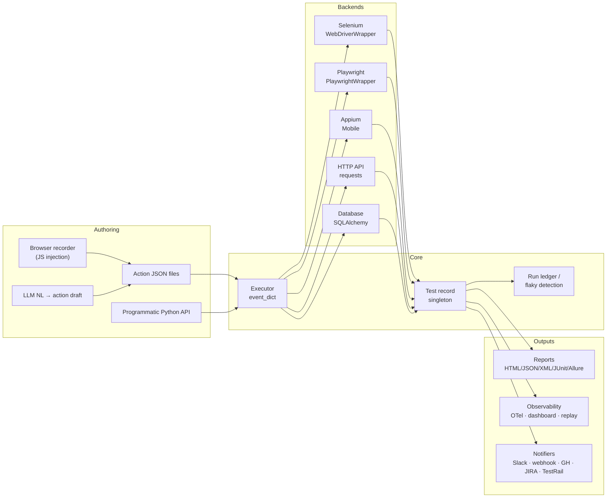
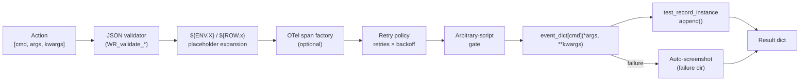
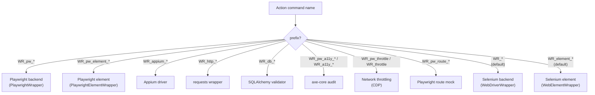

# WebRunner

<p align="center">
  <strong>跨平台網頁自動化：Selenium + Playwright，外加一個開箱即用、由 JSON 驅動的動作執行器。</strong>
</p>

<p align="center">
  <a href="https://pypi.org/project/je-web-runner/"></a>
  <a href="https://pypi.org/project/je-web-runner/"></a>
  <a href="https://github.com/Integration-Automation/WebRunner/blob/main/LICENSE"></a>
  <a href="https://webrunner.readthedocs.io/en/latest/"></a>
</p>

<p align="center">
  <a href="../README.md">English</a> |
  <a href="README_zh-CN.md">简体中文</a>
</p>

---

WebRunner（`je_web_runner`）最初只是一個 Selenium 封裝，如今已成長為一個完整的自動化平台：一個 Selenium 後端與一個 Playwright 後端，統一由一個 JSON 驅動的動作執行器排程，再加上用於報告、可觀測性、編排、安全與 AI 輔助的各類模組。每個執行器命令都有一個確定性的名稱（`WR_*`）和單一的分發點，因此一份動作 JSON 可以在同一個腳本裡混合瀏覽器、HTTP、資料庫與 webhook 呼叫。

> **自動產生的參考文件** —— 每個已註冊的 `WR_*` 命令（簽章 + 摘要）都匯出在 [`docs/reference/command_reference.md`](docs/reference/command_reference.md)，動作 JSON 檔案的 JSON Schema 則位於 [`docs/reference/webrunner-action-schema.json`](docs/reference/webrunner-action-schema.json)。

## 目錄

- [亮點特色](#亮點特色)
- [安裝](#安裝)
- [架構](#架構)
  - [系統總覽](#系統總覽)
  - [動作生命週期](#動作生命週期)
  - [後端分發](#後端分發)
  - [模組地圖](#模組地圖)
- [快速開始](#快速開始)
- [公開 API 與棄用政策](#公開-api-與棄用政策)
- [核心 API](#核心-api)
- [動作執行器](#動作執行器)
- [後端](#後端)
  - [Selenium（預設）](#selenium預設)
  - [Playwright（完整）](#playwright完整)
  - [Cloud Grid（雲端網格）](#cloud-grid雲端網格)
  - [Appium（行動端）](#appium行動端)
- [報告](#報告)
- [可觀測性](#可觀測性)
- [測試編排](#測試編排)
- [品質與安全](#品質與安全)
- [更多能力](#更多能力)
- [專項模組](#專項模組)
- [進階 WebDriverWrapper](#進階-webdriverwrapper)
- [瀏覽器內部機制](#瀏覽器內部機制)
- [測試資料](#測試資料)
- [認證與 API](#認證與-api)
- [錄製器](#錄製器)
- [CI / 整合](#ci--整合)
- [AI 輔助](#ai-輔助)
- [CLI 用法](#cli-用法)
- [測試記錄](#測試記錄)
- [例外處理](#例外處理)
- [日誌](#日誌)
- [支援的瀏覽器](#支援的瀏覽器)
- [支援的平台](#支援的平台)
- [授權](#授權)

## 亮點特色

- **兩個後端，一個執行器。** Selenium 為預設後端；Playwright 後端在 `WR_pw_*` 下鏡射了相同的操作面，完全依需選用。
- **動作 JSON 即契約。** 每個命令都透過 `Executor.event_dict` 解析；舊式別名與 snake_case 名稱並存以維持向後相容，並匯出 JSON Schema 供 IDE 自動補全。
- **五種格式的報告。** HTML、JSON、XML、JUnit XML（CI 原生）以及 Allure 結果檔案；單一清單（manifest）將每個輸出綁定起來，方便下游用萬用字元比對。
- **內建編排能力。** 標籤過濾、帶拓撲排序的相依宣告、由帳本支撐的只重跑失敗項、不穩定偵測、A/B 執行模式、多使用者矩陣、確定性分片、監看模式，以及一個以標準函式庫為基礎的排程器。
- **無須額外接線的可觀測性。** 失敗時自動截圖、重試策略、OpenTelemetry 掛鉤、即時 HTTP 儀表板、重播工作室（HTML 時間軸）、HAR 擷取 + 差異比對。
- **品質與安全守衛。** 動作 linter、遷移小幫手、硬編碼密鑰掃描器、HTTP 安全回應標頭稽核、axe-core 無障礙稽核、Lighthouse 執行器、效能指標（FCP/LCP/CLS）、視覺回歸、快照測試、網路限速、任意腳本閘門。
- **瀏覽器內部機制。** 原始 CDP、主控台 + 網路事件擷取、localStorage / sessionStorage / IndexedDB、service worker / 快取控制、穿透 Shadow DOM、多 iframe、檔案上傳 / 下載、瀏覽器擴充功能載入器。
- **進階 WebDriverWrapper 介面。** `set_driver(experimental_options=, extension_paths=, enable_bidi=)`、`attach_to_existing_browser`、原生 CDP 快捷方法（`set_timezone` / `set_locale` / `set_device_metrics` / `set_user_agent` / `set_extra_http_headers` / `set_geolocation` / `set_network_conditions` / `block_urls` / `set_cache_disabled` / `set_download_directory`）、Fetch 攔截原語（`enable_fetch_interception` / `continue_request` / `fulfill_request` / `fail_request`）、W3C BiDi 監聽器（`add_console_listener` / `add_js_error_listener`）、用於工作階段重用的 `save_cookies` / `load_cookies`、`save_full_page_screenshot`、`print_page`（PDF）、`reload(ignore_cache)`、`bring_to_front`、`switch_to_window_by_url|title`、頁面中繼資料取值器（`get_current_url` / `get_title` / `get_page_source` / `get_window_handles` / `new_window` / `close_window`）。以上全部也透過 `WR_*` 別名公開。
- **獨立的 CDP / BiDi 模組。** 背景 `CDPEventListener`（WebSocket 迴圈 + 同步的 `send` / `on` / 情境管理器）、用於產生 Chrome DevTools 可載入效能追蹤的 `record_trace(driver, path)`，以及封裝 `driver.network.add_request_handler` / `add_response_handler` / `add_auth_handler` 的 `bidi_network` 模組，用於跨瀏覽器請求攔截。
- **測試資料與固件。** Faker 整合、工廠模式、testcontainers（Postgres / Redis / 通用）、帶 `${ENV.X}` 佔位符展開的按環境 `.env` 載入器、帶 `${ROW.x}` 的 CSV/JSON 資料驅動執行器。
- **認證、API、資料庫。** 帶權杖快取的 OAuth2 / OIDC 用戶端憑證 / 密碼 / 更新權杖流程、帶 JSON 斷言的 HTTP API 測試命令、由 SQLAlchemy 支撐的資料庫驗證。
- **整合。** 帶權杖 + TLS 的 TCP 通訊端伺服器、BrowserStack / Sauce Labs / LambdaTest 雲端網格、Appium 行動端、JIRA + TestRail、Slack / 通用 webhook 通知器、GitHub Actions 內嵌註解、Locust 負載測試。
- **AI 掛鉤。** 可插拔的 LLM callable 驅動自我修復定位器和自然語言 → 動作 JSON 草稿。
- **跨平台與多瀏覽器。** Windows、macOS、Linux、Raspberry Pi · Chrome、Chromium、Firefox、Edge、IE、Safari · Chromium、Firefox、WebKit（Playwright）。

## 安裝

**穩定版：**

```bash
pip install je_web_runner
```

**開發版：**

```bash
pip install je_web_runner_dev
```

**選用相依套件**（每一項啟用一部分功能；只安裝你用到的）：

```bash
pip install playwright           # Playwright backend
python -m playwright install     # Browser binaries for Playwright
pip install Pillow               # Visual regression
pip install faker                # Random test data (WR_faker_*)
pip install sqlalchemy           # Database validation (WR_db_*)
pip install opentelemetry-sdk    # Distributed traces (WR_set_action_span_factory)
pip install Appium-Python-Client # Mobile native (WR_appium_*)
pip install testcontainers       # Spin up Postgres / Redis (WR_tc_*)
pip install locust               # Load testing (WR_locust_*)
```

硬性要求：Python **3.10+**、`selenium>=4.0.0`、`requests`、`python-dotenv`、`webdriver-manager`、`defusedxml`、`Pillow`。

## 架構

### 系統總覽



### 動作生命週期



### 後端分發



### 模組地圖

每個 `utils/` 子套件都附有一行摘要，並按核心引擎、`je_web_runner.api` 門面主題及其餘部分分組：[`docs/reference/utils_index.md`](docs/reference/utils_index.md)
（由 `scripts/gen_utils_index.py` 產生）。

```
je_web_runner/
├── __init__.py
├── __main__.py                    # CLI: --execute_dir / --watch / --tag / --shard / --migrate ...
├── element/web_element_wrapper.py
├── manager/webrunner_manager.py
├── webdriver/
│   ├── webdriver_wrapper.py             # Selenium core
│   ├── webdriver_with_options.py
│   ├── playwright_wrapper.py            # Playwright sync backend (full)
│   ├── playwright_element_wrapper.py
│   └── playwright_locator.py            # TestObject ↔ Playwright selector
└── utils/
    ├── ab_run/                  # A/B run mode (run_ab + diff_records)
    ├── accessibility/           # axe-core audit
    ├── ai_assist/               # Pluggable LLM scaffold
    ├── api/                     # HTTP API testing commands
    ├── appium_integration/      # Mobile native via Appium
    ├── auth/                    # OAuth2 / OIDC token helpers
    ├── callback/                # Callback executor
    ├── cdp/                     # Raw CDP passthrough
    ├── ci_annotations/          # GitHub Actions ::error::
    ├── cli/                     # CLI parser, watch mode, dispatch
    ├── cloud_grid/              # BrowserStack / Sauce Labs / LambdaTest
    ├── dashboard/               # Live progress HTTP server
    ├── database/                # SQL validation (SQLAlchemy)
    ├── data_driven/             # CSV/JSON dataset + ${ROW.x}
    ├── docs/                    # Auto-generated command reference
    ├── dom_traversal/           # Shadow DOM / iframe helpers
    ├── env_config/              # .env loader + ${ENV.X}
    ├── exception/               # Exception hierarchy
    ├── executor/                # Action executor + retry/screenshot/gate
    ├── extensions/              # Browser extension loaders
    ├── factories/               # Factory pattern helpers
    ├── file_process/            # File utilities
    ├── file_transfer/           # Upload / download helpers
    ├── generate_report/         # HTML/JSON/XML/JUnit/Allure + manifest
    ├── har_diff/                # HAR file diff
    ├── json/                    # JSON I/O + validator (length 1/2/3)
    ├── lighthouse/              # Lighthouse CLI runner
    ├── linter/                  # action_linter + migration
    ├── load_test/               # Locust wrapper
    ├── logging/                 # Rotating file handler
    ├── multi_user/              # Multi-user matrix runner
    ├── network_emulation/       # Throttling presets via CDP
    ├── notifier/                # Slack / generic webhooks
    ├── observability/           # Console+network capture · OTel
    ├── package_manager/         # Dynamic plugin loader
    ├── perf_metrics/            # FCP / LCP / CLS / TTFB
    ├── pom_generator/           # POM skeleton from URL/HTML
    ├── project/                 # Project template generator
    ├── recorder/                # JS-injection recorder + PII mask
    ├── replay_studio/           # HTML timeline studio
    ├── run_ledger/              # ledger · flaky · classifier
    ├── schema/                  # Action JSON Schema export
    ├── scheduler/               # stdlib-sched scheduled runner
    ├── secrets_scanner/         # Hard-coded credential scanner
    ├── security_headers/        # HTTP headers audit
    ├── selenium_utils_wrapper/  # Keys / Capabilities
    ├── self_healing/            # Fallback locator registry
    ├── service_worker/          # SW unregister + cache clear
    ├── sharding/                # Deterministic test sharding
    ├── snapshot/                # Text/DOM snapshot testing
    ├── socket_server/           # TCP server with token + TLS
    ├── storage/                 # localStorage / session / IDB
    ├── test_data/               # Faker integration
    ├── test_filter/             # Tag filter + dependency graph
    ├── test_management/         # JIRA + TestRail
    ├── test_object/             # TestObject + record
    ├── test_record/             # Action recording
    ├── testcontainers_integration/   # Postgres / Redis / generic
    ├── visual_regression/       # Pillow-based image diff
    └── xml/                     # XML utilities
```

## 範例手冊（Cookbook）

`examples/` 目錄提供了可直接執行的範例，會針對真實的 Chrome / 網路演練這些新的輔助函式。每個範例都從儲存庫根目錄呼叫：

| 範例 | 演示內容 |
|---|---|
| `counting_stars.{py,json}` | `WR_sleep`、帶 Chrome 旗標的 `WR_set_driver`、自動播放政策覆寫、由 JS 驅動的 `video.play()`、跳過廣告輪詢。 |
| `google_search.py` | 關閉同意提示、在搜尋框輸入、按 ENTER 送出、擷取結果標題。 |
| `form_submit.py` | 針對 `httpbin/forms/post` 的 `form_autofill.plan_fill_actions` + `state_diff.capture_state` 往返。 |
| `smart_wait_demo.py` | 針對真實頁面的 `wait_for_fetch_idle` + `wait_for_spa_route_stable` + `memory_leak.detect_growth`。 |
| `fanout_demo.py` | `fanout.run_fan_out` 平行 HTTP 預檢。 |
| `pii_redact_demo.py` | `pii_scanner.scan_text` + `redact_text` + `assert_no_pii`（純邏輯）。 |
| `quick_smoke.json` | 透過執行器 CLI 執行的最小 `WR_set_driver` → `WR_sleep` → `WR_execute_script` → `WR_quit_all` 冒煙測試。 |

直接執行一個 Python 範例：

```bash
python examples/google_search.py
```

透過執行器執行一個動作 JSON 範例：

```bash
python -m je_web_runner -e examples/quick_smoke.json
```

## 測試分層

```
test/
├── unit_test/         # mock-based unit tests
├── integration_test/  # wired-modules tests with real I/O
└── e2e_test/          # real-browser tests; skips without Selenium Grid
```

- **單元測試**（`test/unit_test/test_*.py`）—— 處處可執行；`test_dev.yml`
  和 `test_stable.yml` 都會拉入。
- **整合測試**（`test/integration_test/`）—— 用真實 SQLite、行程內 HTTP
  伺服器以及為 MCP / LSP 準備的真實子行程，把兩個及以上模組接線在一起。
  與單元測試相同的工作流程，第二步執行。
- **端對端測試**（`test/e2e_test/`）—— 透過 `WEBRUNNER_E2E_HUB`
  與 Selenium Grid 通訊。本機：`cd docker && docker compose up -d`。
  CI：`.github/workflows/e2e_browser.yml` 每日 / 依需求啟動 `selenium/hub:4.20.0`
  + `selenium/node-chrome`。

## 主題化 API 門面

80 多個工具輔助函式位於 `je_web_runner.utils.<area>` 下；為便於發現，
它們同時也在 `je_web_runner.api` 下重新匯出：

```python
from je_web_runner.api import (
    authoring,      # action_formatter, md_authoring, templates, sel_to_pw, bootstrap
    debugging,      # cross_browser, pr_comment, extension_harness
    frontend,       # device emulation, geo/locale, multi-tab, shadow pierce, …
    infra,          # driver pin, k8s runner, pipeline, lock, watch_mode, …
    mobile,         # Appium gestures
    networking,     # api_mock, contract_testing, GraphQL, mock services, har_replay
    observability,  # timeline, failure bundle, trace recorder, OTLP, BiDi, cdp_tap
    quality,        # a11y_diff, a11y_trend, perf budgets/drift, trend, failure cluster
    reliability,    # adaptive retry, browser pool, smart wait, throttler, supervisor
    security,       # PII, license, CSP, cookie consent, header tampering
    test_data,      # DB fixtures, fixture record/replay, form auto-fill
)
```

原有的 Selenium 風格頂層介面（`webdriver_wrapper_instance`、
`execute_action`、`TestObject`……）保持不變。

## 快速開始

### 直接 API

```python
from je_web_runner import TestObject, get_webdriver_manager, web_element_wrapper

manager = get_webdriver_manager("chrome")
manager.webdriver_wrapper.to_url("https://www.google.com")
manager.webdriver_wrapper.implicitly_wait(2)

search_box = TestObject("q", "name")
manager.webdriver_wrapper.find_element(search_box)
web_element_wrapper.click_element()
web_element_wrapper.input_to_element("WebRunner automation")

manager.quit()
```

### JSON 動作清單（現代別名）

```python
from je_web_runner import execute_action

actions = [
    ["WR_new_driver", {"webdriver_name": "chrome"}],
    ["WR_to_url", {"url": "https://www.google.com"}],
    ["WR_implicitly_wait", {"time_to_wait": 2}],
    ["WR_save_test_object", {"test_object_name": "q", "object_type": "NAME"}],
    ["WR_find_recorded_element", {"element_name": "q"}],
    ["WR_element_click"],
    ["WR_element_input", {"input_value": "WebRunner automation"}],
    ["WR_quit_all"],
]
execute_action(actions)
```

舊式名稱（`WR_get_webdriver_manager`、`WR_SaveTestObject`、`WR_quit`、`WR_input_to_element`……）仍可使用 —— 關於一鍵遷移小幫手，請參見[品質與安全](#品質與安全)。

### 混合位置參數與關鍵字參數

```python
[
    ["WR_to_url", ["https://example.com"], {"timeout": 30}],
]
```

驗證器接受長度為 1、長度為 2（`[cmd, dict_or_list]`）以及長度為 3（`[cmd, [positional], {kwargs}]`）的動作。

## 公開 API 與棄用政策

**哪些是公開的** —— 只有這些內容是其他程式碼應當相依的，也只有這些內容受本政策保護：

| 介面面 | 涵蓋內容 |
| --- | --- |
| 頂層名稱 | `je_web_runner.__all__` 中列出的一切（`from je_web_runner import …`） |
| CLI | `python -m je_web_runner` 的各旗標，包括原有的 `-e/--execute_file`、`-d/--execute_dir` 和 `--execute_str`（含 Windows 雙重編碼的 JSON） |
| 動作 JSON | 在 `executor.event_dict` 中註冊的 `WR_*` 命令名，以及動作檔案的 `webdriver_wrapper` / `meta` 頂層鍵 |
| 通訊端伺服器 | `start_web_runner_socket_server`、`send_command`、`read_frame`、`encode_frame` 以及長度前綴的分幀 |
| 受支援的模組路徑 | `je_web_runner.utils.executor.action_executor`（`executor`）、`je_web_runner.utils.logging.loggin_instance`（`web_runner_logger`、`WebRunnerLoggingHandler`）、`je_web_runner.webdriver.webdriver_wrapper`（`WebDriverWrapper`、`webdriver_wrapper_instance`，以及 `_options_dict` / `_webdriver_dict` / `_webdriver_manager_dict` 修補目標） |

這三個模組路徑之所以受支援，是因為其他儲存庫已經匯入它們：AutoControlGUI 的
WebRunner 橋接取用 `executor`，Jeffrey_RPA 以那個確切（拼寫有誤）的名稱
掛鉤 `loggin_instance` 並對封裝字典打修補。它們被視為公開，而不是被要求遷移。
如果其中任何一個消失，`test/unit_test/test_public_api.py` 就會失敗。

**哪些不是公開的**：`je_web_runner.utils.` 下的其餘所有模組、除上述修補目標之外
任何以底線開頭命名的東西、報告檔案的結構，以及日誌格式。它們可以在任意
版本中移動。

**退役某個公開項**

1. 替代項先發布，舊名稱作為別名繼續可用。
2. 別名擲出 `DeprecationWarning` 指明替代項，並在發行說明中說明。
3. 別名至少再保留兩個後續版本才可移除，且只有明確說明移除的版本才可刪除它。
4. 在 `architecture.md` §6 中列為跨專案契約的名稱有所不同：它絕不會在沒有
   消費方儲存庫於同一輪一起變更的情況下改變，並且雙方的 §6 都要更新。

## 核心 API

原有的 Selenium 風格 API 仍是程式化使用的規範進入點。從原始 README 保留的各節：

- **WebDriver Manager** —— `get_webdriver_manager`、`new_driver`、`change_webdriver`、`close_choose_webdriver`、`quit`。
- **WebDriver Wrapper** —— `to_url`、`forward`、`back`、`refresh`、`find_element`、`find_elements`、`implicitly_wait`、`explict_wait`（別名 `WR_explicit_wait`）、`set_script_timeout`、`set_page_load_timeout`、完整的由 ActionChains 支撐的滑鼠/鍵盤介面、cookies、`execute_script`、視窗管理、截圖、frame/window/alert 切換、`get_log`。
- **Web Element Wrapper** —— `click_element`、`input_to_element`、`clear`、`submit`、`get_attribute`、`get_property`、`get_dom_attribute`、`is_displayed`、`is_enabled`、`is_selected`、`value_of_css_property`、`screenshot`、`change_web_element`、`check_current_web_element`，以及新增的 `select_by_value` / `select_by_index` / `select_by_visible_text`。
- **TestObject** —— `TestObject(name, type)`、`create_test_object`、`get_test_object_type_list`（回傳 `['ID', 'NAME', 'XPATH', 'CSS_SELECTOR', 'CLASS_NAME', 'TAG_NAME', 'LINK_TEXT', 'PARTIAL_LINK_TEXT']`）。

各介面面的程式化範例與前一版保持一致；完整程式碼片段見 `docs/source/Eng/doc/` 下相應的 Sphinx 頁面。

## 動作執行器

執行器將字串命令名對應到一個 Python callable。每個後端、整合與輔助函式都在 `event_dict` 下註冊。

### 動作形態

```python
["command"]                                    # no args
["command", {"key": "value"}]                  # kwargs
["command", [arg1, arg2]]                      # positional
["command", [arg1], {"key": "value"}]          # positional + kwargs (length 3)
```

### 長度為 3 的範例

```python
[
    ["WR_pw_evaluate", ["() => document.title"], {"arg": None}],
]
```

### 節奏控制動作

`WR_sleep` 會將執行器執行緒阻塞指定的秒數 —— 當頁面需要沉降時間、當某個 JS 動畫需要完成時，或當某個範例想讓瀏覽器保持開啟以便使用者觀看時，都很有用：

```python
[
    ["WR_to_url", {"url": "https://example.com"}],
    ["WR_sleep", {"seconds": 2.5}],
    ["WR_get_screenshot_as_png"],
]
```

負數或非數字的 `seconds` 會擲出 `ValueError`。若要在 JavaScript 內部進行節奏控制（例如等待來自頁面的自訂事件），請使用帶有 `setTimeout` 驅動回呼的 `WR_execute_async_script`。

### 頂層形態

```python
[ ...actions... ]                                                  # bare list

{
  "webdriver_wrapper": [ ...actions... ],
  "meta": {"tags": ["smoke", "fast"], "depends_on": ["login"]}     # optional
}
```

`meta.tags` 與 `meta.depends_on` 會被 CLI 擷取，用於過濾和拓撲執行。

### 新增自訂命令

```python
from je_web_runner import add_command_to_executor

def my_step(name: str) -> None:
    print(f"hello {name}")

add_command_to_executor({"my_command": my_step})
```

### 重試、截圖與腳本

```python
from je_web_runner.utils.executor.action_executor import executor

executor.set_retry_policy(retries=2, backoff=0.5)             # global retry
executor.set_failure_screenshot_dir("./failures")              # auto PNG on raise
executor.set_allow_arbitrary_script(False)                     # gate WR_execute_script / WR_pw_evaluate / WR_cdp
```

## 後端

### Selenium（預設）

Selenium 是最初的後端。除非明確使用 `WR_pw_*` / `WR_appium_*` 前綴，否則每個舊式命令（及其現代別名）都路由到這裡。

### Playwright（完整）

Playwright 後端在 `WR_pw_*` 下鏡射了 Selenium 封裝的操作面：

- **生命週期 / 頁面 / 導覽** —— `WR_pw_launch`、`WR_pw_quit`、`WR_pw_new_page`、`WR_pw_switch_to_page`、`WR_pw_close_page`、`WR_pw_to_url`、`WR_pw_forward`、`WR_pw_back`、`WR_pw_refresh`、`WR_pw_url`、`WR_pw_title`、`WR_pw_content`。
- **尋找** —— `WR_pw_find_element`、`WR_pw_find_elements`、`WR_pw_find_element_with_test_object_record`、`WR_pw_find_with_healing`。
- **頁面級快捷方法** —— `WR_pw_click`、`WR_pw_dblclick`、`WR_pw_hover`、`WR_pw_fill`、`WR_pw_type_text`、`WR_pw_press`、`WR_pw_check`、`WR_pw_uncheck`、`WR_pw_select_option`、`WR_pw_drag_and_drop`。
- **元素級（在 `WR_pw_find_element_with_test_object_record` 之後）** —— `WR_pw_element_click`、`WR_pw_element_dblclick`、`WR_pw_element_fill`、`WR_pw_element_type_text`、`WR_pw_element_press`、`WR_pw_element_check`、`WR_pw_element_uncheck`、`WR_pw_element_select_option`、`WR_pw_element_get_attribute`、`WR_pw_element_inner_text`、`WR_pw_element_inner_html`、`WR_pw_element_is_visible`、`WR_pw_element_is_enabled`、`WR_pw_element_is_checked`、`WR_pw_element_scroll_into_view`、`WR_pw_element_screenshot`、`WR_pw_element_change`。
- **腳本 / cookies / 等待 / 視埠 / 滑鼠 / 鍵盤 / frames** —— `WR_pw_evaluate`、`WR_pw_get_cookies`、`WR_pw_add_cookies`、`WR_pw_clear_cookies`、`WR_pw_screenshot`、`WR_pw_wait_for_selector`、`WR_pw_wait_for_load_state`、`WR_pw_wait_for_timeout`、`WR_pw_wait_for_url`、`WR_pw_set_viewport_size`、`WR_pw_mouse_*`、`WR_pw_keyboard_*`。
- **行動端模擬 / 地區 / 時鐘** —— `WR_pw_emulate("iPhone 13")`、`WR_pw_set_locale`、`WR_pw_set_timezone`、`WR_pw_clock_install` / `_set_time` / `_run_for`、`WR_pw_set_geolocation`、`WR_pw_grant_permissions`。
- **HAR + 路由模擬** —— `WR_pw_start_har_recording`、`WR_pw_stop_har_recording`、`WR_pw_route_mock`、`WR_pw_route_mock_json`、`WR_pw_route_unmock`、`WR_pw_route_clear`。

現有腳本可以逐步遷移到 Playwright；`TestObject` 記錄會自動翻譯為 Playwright 選擇器（`CSS_SELECTOR` → 原樣，`XPATH` → `xpath=…`，`ID` → `#…`，`NAME` → `[name="…"]`，`LINK_TEXT` → `text=…`，`PARTIAL_LINK_TEXT` → `:has-text("…")`）。

### Cloud Grid（雲端網格）

```python
from je_web_runner.utils.cloud_grid.cloud_drivers import (
    connect_browserstack,
    build_browserstack_capabilities,
)

connect_browserstack(
    username="...",
    access_key="...",
    capabilities=build_browserstack_capabilities(
        browser_name="chrome",
        browser_version="latest",
        os_name="Windows",
        os_version="11",
        project="WebRunner",
        build="ci-2026-04-26",
    ),
)
# All existing WR_* commands now run against the cloud session.
```

`connect_saucelabs` 與 `connect_lambdatest` 遵循相同的形態。

### Appium（行動端）

```python
from je_web_runner.utils.appium_integration.appium_driver import (
    start_appium_session,
    build_android_caps,
    build_ios_caps,
)

start_appium_session(
    "https://appium.example/wd/hub",
    capabilities=build_android_caps(app="/path/to/app.apk"),
)
# WR_* commands now drive the mobile session.
```

## 報告

```python
from je_web_runner import (
    generate_html_report,
    generate_json_report,
    generate_xml_report,
    generate_junit_xml_report,
    generate_allure_report,
)
from je_web_runner.utils.generate_report.report_manifest import generate_all_reports

# Run every generator + write a manifest binding all outputs:
result = generate_all_reports("run_2026_04_26", allure_dir="allure-results")
print(result["manifest_path"])  # → run_2026_04_26.manifest.json
```

| 格式      | 輸出形態                                                 | 規格驅動？   |
|-----------|----------------------------------------------------------|--------------|
| JSON      | `<base>_success.json` + `<base>_failure.json`            | 拆分         |
| HTML      | `<base>.html`                                            | 單個         |
| XML       | `<base>_success.xml` + `<base>_failure.xml`              | 拆分         |
| JUnit XML | `<base>_junit.xml`                                       | 單個         |
| Allure    | `<allure_dir>/<uuid>-result.json`（× N）                 | 目錄         |

清單會擷取實際產出的路徑 —— CI 的萬用字元不再需要知道每種格式的慣例。

## 可觀測性

```python
from je_web_runner import (
    test_record_instance,
    summarise_run,
    notify_run_summary,
)
from je_web_runner.utils.executor.action_executor import executor
from je_web_runner.utils.observability.otel_tracing import install_executor_tracing
from je_web_runner.utils.dashboard.live_dashboard import start_dashboard
from je_web_runner.utils.replay_studio.replay_studio import export_replay_studio

executor.set_failure_screenshot_dir("./failures")
install_executor_tracing("webrunner")                 # one OTel span per action
start_dashboard("127.0.0.1", 8080)                    # browser-friendly progress UI
test_record_instance.set_record_enable(True)

# … run actions …

export_replay_studio("./run.html", screenshot_dir="./failures")
notify_run_summary("https://hooks.slack.com/services/...")
```

失敗截圖、OpenTelemetry 追蹤、重試策略以及即時儀表板都掛接到同一個 `Executor.event_dict`，因此它們可以組合而不產生耦合。

## 測試編排

```bash
# Filter by tag, run in parallel processes, persist a ledger, fail fast on dep breaks.
python -m je_web_runner \
    --execute_dir ./actions \
    --tag smoke,fast \
    --exclude-tag slow \
    --parallel 4 \
    --parallel-mode process \
    --ledger ./.run_ledger.json

# Re-run only the files that failed last time:
python -m je_web_runner --execute_dir ./actions --rerun-failed ./.run_ledger.json

# Watch a directory and re-run on file change:
python -m je_web_runner --execute_dir ./actions --watch ./actions

# Distribute across 4 runners deterministically (per machine):
python -m je_web_runner --execute_dir ./actions --shard 1/4
python -m je_web_runner --execute_dir ./actions --shard 2/4
python -m je_web_runner --execute_dir ./actions --shard 3/4
python -m je_web_runner --execute_dir ./actions --shard 4/4
```

配套 API —— `WR_run_for_users`（多使用者矩陣）、`WR_run_ab`（A/B 模式）、`WR_flakiness_stats`、`WR_classify_failure`、`WR_schedule` + `WR_run_scheduler_for`。

## 品質與安全

- **動作 linter** —— `WR_lint_action` / `WR_lint_action_file` 標記舊式命令名、硬編碼 URL、危險腳本、缺失標籤、連續重複動作。
- **遷移小幫手** —— `python -m je_web_runner --migrate ./actions` 將十一個舊式別名重寫為其偏好名稱（`--migrate-dry-run` 只報告而不寫入）。
- **硬編碼密鑰掃描器** —— `WR_scan_secrets_file` / `WR_assert_no_secrets` 在 AWS / GitHub / Slack / JWT / Google / 私鑰字串落入提交之前將其攔截。
- **安全回應標頭稽核** —— `WR_audit_security_headers_url` 檢查 HSTS / CSP / X-Frame-Options / X-Content-Type-Options / Referrer-Policy / Permissions-Policy。
- **無障礙稽核** —— `WR_a11y_run_audit` 注入使用者提供的 axe-core（`load_axe_source`）並針對作用中的工作階段執行；Playwright 變體為 `WR_pw_a11y_run_audit`。
- **Lighthouse** —— `WR_lighthouse_run` 外殼呼叫官方的 `lighthouse` Node CLI；`WR_lighthouse_assert_scores` 強制執行預算。
- **頁面效能指標** —— `WR_perf_collect` / `WR_pw_perf_collect` 透過 `PerformanceObserver` 快照 FCP / LCP / CLS / TTFB / domContentLoaded / load；`WR_perf_assert_within` 檢查閾值。
- **視覺回歸** —— `WR_visual_capture_baseline` + `WR_visual_compare`（Pillow 軟相依）。
- **快照測試** —— `WR_match_snapshot` / `WR_update_snapshot`（文字/DOM，不符時輸出統一差異）。
- **網路限速** —— `WR_throttle("slow_3g")` / `WR_pw_throttle("offline")`；預設涵蓋 Slow 3G、Fast 3G、Regular 4G、Wi-Fi、Offline、no-throttling。
- **HAR 差異** —— `WR_diff_har` / `WR_diff_har_files` 顯示兩次執行之間新增 / 移除 / 狀態變化的請求。
- **任意腳本閘門** —— `executor.set_allow_arbitrary_script(False)` 為不可信的動作 JSON 阻擋 `WR_execute_script` / `WR_execute_async_script` / `WR_pw_evaluate` / `WR_cdp` / `WR_pw_cdp`。

## 擴充能力

可靠性與不穩定縮減：

- **自適應重試** —— `je_web_runner.utils.adaptive_retry.run_with_retry(fn, policy=...)` 只重播分類器標記為瞬態 / 不穩定 / 環境的失敗；真正的 bug 會短路。
- **定位器強度評分器** —— `linter.locator_strength.score_locator(strategy, value)` 將定位器評為 0–100 分；`assert_strength` 在脆弱的 XPath / TAG_NAME 選取上讓 CI 失敗。
- **智慧等待** —— `smart_wait.wait_for_fetch_idle` 與 `wait_for_spa_route_stable` 對 `window.fetch` 和 `history.pushState` 打修補以偵測 SPA 靜默 —— 不再需要 `time.sleep`。
- **服務限流器** —— `throttler.throttle("payments-api")` 是一個檔案號誌，用於限制共享服務上的跨分片並行。

除錯與可觀測性：

- **時間軸合併器** —— `observability.timeline.build(spans=, console=, responses=)` 將 OTel spans、主控台訊息和網路回應合併為一個按時間順序排序的事件清單。
- **失敗包** —— `failure_bundle.FailureBundle("login_test", error_repr).add_screenshot(...).write("bundle.zip")` 將截圖 / DOM / 網路 / 主控台 / 追蹤打包進單個帶清單的可重播 zip。
- **記憶體洩漏偵測器** —— `memory_leak.detect_growth(driver, action, iterations=10, growth_bytes_per_iter_budget=...)` 輪詢 `performance.memory.usedJSHeapSize`，並在線性擬合成長超出預算時失敗。
- **Playwright 追蹤錄製器** —— `trace_recorder.TraceRecorder(output_dir="trace-out").start(context, name); …; .stop(context)` 始終寫出一個可用 `playwright show-trace` 檢視的 `.zip`。
- **CSP 報告器** —— `csp_reporter.CspViolationCollector` 注入一個 `securitypolicyviolation` 監聽器並公開 `assert_none()` / `assert_no_directive("script-src")`。

測試資料與確定性：

- **錄製/重播固件** —— `snapshot.fixture_record.FixtureRecorder("fx.json", mode="auto")` 首次儲存生產者的輸出，之後永遠重播。
- **資料庫固件載入器** —— `database.fixtures.load_fixture_file("seed.json")` + `load_into_connection(conn, fixture)` 從一個 `{table: [rows]}` JSON 為 testcontainers 的 Postgres / MySQL / SQLite 播種。

API 與契約測試：

- **API 模擬** —— `api_mock.MockRouter().add("GET", "/api/users/*", body={"id": 1}).attach_to_page(page)` 攔截 Playwright 路由；支援 URL 萬用字元與 `re:` 正規表示式模式。
- **契約測試** —— `contract_testing.validate_response(body, schema)` 執行 JSON-Schema 的一個子集；`validate_against_openapi(body, doc, "/users/{id}", "GET", 200)` 解析 `$ref` 並為回應狀態檢查正確的 schema。
- **GraphQL 輔助** —— `graphql.GraphQLClient("https://api/graphql").execute("{ me { id } }")`；`extract_field(payload, "me.id")` 透過點分路徑擷取值。
- **行程內模擬服務** —— `mock_services.MockOAuthServer().start()` 簽發假的 bearer 權杖，`MockSmtpServer` 擷取寄出的郵件，`MockS3Storage` 是一個記憶體 KV。

安全探測：

- **請求標頭竄改** —— `header_tampering.HeaderTampering().set_header("X-Forwarded-For", "192.0.2.1").attach_to_page(page)` 變更出站請求，讓測試者可探測缺失-CSRF / 錯誤-origin / 剝離-auth 的處理。
- **授權掃描器** —— `license_scanner.scan_text(bundle_text)` 尋找 SPDX 識別碼和已知的授權措辭（AGPL/GPL/MIT/Apache-2.0/MPL/ISC/BSD），使 SBOM 閘門可以 `assert_allowed_licenses`。

瀏覽器與地區：

- **裝置模擬預設** —— `device_emulation.playwright_kwargs("iPhone 15 Pro")` 與 `apply_to_chrome_options(opts, "Desktop 1080p")`；一次呼叫完成視埠 + DPR + UA + touch。
- **地理 / 時區 / 地區** —— `geo_locale.GeoOverride(latitude=51.5, longitude=-0.13, timezone="Europe/London", locale="en-GB")` 同時產出 CDP 命令和 Playwright `new_context` kwargs。
- **多分頁編排器** —— `multi_tab.TabChoreographer().open_new(driver, "side", url=...)` 按別名註冊分頁，使動作 JSON 可以 `WR_switch_tab("side")`。
- **WebAuthn 虛擬認證器** —— `webauthn.enable_virtual_authenticator(driver)` 使用 CDP `WebAuthn.*` 模擬 passkey / FIDO2 登入流程。
- **Cookie 同意關閉器** —— `cookie_consent.ConsentDismisser().dismiss(driver)` 點擊首個相符的 OneTrust / TrustArc / Cookiebot / Didomi / Quantcast 按鈕；選擇器清單可透過 `register_selector` 擴充。

報告與 CI：

- **PR 留言發布器** —— `pr_comment.post_or_update_comment("owner/repo", 42, body, token=...)` 藉由隱藏的 HTML 標記實現冪等，因此重試的 CI 執行不會堆積。
- **趨勢儀表板** —— `trend_dashboard.compute_trend("ledger.json")` 按天對帳本分桶；`render_html(trend)` 產出一個自包含的 SVG 折線圖 + 表格。

編排與開發者體驗：

- **動作範本庫** —— `action_templates.render_template("login_basic", {...})` 在內建流程（login、accept-cookies、switch-locale、close-modal）中替換 `{{placeholders}}`。
- **差異感知分片** —— `sharding.diff_shard.select_for_changed(candidates, base_ref="main")` 將候選篩選為目前分支 `git diff` 觸及的那些。
- **監看模式** —— `watch_mode.watch_loop(directory, on_change=callback, interval=0.5)` 在 JSON 檔案變化時重新執行回呼。
- **Kubernetes 執行器** —— `k8s_runner.render_job_manifests(ShardJobConfig(name_prefix="run", image=..., total_shards=8, actions_dir="/actions"))` 為每個分片產出一個 `batch/v1 Job`。
- **按路由的效能預算** —— `perf_metrics.budgets.evaluate_metrics("/checkout", {"lcp_ms": 2300}, budgets)` 加上 `assert_within_budget(result)` 強制執行按路由的閾值。

AI 輔助：

- **失敗根因分析** —— `ai_assist.llm_assist.explain_failure(test_name, error_repr, console=, network=, steps=)` 請求已註冊的 LLM 回傳 `{likely_cause, evidence, next_steps, confidence}`。

## MCP 伺服器

WebRunner 隨附一個 [Model Context Protocol](https://modelcontextprotocol.io/) 伺服器，因此任何支援 MCP 的用戶端（Claude、IDE 外掛等）都能透過 JSON-RPC stdio 驅動 WebRunner。

```bash
python -m je_web_runner.mcp_server
```

預設工具清單（22 個工具）公開：

即時瀏覽器執行：
- `webrunner_run_actions` —— 執行任意 `WR_*` 動作清單。涵蓋全部 444 個 `WR_*` 命令，包括進階 WebDriverWrapper 新增項：`WR_attach_to_existing_browser`、`WR_execute_cdp_cmd`、`WR_set_timezone` / `_locale` / `_device_metrics` / `_user_agent` / `_extra_http_headers` / `_geolocation` / `_network_conditions`、`WR_block_urls` / `_set_cache_disabled` / `_set_download_directory`、`WR_save_cookies` / `_load_cookies` / `_clear_origin_storage`、`WR_save_full_page_screenshot` / `_print_page`、`WR_reload(ignore_cache=True)`、`WR_bring_to_front`、`WR_switch_to_window_by_url|title`、`WR_new_window` / `_close_window`、頁面中繼資料取值器、Fetch 攔截原語、`WR_add_script_to_evaluate_on_new_document`……
- `webrunner_run_action_files` —— 批次執行磁碟上的 JSON 檔案
- `webrunner_list_commands` —— 探索完整的 `WR_*` 介面面

外加以下工具（無即時瀏覽器）：

動作 JSON 撰寫與檢查：
- `webrunner_lint_action`、`webrunner_score_action_locators`、`webrunner_locator_strength`
- `webrunner_format_actions`、`webrunner_parse_markdown`、`webrunner_render_template`
- `webrunner_translate_actions_to_playwright`、`webrunner_translate_python_to_playwright`

程式碼產生：
- `webrunner_pom_from_html`

品質 / 分流：
- `webrunner_a11y_diff`、`webrunner_cluster_failures`、`webrunner_compute_trend`

安全與隱私：
- `webrunner_scan_pii`、`webrunner_redact_pii`

報告與契約：
- `webrunner_summary_markdown`、`webrunner_validate_response`

分片與基礎設施：
- `webrunner_diff_shard`、`webrunner_render_k8s`、`webrunner_partition_shard`

```python
from je_web_runner.mcp_server import McpServer, Tool, build_default_tools, serve_stdio

# Or build a custom server
server = McpServer()
for tool in build_default_tools():
    server.register(tool)
server.register(Tool(
    name="my_custom_tool",
    description="…",
    input_schema={"type": "object", "properties": {"x": {"type": "string"}}},
    handler=lambda args: f"hello {args['x']}",
))
serve_stdio(server=server)
```

該伺服器講的是 MCP `2024-11-05`：`initialize`、`tools/list`、`tools/call`、`resources/list`、`ping`、`shutdown`。

## 動作 JSON LSP

一個用於動作 JSON 檔案的標準 Language Server Protocol 實作：

```bash
python -m je_web_runner.action_lsp
```

`textDocument/completion` 回傳每個已註冊的 `WR_*` 命令；`textDocument/publishDiagnostics` 在 `didOpen` / `didChange` 時執行動作 linter。可與 VS Code 的 *Configure JSON Language Servers* 或 JetBrains LSP 外掛搭配使用。

## 更多能力

更小的模組，按其協助解決的問題分組。較大的領域在上文以及[專項模組](#專項模組)中有各自的章節。

### CLI 與編排優化

- **正規表示式測試選擇器** —— `test_filter.name_filter.filter_paths(paths, include=["smoke.*"], exclude=["slow"])` 只保留相符的候選路徑；與現有的標籤過濾正交。
- **行程監督者** —— `process_supervisor.ProcessSupervisor().kill_orphans()` 走訪作業系統行程表尋找 `chromedriver` / `geckodriver` / `msedgedriver` 並殺掉殘留（自動跳過 `os.getpid()`）。`with_watchdog(callable, timeout_seconds=300)` 用一個硬性掛鐘逾時擲出來包裹長時可呼叫物件。
- **流水線 DSL** —— `pipeline.load_pipeline({"stages": [...]})` + `run_pipeline(pipeline, runner)` 執行多階段閘門：`continue_on_failure=True` 讓某階段非阻塞（linters / 掃描器），否則下游階段跳過。

### 前端 / 行動端 / 覆蓋率

- **Storybook 視覺快照** —— `storybook.visual_snapshots.capture_story_snapshots(stories, base_url, take_screenshot, navigate, baseline_dir=...)` 走訪每個 story，持久化確定性檔名（`components-button--primary.png`），並與選用基準做差異比對。`assert_no_visual_regressions(report)` 是閘門。
- **Appium 手勢** —— `appium_integration.gestures` 提供 `swipe`、`scroll`、`long_press`、`pinch`、`double_tap`，優先使用 Appium 的 `mobile:` 具名手勢擴充，在較舊驅動上回退到 W3C Actions。
- **覆蓋率地圖** —— `coverage_map.build_coverage_map("./actions")` 走訪每個動作 JSON 檔案，正規化 `WR_to_url` 路徑（`/users/42` → `/users/:id`）並產出一個路由 → 檔案的反向索引。`coverage.uncovered(declared_routes)` 回答「哪些路由沒有測試？」。

### 除錯與可重現性

- **CDP 訊息擷取** —— `cdp_tap.CdpRecorder("cdp.ndjson").attach(driver)` 包裹 `execute_cdp_cmd`，使每個命令 + 回傳值都附加到一個 ndjson 日誌；`CdpReplayer(load_recording(...))` 針對一個樁重播它以進行離線除錯。
- **跨瀏覽器一致性** —— `cross_browser.diff_runs([chromium_run, firefox_run, webkit_run])` 比對標題 / DOM 雜湊 / 主控台 / 網路狀態 / 截圖雜湊，將每個發現分類為 `major`（5xx、標題、DOM 不符）或 `minor`。`assert_parity(report, only_major=True)` 是閘門。
- **瀏覽器狀態差異** —— `state_diff.capture_state(driver)` 快照 cookies + localStorage + sessionStorage；`diff_states(before, after)` 按分區列出新增 / 移除 / 變更的鍵，使購物車 / 認證流程保持可追蹤。

### 撰寫 / 鷹架

- **頁面物件程式碼產生** —— `pom_codegen.discover_elements_from_html(html)` 走訪每個帶 `data-testid` / `id` / 表單 `name` 的元素；`render_pom_module(elements, class_name="LoginPage")` 回傳一個每元素一個 `TestObject` 屬性的 Python 模組。

### CI 可重現性

- **工作區鎖定檔** —— `workspace_lock.build_lock(drivers=..., playwright_versions={"chromium": "127.0.0.0"})` 快照每個 Python 發行版 + 驅動版本 + Playwright 瀏覽器版本；`write_lock(lock, ".webrunner/lock.json")` 和 `diff_locks(before, after)` 完成這條流水線。

### 長時執行的可觀測性

- **無障礙趨勢儀表板** —— `a11y_trend.aggregate_history(history)` 按天和影響程度對 axe 執行分桶；`render_html(points)` 產出一個自包含的 SVG 折線圖，使回歸一眼可見。
- **效能漂移偵測器** —— `perf_drift.detect_drift({"lcp_ms": samples}, baseline_window=20, recent_window=5)` 將近期 P95 與滾動基準 P95 比較，並標記超出 `tolerance` 的漂移。`assert_no_regression(report)` 是嚴格路徑；`higher_is_better={"frame_rate"}` 用於反向指標。

### 撰寫 / 格式化

- **動作 JSON 格式化器** —— `action_formatter.format_actions(actions)` 寫出一個規範的多行陣列，kwargs 按穩定的「偏好優先再字母序」排列；`format_file(path)` 就地重格式化並報告 `(text, changed)`。
- **Markdown → 動作 JSON** —— `md_authoring.parse_markdown(text)` 理解 `- open <url>`、`- click #id`、`- type "x" into <selector>`、`- wait 3s`、`- assert title "..."`、`- press Enter`、`- screenshot`、`- run template <name>`、`- quit`。不相符的行會保留為 `WR__note`，使往返無損。

### 分流 / 生產可觀測性

- **失敗聚類** —— `failure_cluster.cluster_failures(failures, top_n=5)` 將每條錯誤訊息歸約為一個穩定簽章（剝離時間戳記、十六進位位址、行號、路徑、大數字、引號子字串），使跨執行的同一根因落入一個桶。
- **合成監控** —— `synthetic_monitoring.SyntheticMonitor(alert_sink).register("homepage", check)` 重跑檢查；sink 只在邊緣轉換（`green → red` / `red → green`）時觸發，並用 `failure_threshold` / `recovery_threshold` 抑制抖動。
- **OTLP 匯出器** —— `observability.otlp_exporter.configure_otlp_export(provider, OtlpExportConfig(endpoint="https://otlp:4317"))` 將現有的 OTel spans 送往 Jaeger / Tempo / 任意 OTLP 後端（預設 gRPC，HTTP 回退）。

### 前端 / 元件

- **Storybook 整合** —— `storybook.discover_stories(index_path)` 讀取 Storybook 7+ 的 `index.json`（或舊式 `stories.json`）；`plan_actions_for_stories(stories, base_url, run_a11y=True)` 建構一個平鋪的動作清單，以 iframe 模式造訪每個 story 並執行 axe + 截圖。
- **Shadow DOM 自動穿透** —— `dom_traversal.shadow_pierce.find_first(driver, "button.primary")` 遞迴走訪開放的 shadow root（Selenium `execute_script` 或 Playwright `evaluate`），使單個 CSS 選擇器可跨 shadow 邊界相符。

### 上手 / 遷移

- **工作區引導器** —— `bootstrapper.init_workspace("my-tests")` 放置 `actions/sample.json`、`.webrunner/ledger.json`、固定驅動範本、JSON schema、pre-commit 掛鉤，以及一個起步的 GitHub Actions 工作流程。
- **驅動固定器** —— `driver_pin.install_for_browser(".webrunner/drivers.json", "firefox")` 讀取一個 JSON pin 檔案（`name` / `version` / `url` / `archive_format` / `binary_inside`），下載 + 解壓一次，然後從快取提供。繞過 webdriver-manager 在 CI 中命中的 GitHub API 速率限制。
- **Selenium → Playwright 翻譯器** —— `sel_to_pw.translate_python_source(text)` 將 `driver.find_element(By.ID, "x")` 重寫為 `page.locator("#x")` 之類；`translate_action_list(actions)` 將 `WR_*` 動作 JSON 重寫為其 `WR_pw_*` 等價物（丟棄 `WR_implicitly_wait`，因為 Playwright 會自動等待）。

### 測試撰寫

- **表單自動填入** —— `form_autofill.plan_fill_actions(fields, fixture, submit_locator=...)` 從 `data-testid` / `id` / `name` / `placeholder` / `label` / `type` 推斷每個欄位，並發出一個可直接執行的 `WR_save_test_object` + `WR_element_input` 序列。

### 品質

- **無障礙差異** —— `accessibility.a11y_diff.diff_violations(baseline, current)` 將 axe-core 發現以 `(rule_id, target)` 為鍵分桶為 `added` / `resolved` / `persisting`；`assert_no_regressions(diff, allow_rules=...)` 是 CI 閘門。

### 效能 / 編排

- **扇出** —— `fanout.run_fan_out([("preflight-a", task_a), task_b, ...], max_workers=4)` 在一個測試內並行執行唯讀可呼叫物件，回傳每任務的耗時 + 結果，並以 `raise_for_failures()` 提供嚴格路徑。
- **事件匯流排** —— `event_bus.EventBus(".webrunner/events.log").publish("setup-done", {"shard": 1})`；訂閱者從記住的偏移量 `poll()`，或 `wait_for(topic, predicate=..., timeout=30)`。檔案支撐的 ndjson —— 無 Redis 相依。

### 瀏覽器內部機制

- **擴充功能測試裝置** —— `extension_harness.parse_manifest("./ext")` 讀取 MV2 / MV3 manifest；`apply_to_chrome_options(options, [ext_dir])` 新增 `--load-extension` 旗標；`playwright_persistent_context_args(...)` 回傳 `launch_persistent_context` 所需的 kwargs。

### 可靠性與開發循環

- **瀏覽器池** —— `browser_pool.BrowserPool(factory, size=4, max_uses=50).warm()`；`with pool.session() as ses: …` 從本機開發中移除瀏覽器冷啟動。內建健康檢查 + 回收策略。
- **WebDriver BiDi 橋接** —— `bidi_backend.BidiBridge().subscribe(target, "console", callback)` 可針對 Selenium 4 BiDi（`driver.script.add_console_message_handler`）或 Playwright `page.on(...)` 運作。`register_translator` 讓你接線自訂事件名。

### 確定性與離線執行

- **HAR 重播伺服器** —— `har_replay.HarReplayServer(load_har("recorded.har")).start()` 啟動一個本機 HTTP 伺服器，提供錄製的回應；支援字面 / glob / `re:` URL 比對並在重複項間輪換。可直接替代預備 API 的停機。

### 品質 / 隱私

- **PII 掃描器** —— `pii_scanner.scan_text(text)` 尋找電子郵件、E.164 電話、Luhn 驗證的信用卡、美國 SSN、中華民國身分證號和 IPv4。`assert_no_pii(text, allow_categories=...)` 用於 CI 閘門；`redact_text(text)` 回傳一個淨化副本。
- **視覺差異審查 UI** —— `visual_review.VisualReviewServer(baseline_dir, current_dir).start()` 開啟一個本機 Web UI，將每對基準 / 目前並排顯示，並帶一個 *Accept current as baseline* 按鈕（帶路徑穿越防護的冪等檔案複製）。

### 測試編排

- **測試影響分析** —— `impact_analysis.build_index("./actions")` 走訪每個動作 JSON 檔案，將定位器名、URL、範本名和 `WR_*` 命令投影到一個反向索引；`affected_action_files(index, locators=["primary_cta"])` 回答「哪些測試觸及這個？」，使差異感知分片可以超越檔名比對。

## 專項模組

第二波工具模組，各自位於 `je_web_runner/utils/` 下獨立的子套件中，按能力領域組織。每個模組都經過完整的單元測試，並獨立於核心執行器發布（只匯入你用到的）。

### Web 平台 API

- **`webtransport_assert`** —— HTTP/3 WebTransport 資料報 + 串流幀錄製器，帶
  count / payload / JSON-shape / stream-complete 斷言（對應 `websocket_assert`
  和 `sse_assert`）。
- **`indexed_db_explorer`** —— 瀏覽器側採集 JS + 型別化
  `IdbSnapshot`；斷言涵蓋 store 存在性、記錄數、鍵存在、
  索引存在，外加按 store 的差異。
- **`file_system_access`** —— 模擬 `showOpenFilePicker` /
  `showSaveFilePicker` / `showDirectoryPicker` 的 JS shim；記錄對假控制代碼
  執行的每次寫入以便後續斷言。
- **`notifications_audit`** —— 追蹤 `Notification.requestPermission`
  呼叫時機（使用者手勢檢查、最小頁面存活時間）與政策違規
  （拒絕後重複提示、拒絕後通知洗版、tag 重用）。
- **`sse_assert`** —— Server-Sent Events 串流錄製器 + 分塊緩衝
  饋送 + count / data-contains / JSON-shape / 嚴格遞增 id 斷言。
- **`websocket_assert`** —— WebSocket 幀錄製器 + count / payload /
  pubsub-pattern / JSON-shape 斷言。
- **`webrtc_assert`** —— `PeerSnapshot.from_dict`、`aggregate_stats`
  （getStats），以及 connected / track-present / SDP-codec / packet-loss /
  min-bytes 斷言。
- **`view_transitions`** —— View Transitions API 的插樁片段 +
  duration budget / CLS budget / group-name 斷言。

### 安全與回應標頭

- **`mixed_content_audit`** —— HAR + 主控台訊息掃描，尋找 HTTPS 頁面上的
  HTTP 資源（active vs passive vs HSTS-upgrade）。
- **`clickjacking_audit`** —— X-Frame-Options + `frame-ancestors` 解析器
  + iframe 探測頁產生器；STRICT / SAMEORIGIN / ALLOWED / MISSING
  裁定。
- **`open_redirect_detector`** —— 八載荷探測集（`//evil`、
  `@userinfo`、`javascript:`、`data:`、大小寫混合繞過……）+
  分類器（BLOCKED / ALLOWED / AMBIGUOUS）。
- **`sri_verify`** —— 解析 `<script>` / `<link rel=stylesheet>` 標籤 →
  驗證 `integrity=` 強度 + crossorigin 要求 +
  從呼叫方提供的載荷提供者重新計算雜湊。
- **`coop_coep_audit`** —— `crossOriginIsolated` 頁面標頭檢查（COOP
  `same-origin` + COEP `require-corp` / `credentialless`）+ 按資源的
  CORP / CORS 驗證器。
- **`token_leak_detector`** —— 掃描回應主體 / HAR / 日誌行，尋找
  洩漏的 JWT（含標頭驗證）、AWS / GitHub / Slack / Stripe /
  Google / 通用 bearer 權杖。按權杖後綴去重。
- **`consent_audit`** —— Cookie 目錄（GA / FB pixel / Hotjar /
  LinkedIn / Mixpanel / Stripe / Intercom / CSRF / session）+ 同意前
  + 拒絕後重新引入偵測器。
- **`pii_in_screenshot`** —— 對截圖做 OCR + PII 正規表示式（Luhn 驗證的卡號、SSN、
  中華民國身分證號、IBAN、IPv4、電話、電子郵件）；OCR 層重用
  `ocr_assert`。

### 效能預算

- **`inp_tracker`** —— Interaction-to-Next-Paint 插樁 +
  p98-INP + 按 Google 閾值的 good/needs-work/poor 評級。
- **`hydration_check`** —— SSR hydration 不符偵測（帶框架屬性/註解
  剝離的 DOM 差異 + 涵蓋 React / Vue / Svelte / Astro / Nuxt 的
  主控台標記掃描）。
- **`bundle_budget`** —— HAR → 按 AssetKind 的傳輸總量（script /
  stylesheet / image / font / media）+ 違規明細 + 最大資產
  排名。
- **`third_party_budget`** —— 供應商目錄（GA / FB Pixel / Hotjar /
  Intercom / Stripe / Segment / Mixpanel / Amplitude / Sentry 等）+
  req / byte / blocking-ms / vendor-count 預算。
- **`long_animation_frame`** —— `long-animation-frame` PerformanceObserver
  監聽器 + 按腳本歸因（強制回流時間、暫停時間）。
- **`console_error_budget`** —— JS 主控台 / 未處理拒絕預算，
  帶正規表示式忽略模式；Selenium 與 CDP 配接器。

### 後端整合

- **`grpc_tester`** —— gRPC 樁方法封裝 + gRPC-Web 分幀
  （長度前綴編/解碼 + trailer 解析器）+ 狀態斷言。
- **`webhook_receiver`** —— 標準函式庫執行緒化 HTTP 伺服器（隨機埠）+
  `wait_for(predicate)` 輪詢 + path / header / JSON-predicate
  斷言輔助。可直接用於「應用是否 POST 了 webhook？」測試。
- **`idempotency_check`** —— 執行請求兩次 + 比較
  status / body / state / side-effect count。`ignore_body_keys`、
  `allow_status_change_to` 處理合法的第二次 409。
- **`pagination_audit`** —— 透過呼叫方提供的 fetcher 走訪所有頁；
  偵測跨頁重複、cursor-loop、off-by-one 總數，以及
  排序違規。
- **`backend_log_correlator`** —— W3C traceparent → 從
  Loki / Elasticsearch / JSON-lines 檔案抓取相符日誌行 → 附加到
  失敗包。
- **`email_render`** —— MailHog / Mailpit / `.eml` 擷取 →
  透過可插拔渲染驅動做跨視埠截圖。

### AI / 工作流程

- **`failure_narrator`** —— 載入失敗包目錄 → LLM 驅動的
  自然語言「為何失敗」摘要 → 嚴格 JSON 信封 →
  markdown 報告。LLM 用戶端可插拔。
- **`repro_minimizer`** —— 經典 delta-debugging（ddmin），把一個
  失敗的動作清單收縮到其最小的仍失敗子序列。
- **`locator_hardener`** —— 啟發式脆弱性評分（nth-of-type /
  text-xpath / hashed-class / deep-descendant）→ LLM 建議的穩定
  選擇器，並對回應加安全過濾。
- **`test_categorizer`** —— 對動作名模式的正規表示式規則 → 自動
  打標籤：smoke / regression / perf / a11y / security / payment /
  data_driven / visual / api。
- **`exploratory_ai`** —— 帶 `PageObserver`
  + `ActionPlanner` 協定的代理式探索測試器；提供一個確定性的
  `RandomPlanner` 作為 fuzz 回退，從觀測到的錯誤收集 `BugSignal`。
- **`story_to_actions`** —— 將使用者故事 + 選用 Figma 框提示 LLM 驅動地
  翻譯為經驗證的 WR 動作 JSON；驗證器拒絕不安全的動作名
  和糟糕的定位器策略。
- **`session_to_test`** —— rrweb / 通用事件串流 → WR 動作 JSON；
  自動偵測輸入格式。
- **`test_auto_repair`** —— 依據失敗包
  + git diff 上下文，由 LLM 驅動改寫測試。
- **`edge_case_generator`** —— LLM 邊界案例變體產生器
  （與 `mutation_testing` 互補）。
- **`multimodal_qa`** —— 將截圖 + 問題送給視覺 LLM，
  解析帶信心下限的 pass / fail / uncertain 判定；適用於像素差異之外的
  UI「這樣對嗎？」檢查。
- **`prompt_drift_monitor`** —— 透過基準嵌入向量 + must_include / must_exclude
  詞彙錨點，追蹤應用程式內部 LLM 功能的輸出漂移。
- **`test_dedup_ai`** —— 結構式（正規指紋）+ 語意
  （可插拔嵌入器的餘弦聚類）方式對動作 JSON
  檔案去重。
- **`walkthrough_docs`** —— 從錄製的執行產生逐步 SOP / Confluence 風格
  文件。

### a11y / i18n / 視覺

- **`ocr_assert`** —— 基於 OCR 的文字斷言（`contains` / `fuzzy` /
  `any`），用於 canvas / WebGL / 影像內容；內建空白 + 重音
  正規化。
- **`screen_reader_runner`** —— 走訪無障礙樹以模擬
  NVDA / VoiceOver 的閱讀順序 + 標記未命名的互動元素、
  標題級別跳躍、缺失 alt、通用連結文字。
- **`pseudo_localization`** —— 偽本地化字串
  （`__éxámplé strîng__`）+ 掃描渲染頁面尋找硬編碼文字
  洩漏。保留 `{name}` / `%d` / `<tag>` 佔位符。
- **`forced_colors_mode`** —— 四個 CSS 媒體查詢（color-scheme /
  reduced-motion / forced-colors / contrast）的 CDP-features
  建構器 + 帶「變為不可見」偵測的計算樣式差異。
- **`visual_ai`** —— aHash / dHash / pHash + SSIM 代理，用於 canvas /
  圖表視覺差異。

### 治理與報告

- **`pr_risk_score`** —— 將 flake / 影響分析 / 定位器健康 /
  覆蓋率訊號融合為 0-100 的 PR 風險評分，帶 markdown 報告和
  is_blocking 閘門。
- **`flag_matrix`** —— 特性旗標組合矩陣，帶
  forbid / require 約束、固定基準、確定性
  取樣，以及貪婪的最小失敗子集覆蓋。
- **`chaos_hooks`** —— 帶種子的混沌注入（offline / throttle /
  流程中重載 / tab-background），每個動作清單有確定性
  時間表。
- **`db_snapshot`** —— 按測試的資料庫 savepoint/rollback 隔離，帶
  可插拔後端協定；提供一個 `InMemoryBackend` 用於
  對該工作流程自身做單元測試。
- **`time_freezer`** —— 覆寫 `Date` / `Date.now` / `performance.now` 的
  CDP 注入腳本；freeze 或 slow-motion 模式，
  用於確定性的時間相關測試。
- **`persona_runner`** —— 同一套件 × N 個人物（admin / free /
  enterprise / guest）矩陣；摘要標記人物特定 vs
  檔案特定的回歸。
- **`git_bisect_flake`** —— 僅帳本或探測驅動的 bisect，找出導致測試
  開始失敗的回歸提交。
- **`test_cost_estimator`** —— 按執行器的價目表（Sauce / BrowserStack /
  LambdaTest / GitHub Actions）× 帳本分鐘數 → 每套件 / 執行器 / 測試的
  USD + CO₂ 估算。
- **`slack_digest`** —— 渲染 Slack Block-Kit + Teams Adaptive Card +
  純文字測試摘要，含隔離活動、最高風險 PR、成本
  趨勢和通過率變化。
- **`quarantine_age_report`** —— 為每個被隔離的測試新增 fresh / lingering /
  stale / abandoned 層級 + 升級告警。
- **`test_debt_dashboard`** —— 掃描 pytest skip / xfail / TODO + JSON
  `_skip` 標記 + 年齡 + 從 CODEOWNERS 衍生的擁有者對應。
- **`sla_tracker`** —— 按週 / 按日分桶的、在 SLA 時長閾值下
  完成的套件百分比 + 趨勢。
- **`bug_repro_stability`** —— 將失敗探測重複 N 次 → 分類
  deterministic / flaky / non-reproducible + 錯誤簽章分組 +
  最長通過 / 失敗連續段。
- **`test_owners_map`** —— CODEOWNERS 解析器（last-match-wins glob
  語意）+ 按測試的覆蓋層 + 無主測試稽核。
- **`failure_triage`** —— 對失敗包做 AI 失敗根因
  分析。
- **`flake_detector`** —— 時間衰減的不穩定評分 + 隔離
  註冊表。
- **`locator_health`** —— 專案級定位器稽核 + 升級
  建議。
- **`mutation_testing`** —— 動作 JSON 變異測試（kill-rate /
  score）。
- **`live_dashboard`** —— 聚合的 Web UI：runs + flake + quarantine +
  locators。
- **`test_scheduler`** —— 在時間 + 雲預算約束下的價值密度
  排程器。

### 其他專項模組

- **`chrome_profile`** —— 持久化 Chrome 設定檔 + 隱身 +
  snapshot / sync-back。
- **`device_cloud`** —— 真機雲（BrowserStack / Sauce /
  LambdaTest）連接器。
- **`otel_bridge`** —— 用於分散式追蹤的 W3C traceparent
  注入。
- **`otp_interceptor`** —— MailHog / Mailpit / IMAP / SMS OTP 輪詢
  用於 2FA 流程。
- **`download_verify`** —— PDF / CSV / Excel / JSON / SHA256 下載
  斷言。
- **`openapi_to_e2e`** —— OpenAPI / Swagger 規格 → `WR_http_*` 動作
  JSON 產生器。
- **`cross_tab_sync`** —— 多頁 BroadcastChannel / storage
  傳播斷言。

### 現代 Web 平台與執行期 API

涵蓋較新瀏覽器介面的模組，這些介面用純粹的 WebDriver
難以驅動：

- **`popover_assert`** —— `<dialog>` / popover open / close / invoker
  / 「只有一個 modal」斷言。
- **`cookie_store_api`** —— 非同步 `cookieStore` API 採集 +
  change-event 斷言 + secure-only 強制。
- **`speculation_rules`** —— Speculation Rules（`prerender` /
  `prefetch`）驗證、預渲染啟用、no-double-fire。
- **`web_locks`** —— 多分頁 Web Locks 競用裝置，帶
  deadlock + serialisation + acquired-count 斷言。
- **`storage_buckets`** —— Storage Buckets API 隔離、持久性
  提示，以及按 bucket 的 IDB 隔離檢查。
- **`hydration_streaming`** —— 串流式 SSR 按邊界的時機
  （arrival、interactive）+ 順序斷言。
- **`web_push_assert`** —— Push 訂閱 VAPID key 相符、
  endpoint 允許清單、`userVisibleOnly`、`showNotification` 載荷。
- **`background_sync_assert`** —— Background Sync register / fire /
  retry / `lastChance`（配額耗盡）斷言。
- **`wake_lock_assert`** —— 螢幕喚醒鎖 acquire / release / leak
  / 可見性時重新取得偵測。
- **`pip_assert`** —— 子母畫面（video + Document PiP）
  enter / exit / size 斷言。
- **`web_share_assert`** —— `navigator.share` 載荷記錄 +
  回退 UI 斷言。
- **`compression_streams`** —— `CompressionStream` gzip / deflate /
  brotli 往返 + 壓縮率預算。
- **`compute_pressure`** —— Compute Pressure API 假觀察者 + 應用
  throttle-reaction 斷言。

### 現代認證、支付與身分

- **`webauthn_mock`** —— 用於 Passkey / FIDO2 / WebAuthn 流程的
  確定性 `navigator.credentials` shim；按使用者建構預置憑證。
- **`credential_management`** —— Password / Federated Credential
  Management API 模擬 + autofill / `preventSilentAccess` 斷言。
- **`payment_request_assert`** —— Payment Request API shim + Apple
  Pay / Google Pay 結帳表驗證（currency、shipping、`complete()`）。
- **`three_d_secure_flow`** —— 3-D Secure 2.x 分支模型
  （frictionless / challenge / fallback / reject）+ silent-finalize
  偵測。

### 行動端 Web 專項

- **`touch_gesture`** —— `tap` / `swipe` / `pinch` / `long_press`
  CDP-frame 建構器 + 事件斷言。
- **`viewport_audit`** —— Viewport meta + safe-area-inset 稽核 +
  WCAG 1.4.4 user-scalable 稽核。
- **`virtual_keyboard`** —— `visualViewport` 前 / 後 + 鍵盤
  inset CSS 變數 + 聚焦元素可見性。
- **`pull_to_refresh`** —— `overscroll-behavior` + 閾值 + 重新整理
  處理器 + 面向 PWA 的 network-refetch 斷言。

### LLM / AI 功能測試

- **`rag_grounding_assert`** —— 檢索集中的 RAG 引用、
  詞彙重疊、無支撐宣稱短語掃描。
- **`llm_token_cost_tracker`** —— 按測試的 token / $ 帳本，帶
  按模型價目表 + 預算斷言。
- **`streaming_chat_assert`** —— 面向串流聊天的 TTFT / inter-token gap /
  UTF-8 潔淨度 / duplicate-or-OOS 分塊斷言。
- **`tool_call_assert`** —— LLM tool / function-call 名稱 + 排序
  + JSON Schema 參數驗證。
- **`hallucination_probe`** —— Ground-truth 探測執行器 + 拒絕
  偵測 + 幻覺率預算。

### 電子郵件與通知投遞

- **`email_deliverability`** —— SPF / DKIM / DMARC 標頭 +
  `List-Unsubscribe`（Gmail/Yahoo 批量規則）+ BCC-leak 稽核。
- **`inbox_render_outlook`** —— Outlook（Word 渲染器）/ Gmail /
  Apple Mail 渲染相容性預檢發現。
- **`push_delivery`** —— FCM / APNs 載荷大小 + 必填欄位
  + PII 掃描 + collapse key + TTL 驗證。

### 效能預算（續）

- **`memory_pressure_emulate`** —— CDP 記憶體 / CPU 壓力
  模擬設定 + run-under-profile 斷言。
- **`third_party_block_test`** —— 逐供應商的 block-resilience
  矩陣（no-vendor / blocked / passed）。
- **`bundle_diff_pr`** —— PR bundle 增量（added / removed / grew）+
  growth-gate + markdown 報告。
- **`lcp_image_audit`** —— LCP 影像已預先載入 + 無 `loading="lazy"`
  + `fetchpriority="high"` 斷言。
- **`font_loading_strategy`** —— `@font-face` `font-display` 策略
  + `size-adjust` 回退，用於 FOUT / FOIT / FOFT 驗證。
- **`resource_hints_audit`** —— `preload` / `prefetch` / `preconnect`
  使用 vs 宣告 + `preload as=` 驗證。
- **`critical_css_audit`** —— `<head>` 中內嵌 CSS 預算 + render-
  blocking 外部樣式表預先載入稽核。
- **`lighthouse_regression`** —— Lighthouse 分數相對
  基準的回歸 + Core Web Vitals 指標預算。

### 安全與回應標頭（續）

- **`prompt_injection_scanner`** —— LLM 越獄載荷庫 +
  canary-leak 偵測。
- **`cors_matrix`** —— CORS preflight 矩陣探測 + credentials /
  origin 政策斷言。
- **`oauth_pkce_replay`** —— 確認授權伺服器拒絕
  重播的 OAuth state / PKCE verifier。
- **`cookie_chips_audit`** —— CHIPS Partitioned cookie 合規
  （第三方需 Partitioned + Secure + SameSite=None）。
- **`sbom_diff`** —— CycloneDX SBOM 差異（added / removed / upgrade
  / license / vulnerability 閘門）。
- **`webhook_signature_verify`** —— GitHub / Stripe / Slack / 通用
  HMAC webhook 簽章驗證器。
- **`dom_xss_taint`** —— 透過 JS 插樁 + canary 偵測的輕量
  DOM-XSS 汙點追蹤。
- **`csp_violation_parser`** —— CSP `report-uri` / `report-to`
  載荷解析器 + recon-attempt 啟發式。
- **`hsts_preload_audit`** —— HSTS preload-list 合規
  （`max-age` ≥ 1 年 + `includeSubDomains` + `preload`）。
- **`tls_cipher_audit`** —— 即時 TLS 握手 + 版本 + cipher
  允許清單 + 憑證 subject 檢查。
- **`cookie_scope_abuse`** —— session 類 cookie 範圍（頂級網域
  / `Path=/`）+ `HttpOnly` / `Secure` / `SameSite` 稽核。

### 後端整合（續）

- **`graphql_n_plus_1`** —— N+1 查詢偵測器，帶按欄位 SQL
  範本重複 + cartesian-fanout 啟發式。
- **`mq_assert`** —— Kafka / RabbitMQ / SQS 式訊息佇列
  發布斷言（drain + matcher + idempotency + ordering）。
- **`grpc_streaming_assert`** —— gRPC 串流（unary / server /
  client / bidi）幀數 + 大小 + 順序 + half-close 斷言。
- **`openapi_drift`** —— 即時 API vs OpenAPI 規格漂移（未文件化
  端點 / 方法 / 狀態，zombie 端點）。
- **`api_version_compat`** —— 舊用戶端 vs 新伺服器的向後相容
  矩陣，涵蓋回應結構 + 必填請求欄位。
- **`rate_limit_assert`** —— 429 + `Retry-After` + `X-RateLimit-*`
  單調 + recovery-after-wait 斷言。
- **`har_to_openapi`** —— HAR → OpenAPI 3.1 逆向工程
  （路徑範本、query 參數、回應 schema）。

### QA 治理與開發體驗（續）

- **`failure_auto_tag`** —— 啟發式 + LLM 失敗自動打標籤器
  （`flaky-locator` / `timeout` / `js-error` / `network-5xx` …）。
- **`test_self_describe`** —— 從動作 JSON 逆向工程出 Gherkin
  `Given / When / Then` 段落。
- **`pr_title_generator`** —— 從差異 + 提交歷史產生
  Conventional-Commits PR 標題。
- **`action_refactor_suggester`** —— 動作 JSON 重構壞味道
  （hard sleep、positional XPath、重複定位器、click-wait-click）。
- **`test_roi_scorer`** —— Find-rate × cost × coverage × recency
  加權的每測試 ROI 評分。
- **`pre_merge_gate_dsl`** —— 對 `PrFacts` 快照的宣告式
  `when` / `require` pre-merge 閘門規則。
- **`commit_msg_trigger`** —— 從提交訊息解析 `[skip ci]` / `[ci e2e]` /
  `[ci shard=3/8]` / `Closes #123`。
- **`flakiness_graveyard`** —— 帶 TTL 的隔離 / 復活 / 埋葬帳本，
  用於陳舊的不穩定測試。
- **`test_blame_owner`** —— CODEOWNERS + git-blame + HEAD + 預設
  → 測試擁有者解析鏈。
- **`test_dup_dry`** —— 結構化動作 JSON 重複 + prefix-
  overlap 偵測（抽取輔助函式的機會）。
- **`snapshot_diff_approval`** —— Baseline / pending / rejected
  快照登記 + 審批工作流程。
- **`failure_cluster_dbscan`** —— 失敗訊息分詞器 + DBSCAN
  根因聚類（純 Python，無 sklearn）。
- **`test_naming_lint`** —— `should_when` / `given_when_then` /
  `camel_subject` 命名慣例 linter。

### i18n / a11y（續）

- **`rtl_layout_verify`** —— RTL 方向 + 邏輯屬性
  （`margin-inline-start`）+ bidi-isolation 稽核。
- **`dst_boundary_test`** —— DST 春季前移 / 秋季回撥的間隙與
  重疊偵測 + scheduled-fire 模型。
- **`number_currency_locale`** —— 數字 / 貨幣 / 日期 locale-
  format 斷言輔助（含印度 lakh 分組）。
- **`wcag22_touch_target`** —— WCAG 2.2 SC 2.5.8 target-size 稽核器，
  帶 spacing-circle 例外。

### 新興技術裝置 API

- **`webgpu_pixel_verify`** —— WebGPU canvas 像素回讀 + mean /
  solid-colour / tile-diff 斷言。
- **`webhid_mock`** —— WebHID 裝置 shim，帶 input / output report
  擷取裝置。
- **`webusb_mock`** —— WebUSB 裝置 shim，帶 control / bulk
  transfer 擷取。
- **`webserial_mock`** —— Web Serial UART shim + line-write 擷取。
- **`webcodecs_assert`** —— WebCodecs 分塊 codec / resolution /
  keyframe-interval / framerate 斷言。
- **`speech_api_assert`** —— `SpeechSynthesis` / `SpeechRecognition`
  模擬 + utterance / language / volume 斷言。

關於逐模組的參考，另見 [`CLAUDE.md`](CLAUDE.md)、
自動產生的 [`docs/reference/command_reference.md`](docs/reference/command_reference.md)，
以及 `docs/source/Eng/doc/specialized_modules/` 下的
Sphinx 章節。

## 進階 WebDriverWrapper

Selenium 封裝現在透過 `je_web_runner/webdriver/_wrapper_mixins/` 下的
mixin 組合而成（lifecycle / element / wait 仍在
`webdriver_wrapper.py` 中；cookies / actions / media / navigation / scripting 是
各 mixin 主題）。外部匯入 —— `webdriver_wrapper_instance`、
`WebDriverWrapper`，以及 `_options_dict` / `_webdriver_dict` /
`_webdriver_manager_dict` 修補目標 —— 保持不變。

### 隱身 / 反爬啟動

```python
from je_web_runner import webdriver_wrapper_instance

webdriver_wrapper_instance.set_driver(
    "chrome",
    options=[
        "--disable-blink-features=AutomationControlled",
        f"--user-data-dir={profile_dir}",
    ],
    experimental_options={
        "excludeSwitches": ["enable-automation"],
        "useAutomationExtension": False,
    },
    extension_paths=["/path/to/extension.crx"],  # optional
    enable_bidi=True,                            # for add_console_listener etc.
)
webdriver_wrapper_instance.add_script_to_evaluate_on_new_document(
    "Object.defineProperty(navigator, 'webdriver', {get: () => undefined});"
)
```

### 附加到手動啟動的 Chrome（工作階段重用）

```python
# Step 1 — user starts Chrome themselves:
#   chrome.exe --remote-debugging-port=9222 --user-data-dir="C:/temp/profile"
webdriver_wrapper_instance.attach_to_existing_browser("127.0.0.1:9222")
```

### CDP 快捷方法（模擬、網路、下載）

```python
w = webdriver_wrapper_instance
w.set_timezone("Asia/Tokyo")
w.set_locale("ja-JP")
w.set_device_metrics(390, 844, device_scale_factor=3, mobile=True)
w.set_user_agent("Mozilla/5.0 (custom)")
w.set_extra_http_headers({"X-Test-Run": "ci-123"})
w.set_geolocation(35.68, 139.69, accuracy=50)
w.set_network_conditions(offline=False, latency=200,
                          download_throughput=50_000, upload_throughput=10_000)
w.block_urls(["*.doubleclick.net/*", "*.googletagmanager.com/*"])
w.set_cache_disabled(True)
w.set_download_directory("./downloads")
w.clear_origin_storage("https://example.com")    # cookies + localStorage + IDB + cache
```

### 工作階段持久化

```python
w.to_url("https://example.com/")
# … log in, etc. …
w.save_cookies("./cookies.json")

# Later (after browser restart):
w.to_url("https://example.com/")
added = w.load_cookies("./cookies.json")          # → number of cookies applied
```

### Fetch 攔截原語

```python
w.enable_fetch_interception(patterns=["*/api/*"])
# In a Fetch.requestPaused event callback (subscribe via CDPEventListener):
w.fulfill_request(req_id, response_code=200,
                  body=b'{"ok": true}',
                  response_headers={"Content-Type": "application/json"})
# Or:  w.continue_request(req_id, url=rewritten_url)
# Or:  w.fail_request(req_id, error_reason="AccessDenied")
```

### 頁面中繼資料與多分頁導覽

```python
w.get_current_url(); w.get_title(); w.get_page_source()
w.get_window_handles(); w.get_current_window_handle()
w.new_window("tab")
w.switch_to_window_by_url("checkout")    # restores original if no match
w.close_window()                         # vs quit() which terminates the driver
w.reload(ignore_cache=True)              # CDP Page.reload — Ctrl+Shift+R equivalent
w.bring_to_front()
w.save_full_page_screenshot("./shot.png")   # full page, beyond viewport
w.print_page("./page.pdf")
```

### W3C BiDi 監聽器（Selenium 4.16+）

```python
webdriver_wrapper_instance.set_driver("chrome", enable_bidi=True)
sub_id = webdriver_wrapper_instance.add_console_listener(
    lambda entry: print(entry.text)
)
err_id = webdriver_wrapper_instance.add_js_error_listener(
    lambda err: print("page exception:", err)
)
# …later…
webdriver_wrapper_instance.remove_console_listener(sub_id)
webdriver_wrapper_instance.remove_js_error_listener(err_id)
```

### 背景 CDP 事件迴圈（獨立模組）

`CDPEventListener` 在一個工作執行緒上開啟它自己的 CDP WebSocket，使命令
和事件共享同一個目標工作階段 —— 這是必需的，因為 Selenium 的
`execute_cdp_cmd` 無法訂閱事件。

```python
from je_web_runner import CDPEventListener

with CDPEventListener.from_driver(driver) as listener:
    listener.on("Fetch.requestPaused", handle_paused)
    listener.send("Fetch.enable", {"patterns": [{"urlPattern": "*"}]})
    # … drive the browser …
```

需要 `pip install websocket-client`（惰性載入；若缺失會擲出一個清晰的
`CDPEventLoopError`）。

### 效能追蹤

```python
from je_web_runner import record_trace

record_trace(
    driver, "perf.json",
    categories=["devtools.timeline", "loading"],
    duration=10.0,
)
# Open perf.json in chrome://tracing or DevTools "Performance".
```

### 跨瀏覽器 BiDi 網路（Selenium 4.16+，相容 Firefox）

```python
from je_web_runner import (
    bidi_add_request_handler,
    bidi_add_response_handler,
    bidi_clear_network_handlers,
)

sub = bidi_add_request_handler(driver, lambda req: print(req.url))
bidi_clear_network_handlers(driver)
```

上述每個方法也可透過 `WR_*` 別名從動作 JSON 觸及
（`WR_set_timezone`、`WR_save_cookies`、`WR_enable_fetch_interception`……），
因此同一套介面也驅動 MCP 伺服器。

## 瀏覽器內部機制

```python
from je_web_runner import (
    selenium_cdp,                 # raw CDP
    pw_emulate, pw_set_locale,    # mobile / locale
)
from je_web_runner.utils.storage.browser_storage import (
    selenium_local_storage_set,
    selenium_indexed_db_drop,
)
from je_web_runner.utils.observability.event_capture import (
    start_event_capture,
    assert_no_console_errors,
    assert_no_5xx,
)
from je_web_runner.utils.dom_traversal.shadow_iframe import (
    selenium_query_in_shadow,
    playwright_shadow_selector,
    selenium_switch_iframe_chain,
)
from je_web_runner.utils.file_transfer.file_helpers import (
    selenium_upload_file,
    wait_for_download,
)
from je_web_runner.utils.extensions.extension_loader import (
    selenium_chrome_options_with_extension,
    playwright_extension_launch_args,
)
```

Service worker / 快取控制、主控台 + 網路事件擷取與斷言、透過元素上傳檔案 + 下載目錄監看器、面向 Chromium 系的瀏覽器擴充功能載入器。

## 測試資料

```python
from je_web_runner import (
    load_env, get_env, expand_in_action,                   # .env + ${ENV.X}
    load_dataset_csv, load_dataset_json, run_with_dataset, # data-driven + ${ROW.x}
)
from je_web_runner.utils.test_data.faker_integration import (
    fake_email, fake_name, fake_credit_card, fake_value,   # faker
)
from je_web_runner.utils.factories.factory import user_factory, order_factory
from je_web_runner.utils.testcontainers_integration.containers import (
    start_postgres,
    start_redis,
    cleanup_all,
)
```

每個輔助函式也都可透過 JSON 呼叫（`WR_load_env`、`WR_load_dataset_csv`、`WR_run_with_dataset`、`WR_faker_email`、`WR_user_factory`、`WR_tc_postgres`……）。

## 認證與 API

```python
from je_web_runner import (
    http_get, http_post, http_assert_status, http_assert_json_contains,
)
from je_web_runner.utils.auth.oauth import (
    client_credentials_token,
    bearer_header,
)
from je_web_runner.utils.database.db_validate import (
    db_query,
    db_assert_count,
    db_assert_value,
)

token = client_credentials_token(
    "https://idp.example/oauth2/token",
    "client-id", "client-secret",
    cache_key="default",
)
http_get("https://api.example/users/me", headers=bearer_header(token["access_token"]))
http_assert_status(200)
http_assert_json_contains("role", "admin")

db_assert_count(
    "postgresql+psycopg://user:pw@host/db",
    "SELECT 1 FROM orders WHERE user_id = :uid",
    expected=1,
    params={"uid": 42},
)
```

OAuth2 輔助函式在行程內快取權杖，並在過期前 30 秒更新。

## 錄製器

```python
from je_web_runner import (
    recorder_start,
    recorder_stop,
    recorder_save_recording,
)

recorder_start(webdriver_wrapper_instance)
# … user clicks / inputs in the browser …
recorder_save_recording(
    webdriver_wrapper_instance,
    output_path="./recorded.json",
    raw_events_path="./raw.json",  # optional — debugging
)
```

錄製器注入一個靜態 JS 監聽器（無 CDP、無 eval），因此它在 Chrome / Firefox / Edge 上同樣有效。**敏感欄位預設被遮罩** —— `type=password`、名稱相符 `password / card_number / cvv / ssn / secret / token / api_key / otp / passcode` 的欄位，以及 13–19 位數字值，會被替換為 `***MASKED***`。

## CI / 整合

```python
from je_web_runner.utils.notifier.webhook_notifier import notify_run_summary
from je_web_runner.utils.test_management.jira_client import jira_create_failure_issues
from je_web_runner.utils.test_management.testrail_client import (
    testrail_send_results,
    testrail_results_from_pairs,
)
from je_web_runner.utils.ci_annotations.github_annotations import (
    emit_failure_annotations,
    emit_from_junit_xml,
)
```

對於 GitHub Actions 內嵌註解，在 `generate_junit_xml_report` 之後執行 `emit_from_junit_xml("run_junit.xml")` —— 失敗的測試案例會在 PR 差異上以 `::error file=…::` 行浮現。

`docker/docker-compose.yml` 提供一個 Selenium Grid 4 堆疊（hub + Chrome + Firefox 節點）；`docker/.env.example` 公開版本固定和並行設定。

[`docs/ide/`](docs/ide/) 下的 IDE 設定範例將 VS Code 和 JetBrains 接線到由 `WR_export_action_schema` 產出的動作 JSON schema。

## AI 輔助

```python
from je_web_runner.utils.ai_assist.llm_assist import (
    set_llm_callable,
    suggest_locator,
    generate_actions_from_prompt,
)

# Plug in any callable that returns a string:
def my_llm(prompt: str) -> str:
    # call OpenAI / Anthropic / local Ollama / mock
    ...

set_llm_callable(my_llm)

locator = suggest_locator(html_blob, description="primary submit button")
draft = generate_actions_from_prompt("log in as alice and place an order")
```

WebRunner 有意**不隨附內建的 LLM 用戶端** —— 邊界是單個 `Callable[[str], str]`，因此更換供應商只需一行。

## CLI 用法

```bash
# Original entry points (unchanged):
python -m je_web_runner -e actions.json
python -m je_web_runner -d ./actions/
python -m je_web_runner --execute_str '[["WR_quit_all"]]'

# Newer flags:
python -m je_web_runner -d ./actions --tag smoke --exclude-tag slow
python -m je_web_runner -d ./actions --parallel 4 --parallel-mode process
python -m je_web_runner -d ./actions --ledger ledger.json
python -m je_web_runner -d ./actions --rerun-failed ledger.json
python -m je_web_runner -d ./actions --shard 1/4
python -m je_web_runner -d ./actions --watch ./actions
python -m je_web_runner --report run                          # JSON + HTML + XML + JUnit
python -m je_web_runner --validate ./action_smoke.json
python -m je_web_runner --migrate ./actions --migrate-dry-run
```

可以組合上面任意旗標；分發器在把檔案交給執行器之前，先套用標籤過濾 → 帳本 / 重跑失敗項 → 分片 → 相依感知排序。

## 測試記錄

```python
from je_web_runner import test_record_instance

test_record_instance.set_record_enable(True)
# … perform automation …
records = test_record_instance.test_record_list
# Each record: {"function_name", "local_param", "time", "program_exception"}
test_record_instance.clean_record()
```

## 例外處理

WebRunner 提供一個自訂例外階層 —— 每個輔助函式都擲出 `WebRunnerException` 的一個領域特定子類別：

| 例外                                        | 描述                                             |
|--------------------------------------------|--------------------------------------------------|
| `WebRunnerException`                       | 基底類別                                         |
| `WebRunnerWebDriverNotFoundException`      | 找不到 WebDriver                                 |
| `WebRunnerOptionsWrongTypeException`       | options 型別無效                                 |
| `WebRunnerArgumentWrongTypeException`      | 引數型別無效                                     |
| `WebRunnerWebDriverIsNoneException`        | WebDriver 為 None                                |
| `WebRunnerExecuteException`                | 動作執行錯誤                                     |
| `WebRunnerJsonException`                   | JSON 處理錯誤                                    |
| `WebRunnerGenerateJsonReportException`     | JSON / XML / JUnit / Allure 報告錯誤             |
| `WebRunnerHTMLException`                   | HTML 報告錯誤                                    |
| `WebRunnerAddCommandException`             | 自訂命令註冊錯誤                                 |
| `WebRunnerAssertException`                 | 斷言失敗                                         |
| `XMLException` / `XMLTypeException`        | XML 處理錯誤                                     |
| `CallbackExecutorException`                | 回呼執行錯誤                                     |
| `PlaywrightBackendError`                   | Playwright 後端 / 元素失敗                       |
| `PlaywrightLocatorError`                   | TestObject → Playwright 選擇器對應               |
| `RecorderError` / `VisualRegressionError`  | 錄製器 / 視覺回歸                                |
| `HealingError` / `EnvConfigError` / `DataDrivenError` | 自我修復 / 環境 / 資料集              |
| `HttpAssertionError` / `HttpError`         | HTTP API 斷言                                    |
| `AccessibilityError` / `LighthouseError`   | 無障礙 / Lighthouse                              |
| `NotifierError` / `JiraError` / `TestRailError` | 通知 / 測試管理                             |
| `CDPError` / `StorageError` / `ServiceWorkerError` | 瀏覽器內部機制                           |
| `OAuthError` / `DatabaseValidationError`   | 認證 / 資料庫                                    |
| `NetworkEmulationError` / `LoadTestError`  | 限速 / Locust                                    |
| `ShardingError` / `MigrationError` / `ActionLinterError` | 編排 / linting                       |
| `LLMAssistError` / `OTelTracingError`      | AI / 可觀測性                                    |

## 日誌

WebRunner 使用一個輪替檔案處理器：

- **日誌檔案：** `WEBRunner.log`
- **級別：** WARNING+
- **最大大小：** 1 GB
- **格式：** `%(asctime)s | %(name)s | %(levelname)s | %(message)s`

## 支援的瀏覽器

| 瀏覽器            | Selenium 鍵  | Playwright   |
|-------------------|--------------|--------------|
| Google Chrome     | `chrome`     | `chromium`   |
| Chromium          | `chromium`   | `chromium`   |
| Mozilla Firefox   | `firefox`    | `firefox`    |
| Microsoft Edge    | `edge`       | `chromium`   |
| Internet Explorer | `ie`         | 不適用       |
| Apple Safari      | `safari`     | `webkit`     |

## 支援的平台

- Windows
- macOS
- Ubuntu / Linux
- Raspberry Pi

## 授權

本專案基於 [MIT 授權](LICENSE)授權。
